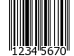
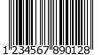
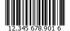
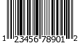

.. _zend.barcode.objects.details:

Beschreibung der ausgelieferten Barcodes
========================================

Anbei findet man detailierte Informationen über alle Barcode Typen welche standardmäßig mit Zend Framework
ausgeliefert werden.

.. _zend.barcode.objects.details.error:

Zend_Barcode_Object_Error
-------------------------

.. image:: ../images/zend.barcode.objects.details.error.png
   :width: 400
   :align: center

Dieser Barcode ist ein spezieller Fall. Er wird intern verwendet um eine Exception automatisch darzustellen wenn
diese von der ``Zend_Barcode`` Komponente gefangen wird.

.. _zend.barcode.objects.details.code25:

Zend_Barcode_Object_Code25
--------------------------

.. image:: ../images/zend.barcode.objects.details.code25.png
   :width: 152
   :align: center

- **Name:** Code 25 (oder Code 2 of 5 oder Code 25 Industrial)

- **Erlaubte Zeichen:**'0123456789'

- **Checksumme:** Optional (Modulo 10)

- **Länge:** Variabel

Es gibt keine speziellen Optionen für diesen Barcode.

.. _zend.barcode.objects.details.code25interleaved:

Zend_Barcode_Object_Code25interleaved
-------------------------------------

.. image:: ../images/zend.barcode.objects.details.int25.png
   :width: 101
   :align: center

Dieser Barcode erweitert ``Zend_Barcode_Object_Code25`` (Code 2 of 5). Er hat die gleichen Details und Optionen und
fügt folgendes hinzu:

- **Name:** Code 2 of 5 Interleaved

- **Erlaubte Zeichen:**'0123456789'

- **Checksumme:** Optional (Modulo 10)

- **Länge:** variabel (immer eine gerade Anzahl an Zeichen)

Vorhandene Optionen:

.. _zend.barcode.objects.details.code25interleaved.table:

.. table:: Optionen für Zend_Barcode_Object_Code25interleaved

   +--------------+--------+------------+----------------------------------------------------------+
   |Option        |Datentyp|Standardwert|Beschreibung                                              |
   +==============+========+============+==========================================================+
   |withBearerBars|Boolean |FALSE       |Zeichnet eine dicke Linie am Beginn und Ende des Barcodes.|
   +--------------+--------+------------+----------------------------------------------------------+

.. note::

   Wenn die Anzahl der Zeichen nicht gerade ist, wird ``Zend_Barcode_Object_Code25interleaved`` fehlende Nullen dem
   Barcode Text automatisch voranstellen.

.. _zend.barcode.objects.details.ean2:

Zend_Barcode_Object_Ean2
------------------------

.. image:: ../images/zend.barcode.objects.details.ean2.png
   :width: 41
   :align: center

Dieser Barcode erweitert ``Zend_Barcode_Object_Ean5`` (*EAN* 5) und hat die gleichen Details und Optionen, und
fügt die folgenden hinzu:

- **Name:** *EAN*-2

- **Erlaubte Zeichen:**'0123456789'

- **Checksumme:** nur intern verwendet aber nicht dargestellt

- **Länge:** 2 Zeichen

Es gibt keine speziellen Optionen für diesen Barcode.

.. note::

   Wenn die Anzahl der Zeichen kleiner als 2 ist, wird ``Zend_Barcode_Object_Ean2`` fehlende Nullen dem Barcode
   Text automatisch voranstellen.

.. _zend.barcode.objects.details.ean5:

Zend_Barcode_Object_Ean5
------------------------

.. image:: ../images/zend.barcode.objects.details.ean5.png
   :width: 68
   :align: center

Dieser Barcode erweitert ``Zend_Barcode_Object_Ean13`` (*EAN* 13) und hat eigene Details und Optionen und fügt die
folgenden hinzu:

- **Name:** *EAN*-5

- **Erlaubte Zeichen:**'0123456789'

- **Checksumme:** nur intern verwendet aber nicht dargestellt

- **Länge:** 5 Zeichen

Es gibt keine speziellen Optionen für diesen Barcode.

.. note::

   Wenn die Anzahl der Zeichen kleiner als 5 ist, wird ``Zend_Barcode_Object_Ean5`` fehlende Nullen dem Barcode
   Text automatisch voranstellen.

.. _zend.barcode.objects.details.ean8:

Zend_Barcode_Object_Ean8
------------------------

Dieser Barcode erweitert ``Zend_Barcode_Object_Ean13`` (*EAN* 13) und hat eigene Details und Optionen und fügt die
folgenden hinzu:

- **Name:** *EAN*-8

- **Erlaubte Zeichen:**'0123456789'

- **Checksumme:** erforderlich (Modulo 10)

- **Länge:** 8 Zeichen (inklusive Checksumme)

Es gibt keine speziellen Optionen für diesen Barcode.

.. note::

   Wenn die Anzahl der Zeichen kleiner als 8 ist, wird ``Zend_Barcode_Object_Ean8`` fehlende Nullen dem Barcode
   Text automatisch voranstellen.

.. _zend.barcode.objects.details.ean13:

Zend_Barcode_Object_Ean13
-------------------------

- **Name:** *EAN*-13

- **Erlaubte Zeichen:**'0123456789'

- **Checksumme:** erforderlich (Modulo 10)

- **Länge:** 13 Zeichen (inklusive Checksumme)

Es gibt keine speziellen Optionen für diesen Barcode.

.. note::

   Wenn die Anzahl der Zeichen kleiner als 13 ist, wird ``Zend_Barcode_Object_Ean13`` fehlende Nullen dem Barcode
   Text automatisch voranstellen.

   Die Option ``withQuietZones`` hat bei diesem Barcode keinen Effekt

.. _zend.barcode.objects.details.code39:

Zend_Barcode_Object_Code39
--------------------------

.. image:: ../images/zend.barcode.introduction.example-1.png
   :width: 275
   :align: center

- **Name:** Code 39

- **Erlaubte Zeichen:**'0123456789ABCDEFGHIJKLMNOPQRSTUVWXYZ -.$/+%'

- **Checksumme:** Optional (Modulo 43)

- **Länge:** Variabel

.. note::

   ``Zend_Barcode_Object_Code39`` fügt automatisch die Start und Stop Zeichen ('\*') hinzu.

Es gibt keine speziellen Optionen für diesen Barcode.

.. _zend.barcode.objects.details.identcode:

Zend_Barcode_Object_Identcode
-----------------------------

Dieser Barcode erweitert ``Zend_Barcode_Object_Code25interleaved`` (Code 2 of 5 Interleaved), und enthält einige
seiner Fähigkeiten; er hat auch selbst einige spezielle.

- **Name:** Identcode (Deutsche Post Identcode)

- **Erlaubte Zeichen:**'0123456789'

- **Checksumme:** zwingend (Modulo 10 aber unterschiedlich von Code25)

- **Länge:** 12 Zeichen (inklusive Checksumme)

Es gibt keine speziellen Optionen für diesen Barcode.

.. note::

   Wenn die Anzahl der Zeichen kleiner als 12 ist, wird ``Zend_Barcode_Object_Identcode`` fehlende Nullen dem
   Barcode Text automatisch voranstellen.

.. _zend.barcode.objects.details.itf14:

Zend_Barcode_Object_Itf14
-------------------------

.. image:: ../images/zend.barcode.objects.details.itf14.png
   :width: 155
   :align: center

Dieser Barcode erweitert ``Zend_Barcode_Object_Int25`` (Code 2 of 5 Interleaved), und erweitert einige seiner
Möglichkeiten; er hat auch selbst einige spezielle.

- **Name:** *ITF*-14

- **Erlaubte Zeichen:**'0123456789'

- **Checksumme:** zwingend (Modulo 10)

- **Länge:** 14 Zeichen (inklusive Checksumme)

Es gibt keine speziellen Optionen für diesen Barcode.

.. note::

   Wenn die Anzahl der Zeichen kleiner als 14 ist, wird ``Zend_Barcode_Object_Itf14`` fehlende Nullen dem Barcode
   Text automatisch voranstellen.

.. _zend.barcode.objects.details.leitcode:

Zend_Barcode_Object_Leitcode
----------------------------

.. image:: ../images/zend.barcode.objects.details.leitcode.png
   :width: 155
   :align: center

Dieser Barcode erweitert ``Zend_Barcode_Object_Identcode`` (Deutsche Post Identcode), und enthält einige seiner
Möglichkeiten; er hat auch einige eigene Möglichkeit.

- **Name:** Leitcode (Deutsche Post Leitcode)

- **Erlaubte Zeichen:**'0123456789'

- **Checksumme:** zwingend (Modulo 10 unterschiedlich zu Code25)

- **Länge:** 14 Zeichen (inklusive der Checksumme)

Es gibt keine speziellen Optionen für diesen Barcode.

.. note::

   Wenn die Anzahl der Zeichen kleiner als 14 ist, wird ``Zend_Barcode_Object_Leitcode`` fehlende Nullen dem
   Barcode Text automatisch voranstellen.

.. _zend.barcode.objects.details.planet:

Zend_Barcode_Object_Planet
--------------------------

.. image:: ../images/zend.barcode.objects.details.planet.png
   :width: 286
   :align: center

- **Name:** Planet (PostaL Alpha Numeric Encoding Technique)

- **Erlaubte Zeichen:**'0123456789'

- **Checksumme:** erforderlich (Modulo 10)

- **Länge:** 12 oder 14 Zeichen (inklusive Checksumme)

Es gibt keine speziellen Optionen für diesen Barcode.

.. _zend.barcode.objects.details.postnet:

Zend_Barcode_Object_Postnet
---------------------------

.. image:: ../images/zend.barcode.objects.details.postnet.png
   :width: 286
   :align: center

- **Name:** Postnet (POSTal Numeric Encoding Technique)

- **Erlaubte Zeichen:**'0123456789'

- **Checksumme:** erforderlich (Modulo 10)

- **Länge:** 6, 7, 10 oder 12 Zeichen (inklusive Checksumme)

Es gibt keine speziellen Optionen für diesen Barcode.

.. _zend.barcode.objects.details.royalmail:

Zend_Barcode_Object_Royalmail
-----------------------------

- **Name:** Royal Mail oder *RM4SCC* (Royal Mail 4-State Customer Code)

- **Erlaubte Zeichen:**'0123456789ABCDEFGHIJKLMNOPQRSTUVWXYZ'

- **Checksumme:** erforderlich

- **Länge:** variabel

Es gibt keine speziellen Optionen für diesen Barcode.

.. _zend.barcode.objects.details.upca:

Zend_Barcode_Object_Upca
------------------------

Dieser Barcode erweitert ``Zend_Barcode_Object_Ean13`` (*EAN* 13) und erweitert einige seiner Möglichkeiten; er
hat auch selbst einige.

- **Name:** *UPC*-A (Universal Product Code)

- **Erlaubte Zeichen:**'0123456789'

- **Checksumme:** erforderlich (Modulo 10)

- **Länge:** 12 Zeichen (inklusive Checksumme)

Es gibt keine speziellen Optionen für diesen Barcode.

.. note::

   Wenn die Anzahl der Zeichen kleiner als 12 ist, wird ``Zend_Barcode_Object_Upca`` fehlende Nullen dem Barcode
   Text automatisch voranstellen.

   Die Option ``withQuietZones`` hat bei diesem Barcode keinen Effekt

.. _zend.barcode.objects.details.upce:

Zend_Barcode_Object_Upce
------------------------

.. image:: ../images/zend.barcode.objects.details.upce.png
   :width: 71
   :align: center

Dieser Barcode erweitert ``Zend_Barcode_Object_Upca`` (*UPC*-A), und verwendet einige seiner Fähigkeiten; er hat
auch einige eigene. Das erste Zeichen des zu kodierenden Textes ist das System (0 oder 1). und enthält einige
seiner Möglichkeiten; er hat auch einige eigene Möglichkeit.

- **Name:** *UPC*-E (Universal Product Code)

- **Erlaubte Zeichen:**'0123456789'

- **Checksumme:** erforderlich (Modulo 10)

- **Länge:** 8 Zeichen (inklusive Checksumme)

Es gibt keine speziellen Optionen für diesen Barcode.

.. note::

   Wenn die Anzahl der Zeichen kleiner als 8 ist, wird ``Zend_Barcode_Object_Upce`` fehlende Nullen dem Barcode
   Text automatisch voranstellen.

.. note::

   Wenn das erste Zeichen des zu kodierenden Textes nicht 0 oder 1 ist, ersetzt ``Zend_Barcode_Object_Upce`` dieses
   automatisch durch 0.

   Die Option ``withQuietZones`` hat bei diesem Barcode keinen Effekt

