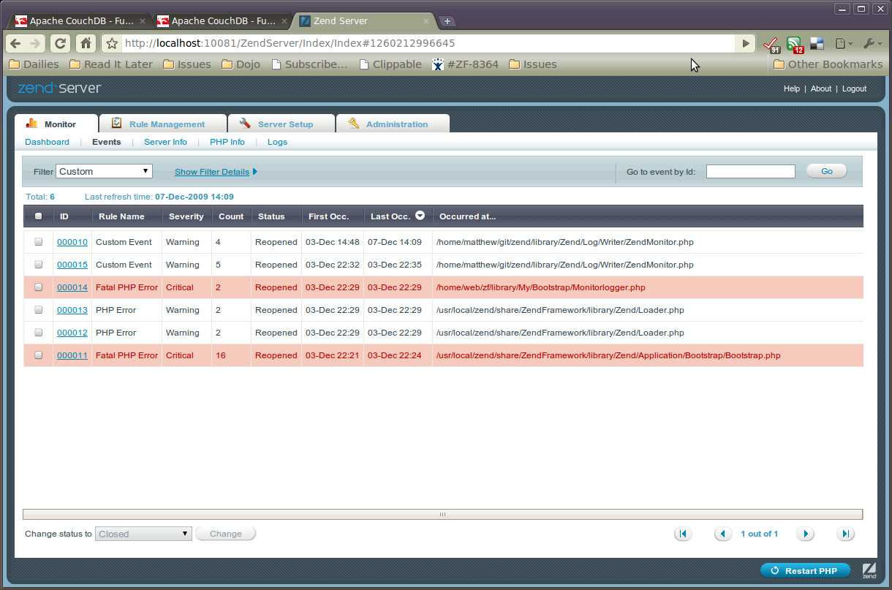

.. _zend.log.writers.zendmonitor:

Auf den Zend Server Montior schreiben
=====================================

``Zend_Log_Writer_ZendMonitor`` erlaubt es Events über Zend Server's Monitor *API* zu loggen. Das erlaubt es die
Log Nachrichten für die Umgebung einer komplette Anwendung an einem einzelnen Ort zu sammeln. Intern verwendet es
einfach die ``monitor_custom_event()`` Funktion der Zend Monitor *API*.

Ein relativ nützlichen Feature der Monitor *API* ist das Sie es erlaubt beliebige eigene Informationen zusammen
mit der Log Nachricht zu spezifizieren. Wenn man zum Beispiel eine Exception loggen will, kann man nicht nur die
Exception Nachricht loggen, sondern auch das komplette Exception Objekt an die Funktion übergeben, und das Objekt
dann im Zend Server Event Monitor inspizieren.

.. note::

   **Zend Monitor muss installiert und aktiviert sein**

   Um diesen Log Writer zu verwenden muss Zend Monitor sowohl installiert als auch aktiviert sein. Trotzdem ist er
   so designt dass, wenn Zend Monitor nicht gefunden wurde, er einfach als ``NULL`` Logger agiert.

Die Instanzierung des ``ZendMonitor`` Log Writers ist trivial:

.. code-block:: php
   :linenos:

   $writer = new Zend_Log_Writer_ZendMonitor();
   $log    = new Zend_Log($writer);

Dann können Nachrichten einfach wie gewohnt geloggt werden:

.. code-block:: php
   :linenos:

   $log->info('Das ist eine Nachricht');

Wenn man zusätzliche Informationen spezifizieren will, die mit dem Event geloggt werden sollen, können diese
Informationen in einem zweiten Parameter übergeben werden:

.. code-block:: php
   :linenos:

   $log->info('Exception gefunden', $e);

Der zweite Parameter kann ein Skalar, Objekt oder ein Array sein; wenn man mehrere Teile an Informationen
übergeben will, ist der beste Weg diese als assoziatives Array zu übergeben.

.. code-block:: php
   :linenos:

   $log->info('Exception gefunden', array(
       'request'   => $request,
       'exception' => $e,
   ));

Im Zend Server wird das Event als "eigenes Event" (custom) geloggt. Vom "Monitor" Tab muss das "Events" Sub-Element
ausgewählt werden und dann der Filter aus "Custom" um eigene Events zu sehen.

Events im Dashboard von Zend Server's Monitor

In diesem Screenshot sind die ersten zwei angeführten Events eigene Events die über den ``ZendMonitor`` Log
Writer geloggt wurden. Man kann anschließend auf ein Event klicken um alle Ihr zugehörigen Informationen zu
sehen.

.. image:: ../images/zend.log.writers.zendmonitor-event.png

Event Detail in Zend Server's Monitor

Wenn auf das Sub-Tab "Custom" geklickt wird, werden alle extra Informationen angezeigt die durch die Übergabe des
zweiten Arguments an die Logging Methode geloggt wurden. Diese Informationen werden als ``info`` Unterschlüssel
geloggt; man kann sehen das in diesem Beispiel das Request Objekt geloggt wurde.

.. note::

   **Integration mit Zend_Application**

   Standardmäßig fügen die Kommandos ``zf.sh`` und ``zf.bat`` die Konfguration für die :ref:`Zend_Application
   Log Ressource <zend.application.available-resources.log>` hinzu, welcher die Konfiguration für den
   ``ZendMonitor`` Log Writer enthält. Zusätzlich verwendet der ``ErrorController`` den konfigurierten Logger um
   Exceptions der Anwendung zu loggen -- und bietet deshalb standardmäßig die Integration für Events im Zend
   Monitor.

   Wie vorher erwähnt fungiert der Logger, wenn die Monitor *API* in der eigenen *PHP* Anwendung nicht erkannt
   wurde, als ``NULL`` Logger.

