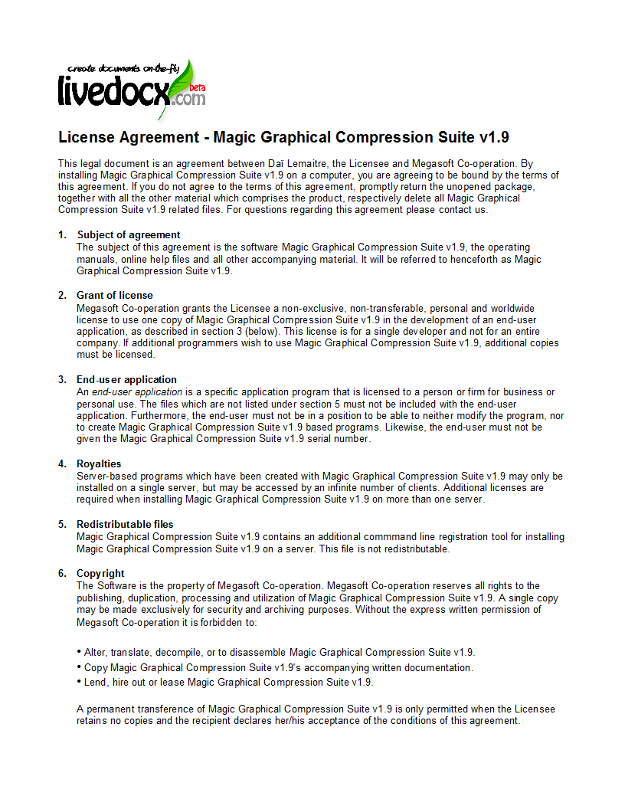

.. EN-Revision: none
.. _zend.service.livedocx:

Zend_Service_LiveDocx
=====================

.. _zend.service.livedocx.introduction:

Einführung in LiveDocx
----------------------

LiveDocx ist ein *SOAP*-Service, der es Entwicklern erlaubt, MS Word Dokumente zu erstellen, indem strukturierte
Daten von *PHP* mit einem Template kombiniert werden, die in einer MS Word-kompatiblen Anwendung erstellt wurden.
Das resultierende Dokument kann als *PDF*, *DOCX*, *DOC*, *HTML* oder *RTF* Datei gespeichert werden. LiveDocx
implementiert `Mail-Merge`_ in *PHP*.

Die Familie der ``Zend_Service_LiveDocx`` Komponenten bietet ein klares und einfaches Interface zur `LiveDocx API`_
und bietet zusätzlich Funktionalitäten, um die Geschwindigkeit im Netzwerk zu erhöhen.

Wenn man zusätzlich zu diesem Kapitel des Handbuchs daran interessiert ist, mehr über ``Zend_Service_LiveDocx``
und den dahinterliegenden *SOAP*-Service LiveDocx zu lernen, kann man bei den folgenden Ressourcen nachsehen:

- **Mitgelieferte Beispielanwendungen**. Es gibt eine große Anzahl an Beispielanwendungen im Verzeichnis
  **/demos/Zend/Service/LiveDocx** der Zend Framework Distributionsdatei, oder der Trunk Version die vom
  standardmäßigen SVN Repository ausgecheckt werden kann. Diese sind dazu gedacht, schnell, in nur ein paar
  Minuten, mit ``Zend_Service_LiveDocx`` zurecht zu kommen.

- `Zend_Service_LiveDocx Blog und Webseite`_.

- `LiveDocx SOAP API Dokumentation`_.

- `LiveDocx WSDL`_.

- `LiveDocx Blog und Webseite`_.

.. _zend.service.livedocx.account:

Für einen Account anmelden
^^^^^^^^^^^^^^^^^^^^^^^^^^

Bevor man damit beginnt LiveDocx zu verwenden, muss man sich zuerst für einen Account `anmelden`_. Der Account ist
komplett kostenlos, und es muss nur ein **Benutzername**, ein **Passwort** und eine **E-Mail-Adresse** eingegeben
werden. Die Anmeldedaten werden mit der E-Mail-Adresse verknüpft, die man angibt, deshalb sollte man vorsichtig
tippen.

.. _zend.service.livedocx.templates-documents:

Templates und Dokumente
^^^^^^^^^^^^^^^^^^^^^^^

LiveDocx unterscheidet zwischen den folgenden Ausdrücken: 1) **Template** und 2) **Dokument**. Um die
Dokumentation und auch die aktuelle *API* vollständig zu verstehen, ist es wichtig dass jeder Programmierer der
LiveDocx ausliefert, den Unterschied versteht.

Der Ausdruck **Template** wird verwendet, um auf eine Eingabedatei zu verweisen, die in einer Textverarbeitung
erstellt wurde und Formatierungen sowie Textfelder enthält. Man kann ein `Beispieltemplate`_ herunterladen,
welches als *DOCX* Datei gespeichert ist. Der Ausdruck **Dokument** wird verwendet, um auf eine Ausgabedatei zu
verweisen, welche die Templatedatei enthält, zusammen mit Daten - z.B. das fertiggestellte Dokument. Man kann ein
`Beispieldokument`_ herunterlaen, welches als *PDF* Datei gespeichert ist.

.. _zend.service.livedocx.formats:

Unterstützte Dateiformate
^^^^^^^^^^^^^^^^^^^^^^^^^

LiveDocx unterstützt die folgenden Dateiformate:

.. _zend.service.livedocx.formats.template:

Template Dateiformate (Eingabe)
^^^^^^^^^^^^^^^^^^^^^^^^^^^^^^^

Templates können in jedem der folgenden Dateiformate gespeichert werden:

- `DOCX`_- Office Open *XML* Format

- `DOC`_- Microsoft Word *DOC* Format

- `RTF`_- Rich-Text-Dateiformat

- `TXD`_- TX Text Control Format

.. _zend.service.livedocx.formats.document:

Dateiformate des Dokuments (Ausgabe):
^^^^^^^^^^^^^^^^^^^^^^^^^^^^^^^^^^^^^

Das resultierende Dokument kann in jedem der folgenden Dateiformate gespeichert werden:

- `DOCX`_- Office Open *XML* Format

- `DOC`_- Microsoft Word *DOC* Format

- `HTML`_-*XHTML* 1.0 Transitional Format

- `RTF`_- Rich-Text-Dateiformat

- `PDF`_- Acrobat Portable Document Format

- `TXD`_- TX Text Control Format

- `TXT`_-*ANSI* reiner Text

.. _zend.service.livedocx.formats.image:

Bilddateiformate (Ausgabe):
^^^^^^^^^^^^^^^^^^^^^^^^^^^

Das resultierende Dokument kann in jedem der folgenden grafischen Dateiformate gespeichert werden:

- `BMP`_- Bitmap Bildformat

- `GIF`_- Graphics Interchange Format

- `JPG`_- Joint Photographic Experts Group Format

- `PNG`_- Portable Network Graphics Format

- `TIFF`_- Tagged Image File Format

- `WMF`_- Windows Meta File Format

.. _zend.service.livedocx.mailmerge:

Zend_Service_LiveDocx_MailMerge
-------------------------------

``Zend_Service_LiveDocx_MailMerge`` ist das Mail-Merge-Objekt in der ``Zend_Service_LiveDocx`` Familie.

.. _zend.service.livedocx.mailmerge.generation:

Prozess der Dokumentenerstellung
^^^^^^^^^^^^^^^^^^^^^^^^^^^^^^^^

Der Prozess der Erstellung des Dokuments kann mit der folgenden Gleichung vereinfacht dargestellt werden:

**Template + Daten = Dokument**

Oder durch das folgende Diagramm ausgedrückt werden:

.. image:: ../images/zend.service.livedocx.mailmerge.generation-diabasic_zoom.png

Daten werden in ein Template eingefügt, um ein Dokument zu erstellen.

Ein Template, das in einer Textverarbeitungsanwendung, wie Microsoft Word, erstellt wird, wird in LiveDocx geladen.
Daten werden in das Template eingesetzt und das resultierende Dokument wird in jedes der unterstützten Formate
gespeichert.

.. _zend.service.livedocx.mailmerge.templates:

Erstellen von Templates in Microsoft Word 2007
^^^^^^^^^^^^^^^^^^^^^^^^^^^^^^^^^^^^^^^^^^^^^^

Man muss damit beginnen Microsoft Word zu starten und ein neues Dokument zu erstellen. Als nächstes wird der
Dialog **Felder** geöffnet. Er sieht wie folgt aus:

.. image:: ../images/zend.service.livedocx.mailmerge.templates-msworddialog_zoom.png

Dialogbox Felder in Microsoft Word 2007.

Durch Verwendung dieses Dialogs kann man die benötigten Merge-Felder in das eigene Dokument einfügen. Anbei ist
ein Screenshot der Lizenzvereinbarung in Microsoft Word 2007. Die Merge-Felder sind als ``{ MERGEFIELD FieldName
}`` markiert:

.. image:: ../images/zend.service.livedocx.mailmerge.templates-mswordtemplatefull_zoom.png

Das Template in Microsoft Word 2007.

Jetzt muss das Template als **template.docx** gespeichert werden.

Im nächsten Schritt vereinen wir die Merge-Felder mit textuellen Daten von *PHP*.

.. image:: ../images/zend.service.livedocx.mailmerge.templates-mswordtemplatecropped_zoom.png

Unterteiltes Template in Microsoft Word 2007.

Um die Merge Felder, im vorher unterteilten Screenshot des `Templates`_, in Microsoft Word auszufüllen, muss das
folgende geschrieben werden:

.. code-block:: php
   :linenos:

   $phpLiveDocx = new Zend_Service_LiveDocx_MailMerge();

   $phpLiveDocx->setUsername('myUsername')
               ->setPassword('myPassword');

   $phpLiveDocx->setLocalTemplate('template.docx');

   $phpLiveDocx->assign('software', 'Magic Graphical Compression Suite v1.9')
               ->assign('licensee', 'Henry Döner-Meyer')
               ->assign('company',  'Co-Operation');

   $phpLiveDocx->createDocument();

   $document = $phpLiveDocx->retrieveDocument('pdf');

   file_put_contents('document.pdf', $document);

Das resultierende Dokument wird auf der Festplatte in die Datei **document.pdf** geschrieben. Diese Datei kann nun
weiter bearbeitet, per E-Eail versendet oder einfach angezeigt werden, wie anbei im **Document Viewer 2.26.1** auf
**Ubuntu 9.04** gezeigt:

.. image:: ../images/zend.service.livedocx.mailmerge.templates-msworddocument_zoom.png

Resultierendes Dokument als *PDF* im Document Viewer 2.26.1.

.. _zend.service.livedocx.mailmerge.advanced:

Gehobeneres Mail-Merge
^^^^^^^^^^^^^^^^^^^^^^

``Zend_Service_LiveDocx_MailMerge`` erlaubt es Entwicklern eine beliebige Anzahl an Text-Feldern in ein Template
einzufügen. Diese Text-Felder werden mit Daten gefüllt, wenn **createDocument()** aufgerufen wird.

Zusätzlich zu Textfeldern ist es auch möglich, spezielle Regionen eines Dokuments anzugeben, die wiederholt
werden sollen.

In einer Telefonrechnung ist es z.b. notwendig, eine Liste aller Verbindungen, inklusive der Zielnummern, der Dauer
und den Kosten jedes Anrufs abzubilden,. Diese Funktion der wiederholten Zeile kann mit sogenannten Blöcken
erzielt werden.

**Blöcke** sind einfach Regionen eines Dokuments, welche wiederholt werden wenn ``createDocument()`` aufgerufen
wird. In einem Block kann eine beliebige Anzahl an **Block-Feldern** spezifiziert werden.

Blöcke bestehen aus zwei zusammenhängenden Sprungmarken mit eindeutigen Namen. Der folgende Screenshot zeigt
diese Sprungmarken und deren Namen in Rot:

.. image:: ../images/zend.service.livedocx.mailmerge.advanced-mergefieldblockformat_zoom.png

Das Format eines Blocks ist wie folgt:

.. code-block:: text
   :linenos:

   blockStart_ + unique name
   blockEnd_ + unique name

Zum Beispiel:

.. code-block:: text
   :linenos:

   blockStart_block1
   blockEnd_block1

Der Inhalt eines Blocks wird wiederholt, bis alle zugeordneten Daten in Blockfeldern des Templates eingefügt
wurden. Die Daten der Blockfelder werden in *PHP* als mehrfach-assoziatives Array spezifiziert.

Der folgende Screenshot eines Templates in Microsoft Word 2007 zeigt wie Blockfelder verwendet werden:

.. image:: ../images/zend.service.livedocx.mailmerge.advanced-mswordblockstemplate_zoom.png

Template, welches Blöcke in Microsoft Word 2007 zeigt.

Der folgende Code füllt das obige Template mit Daten.

.. code-block:: php
   :linenos:

   $phpLiveDocx = new Zend_Service_LiveDocx_MailMerge();

   $phpLiveDocx->setUsername('myUsername')
               ->setPassword('myPassword');

   $phpLiveDocx->setLocalTemplate('template.doc');

   $billConnections = array(
       array(
           'connection_number'   => '+49 421 335 912',
           'connection_duration' => '00:00:07',
           'fee'                 => '€ 0.03',
       ),
       array(
           'connection_number'   => '+49 421 335 913',
           'connection_duration' => '00:00:07',
           'fee'                 => '€ 0.03',
       ),
       array(
           'connection_number'   => '+49 421 335 914',
           'connection_duration' => '00:00:07',
           'fee'                 => '€ 0.03',
       ),
       array(
           'connection_number'   => '+49 421 335 916',
           'connection_duration' => '00:00:07',
           'fee'                 => '€ 0.03',
       ),
   );

   $phpLiveDocx->assign('connection', $billConnections);

   // ... andere Daten hier zuweisen ...

   $phpLiveDocx->createDocument();
   $document = $phpLiveDocx->retrieveDocument('pdf');
   file_put_contents('document.pdf', $document);

Die Daten, welche im Array ``$billConnections`` spezifiziert sind, werden im Template im Block 'connection'
wiederholt. Die Schlüssel des Arrays (``connection_number``, ``connection_duration`` und ``fee``) sind die Namen
der Blockfelder - deren Daten werden bei jeder Iteration in einer Zeile eingefügt.

Das resultierende Dokument wird auf der Festplatte in die Datei **document.pdf** geschrieben. Diese Datei kann
anschließend nachbearbietet, per E-Mail gesendet, oder einfach dargestellt werden, wie anbei im **Document Viewer
2.26.1** unter **Ubuntu 9.04** gezeigt:

.. image:: ../images/zend.service.livedocx.mailmerge.advanced-mswordblocksdocument_zoom.png

Das resultierende Dokument als *PDF* im Document Viewer 2.26.1.

Man kann die *DOC* `Template Datei`_ und das resultierende `PDF Dokument`_ hier herunterladen.

**BEACHTE:** Blöcke können nicht verschachtelt werden.

.. _zend.service.livedocx.mailmerge.bitmaps:

Erstellen von Bitmap Bildern
^^^^^^^^^^^^^^^^^^^^^^^^^^^^

Zusätzlich zu den Dateiformaten für Dokumente erlaubt es ``Zend_Service_LiveDocx_MailMerge`` auch Dokumente als
eine Anzahl von Bildern zu speichern (*BMP*, *GIF*, *JPG*, *PNG* und *TIFF*). Jede Seite des Dokuments wird als
eine Datei gespeichert.

Das folgende Beispiel zeigt die Verwendung von ``getBitmaps($fromPage, $toPage, $zoomFactor, $format)`` und
``getAllBitmaps($zoomFactor, $format)``.

``$fromPage`` ist die untere Grenze der Seitenzahl des Bereichs an Seiten, die als Bilder zurückgegeben werden
sollen und ``$toPage`` ist die obere Grenze der Seitenzahlen. ``$zoomFactor`` ist die Größe der Bilder als
Prozentwert relativ zur originalen Seitengröße. Der Bereich dieses Parameters ist von 10 bis 400. ``$format`` ist
das Format des Bildes, welches von dieser Methode zurückgegeben wird. Die unterstützten Formate erhält man, wenn
man ``getImageExportFormats()`` aufruft.

.. code-block:: php
   :linenos:

   $date = new Zend_Date();
   $date->setLocale('en_US');

   $phpLiveDocx = new Zend_Service_LiveDocx_MailMerge();

   $phpLiveDocx->setUsername('myUsername')
               ->setPassword('myPassword');

   $phpLiveDocx->setLocalTemplate('template.docx');

   $phpLiveDocx->assign('software', 'Magic Graphical Compression Suite v1.9')
               ->assign('licensee', 'Daï Lemaitre')
               ->assign('company',  'Megasoft Co-operation')
               ->assign('date',     $date->get(Zend_Date::DATE_LONG))
               ->assign('time',     $date->get(Zend_Date::TIME_LONG))
               ->assign('city',     'Lyon')
               ->assign('country',  'France');

   $phpLiveDocx->createDocument();

   // Alle Bitmaps holen
   // (zoomFactor, format)
   $bitmaps = $phpLiveDocx->getAllBitmaps(100, 'png');

   // Nur Bitmaps im spezifizierten Bereich erhalten
   // (fromPage, toPage, zoomFactor, format)
   // $bitmaps = $phpLiveDocx->getBitmaps(2, 2, 100, 'png');

   foreach ($bitmaps as $pageNumber => $bitmapData) {
       $filename = sprintf('documentPage%d.png', $pageNumber);
       file_put_contents($filename, $bitmapData);
   }

Das produziert zwei Bilder (``documentPage1.png`` und ``documentPage2.png``) und schreibt diese auf die Festplatte
in das gleiche Verzeichnis wie die ausführbare *PHP*-Datei.

documentPage1.png.

.. image:: ../images/zend.service.livedocx.mailmerge.bitmaps-documentpage2_zoom.png

documentPage2.png.

.. _zend.service.livedocx.mailmerge.templates-types:

Lokale vs. Remote Templates
^^^^^^^^^^^^^^^^^^^^^^^^^^^

Templates können **lokal** auf der Client-Maschine gespeichert werden oder **remote** auf dem Server. Jede
Variante hat Vorteile und Nachteile.

Im Falle, dass ein Template lokal gespeichert ist, muss es bei jeder Anfrage vom Client auf den Server transferiert
werden. Wenn sich der Inhalt vom Templates selten ändert, ist dieser Weg sehr ineffizient. Ähnlich auch, wenn das
Template eine Größe von mehreren Megabyte hat, kann es eine beträchtliche Zeit dauern, es auf den Server zu
transferieren. Lokale Templates sind in Situationen sinnvoll, in denen der Inhalt des Templates konstant geändert
wird.

Der folgende Code zeigt, wie man ein lokales Template verwendet.

.. code-block:: php
   :linenos:

   $phpLiveDocx = new Zend_Service_LiveDocx_MailMerge();

   $phpLiveDocx->setUsername('myUsername')
               ->setPassword('myPassword');

   $phpLiveDocx->setLocalTemplate('./template.docx');

   // Daten hinzufügen und das Dokument erstellen

Im Falle, dass ein Template remote gespeichert ist, wird es nur einmal auf den Server geladen und anschließend bei
allen nachfolgenden Anfragen darauf referenziert. Natürlich ist es viel schneller, als ein lokales Template zu
verwenden, da das Template nicht bei jeder Anfrage übertragen werden muss. Für Anwendungen bei denen die
Geschwindigkeit kritisch ist, wird es empfohlen die Remote-Template-Methode zu verwenden.

Der folgende Code zeigt, wie ein Template auf den Server übertragen wird:

.. code-block:: php
   :linenos:

   $phpLiveDocx = new Zend_Service_LiveDocx_MailMerge();

   $phpLiveDocx->setUsername('myUsername')
               ->setPassword('myPassword');

   $phpLiveDocx->uploadTemplate('template.docx');

Der folgende Code zeigt, wie auf das remote gespeicherte Template bei allen weiteren Anfragen referenziert wird:

.. code-block:: php
   :linenos:

   $phpLiveDocx = new Zend_Service_LiveDocx_MailMerge();

   $phpLiveDocx->setUsername('myUsername')
               ->setPassword('myPassword');

   $phpLiveDocx->setRemoteTemplate('template.docx');

   // assign data and create document

.. _zend.service.livedocx.mailmerge.information:

Informationen erhalten
^^^^^^^^^^^^^^^^^^^^^^

``Zend_Service_LiveDocx_MailMerge`` bietet eine Anzahl an Methoden um Informationen über Feldnamen, vorhandene
Schriftarten und unterstützte Formate zu erhalten.

.. _zend.service.livedocx.mailmerge.information.getfieldname:

.. rubric:: Ein Array an Feldnamen vom Template erhalten

Der folgende Code gibt ein Array aller Feldnamen im angegebenen Template zurück und zeigt diese an. Diese
Funktionalität ist nützlich, wenn man eine Anwendung erstellt, in welcher der Endbenutzer das Template
aktualisieren kann.

.. code-block:: php
   :linenos:

   $phpLiveDocx = new Zend_Service_LiveDocx_MailMerge();

   $phpLiveDocx->setUsername('myUsername')
               ->setPassword('myPassword');

   $templateName = 'template-1-text-field.docx';
   $phpLiveDocx->setLocalTemplate($templateName);

   $fieldNames = $phpLiveDocx->getFieldNames();
   foreach ($fieldNames as $fieldName) {
       printf('- %s%s', $fieldName, PHP_EOL);
   }

.. _zend.service.livedocx.mailmerge.information.getblockfieldname:

.. rubric:: Ein Array an Blockfeldnamen vom Template erhalten

Der folgende Code zeigt ein Array aller Blockfeldnamen im angegebenen Template an. Diese Funktionalität ist
nützlich, wenn man eine Anwendung erstellt, in welcher der Endbenutzer das Template aktualisieren kann. Bevor
solche Templates veröffentlicht werden können, ist es notwendig, die Namen der enthaltenen Blockfelder
herauszufinden.

.. code-block:: php
   :linenos:

   $phpLiveDocx = new Zend_Service_LiveDocx_MailMerge();

   $phpLiveDocx->setUsername('myUsername')
               ->setPassword('myPassword');

   $templateName = 'template-block-fields.doc';
   $phpLiveDocx->setLocalTemplate($templateName);

   $blockNames = $phpLiveDocx->getBlockNames();
   foreach ($blockNames as $blockName) {
       $blockFieldNames = $phpLiveDocx->getBlockFieldNames($blockName);
       foreach ($blockFieldNames as $blockFieldName) {
           printf('- %s::%s%s', $blockName, $blockFieldName, PHP_EOL);
       }
   }

.. _zend.service.livedocx.mailmerge.information.getfontnames:

.. rubric:: Ein Array von Schriftarten erhalten welche auf dem Server installiert sind

Der folgende Code zeigt ein Array aller auf dem Server installierten Schriftarten an. Diese Methode kann verwendet
werden, um eine Liste von Schriftarten anzuzeigen, welche in einem Template verwendet werden können. Das ist
nützlich, um den Endbenutzer über die auf dem Server installierten Schriften zu informieren, da nur diese
Schriftarten in einem Template verwendet werden können. Im Falle, dass ein Template Schriften enthält, welche auf
dem Server nicht enthalten sind, wird eine andere Schriftart verwendet. Dies kann zu unerwünschten Ergebnissen
führen.

.. code-block:: php
   :linenos:

   $phpLiveDocx = new Zend_Service_LiveDocx_MailMerge();

   $phpLiveDocx->setUsername('myUsername')
               ->setPassword('myPassword');

   Zend_Debug::dump($phpLiveDocx->getFontNames());

**BEACHTE:** Da sich der Rückgabewert diese Methode sehr selten ändert, ist es sehr empfehlenswert einen Cache zu
verwenden, wie z.B. ``Zend_Cache``- das macht die Anwendung sichtbar schneller.

.. _zend.service.livedocx.mailmerge.information.gettemplateformats:

.. rubric:: Ein Array an unterstützten Dateiformaten für Templates erhalten

Der folgende Code zeigt ein Array aller unterstützten Dateiformate für Templates. Diese Methode ist partiell
nützlich im Fall, dass eine Auswahlliste angezeigt werden soll, welche es dem Endbenutzer erlaubt, das
Eingabeformat für den Erstellungsprozess des Dokuments auszuwählen.

.. code-block:: php
   :linenos:

   $phpLiveDocx = new Zend_Service_LiveDocx_MailMerge()

   $phpLiveDocx->setUsername('myUsername')
               ->setPassword('myPassword');

   Zend_Debug::dump($phpLiveDocx->getTemplateFormats());

**BEACHTE:** Da sich der Rückgabewert diese Methode sehr selten ändert, ist es sehr empfehlenswert einen Cache zu
verwenden, wie z.B. ``Zend_Cache``- das macht die Anwendung sichtbar schneller.

.. _zend.service.livedocx.mailmerge.information.getdocumentformats:

.. rubric:: Ein Array an unterstützten Dateiformaten für Dokumente erhalten

Der folgende Code zeigt ein Array aller unterstützten Dateiformate für Dokumente. Diese Methode ist besonders
nützlich, falls eine Auswahlliste angezeigt werden soll, welche es dem Endbenutzer erlaubt, das Ausgabeformat für
den Erstellungsprozess des Dokuments auszuwählen.

.. code-block:: php
   :linenos:

   $phpLiveDocx = new Zend_Service_LiveDocx_MailMerge();

   $phpLiveDocx->setUsername('myUsername')
               ->setPassword('myPassword');

   Zend_Debug::dump($phpLiveDocx->getDocumentFormats());

.. _zend.service.livedocx.mailmerge.information.getimageexportformats:

.. rubric:: Ein Array an unterstützten Dateiformaten für Bilder erhalten

Der folgende Code zeigt ein Array aller unterstützten Dateiformate für Bilder. Diese Methode ist besonders
nützlich, falls eine Auswahlliste angezeigt werden soll, welche es dem Endbenutzer erlaubt, das Ausgabeformat für
den Erstellungsprozess des Dokuments auszuwählen.

.. code-block:: php
   :linenos:

   $phpLiveDocx = new Zend_Service_LiveDocx_MailMerge();

   $phpLiveDocx->setUsername('myUsername')
               ->setPassword('myPassword');

   Zend_Debug::dump($phpLiveDocx->getImageExportFormats());

**BEACHTE:** Da sich der Rückgabewert diese Methode sehr selten ändert, ist es sehr empfehlenswert einen Cache zu
verwenden, wie z.B. ``Zend_Cache``- das macht die Anwendung sichtbar schneller.

.. _`Mail-Merge`: http://en.wikipedia.org/wiki/Mail_merge
.. _`LiveDocx API`: http://www.livedocx.com
.. _`Zend_Service_LiveDocx Blog und Webseite`: http://www.phplivedocx.org/
.. _`LiveDocx SOAP API Dokumentation`: http://www.livedocx.com/pub/documentation/api.aspx
.. _`LiveDocx WSDL`: https://api.livedocx.com/1.2/mailmerge.asmx?wsdl
.. _`LiveDocx Blog und Webseite`: https://www.livedocx.com/
.. _`anmelden`: https://www.livedocx.com/user/account_registration.aspx
.. _`Beispieltemplate`: http://www.phplivedocx.org/wp-content/uploads/2009/01/license-agreement-template.docx
.. _`Beispieldokument`: http://www.phplivedocx.org/wp-content/uploads/2009/01/license-agreement-document.pdf
.. _`DOCX`: http://en.wikipedia.org/wiki/Office_Open_XML
.. _`DOC`: http://en.wikipedia.org/wiki/DOC_(computing)
.. _`RTF`: http://en.wikipedia.org/wiki/Rich_Text_Format
.. _`TXD`: http://www.textcontrol.com/
.. _`HTML`: http://en.wikipedia.org/wiki/Xhtml
.. _`PDF`: http://en.wikipedia.org/wiki/Portable_Document_Format
.. _`TXT`: http://en.wikipedia.org/wiki/Text_file
.. _`BMP`: http://en.wikipedia.org/wiki/BMP_file_format
.. _`GIF`: http://en.wikipedia.org/wiki/GIF
.. _`JPG`: http://en.wikipedia.org/wiki/Jpg
.. _`PNG`: http://en.wikipedia.org/wiki/Portable_Network_Graphics
.. _`TIFF`: http://en.wikipedia.org/wiki/Tagged_Image_File_Format
.. _`WMF`: http://en.wikipedia.org/wiki/Windows_Metafile
.. _`Templates`: http://www.phplivedocx.org/wp-content/uploads/2009/01/license-agreement-template.docx
.. _`Template Datei`: http://www.phplivedocx.org/wp-content/uploads/2009/01/telephone-bill-template.doc
.. _`PDF Dokument`: http://www.phplivedocx.org/wp-content/uploads/2009/01/telephone-bill-document.pdf
