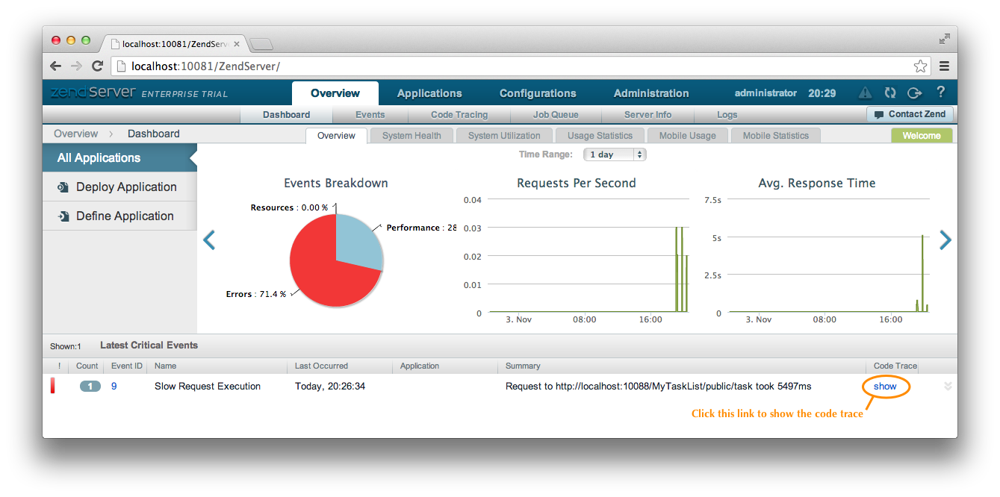
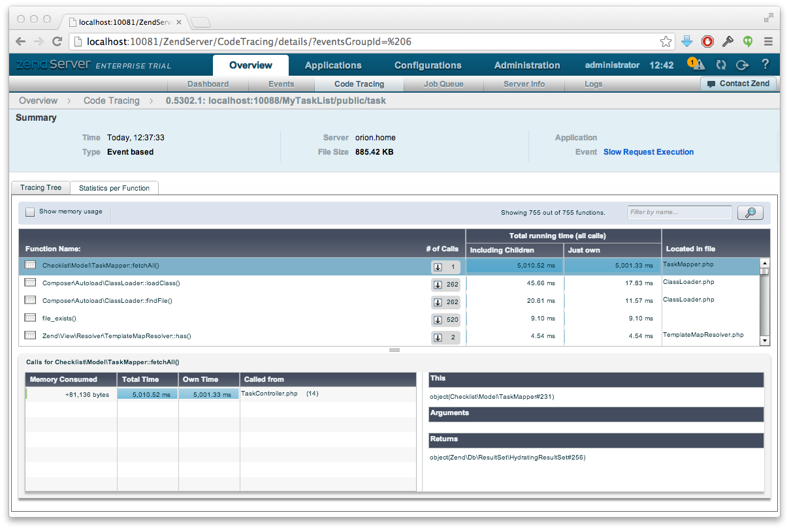
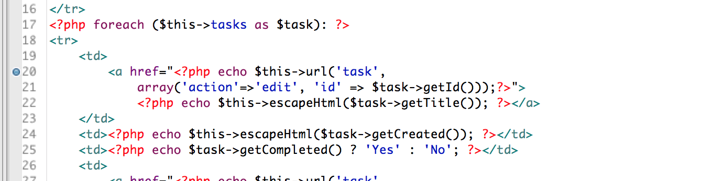

.. _getting-started-with-zend-studio.diagnostics:

Application Diagnostics
=======================

One really useful feature of Zend Server is the code trace feature that can show
you the method-by-method execution of any given PHP request. This is especially
useful in a Zend Framework 2 application as the use of Events and Service
Manager means that our code base isn't necessarily linear.

Let's consider a contrived example and introduce a delay into our codebase. One
of the more common causes of slow down is related to database calls taking too
long due to a complicated query, incorrect indexing or by retrieving too much
data. We have a very simple database table with just 5 rows, so we can simulate
this by adding a ``sleep()`` call to our ``TaskMapper``'s ``fetchAll()`` method.

Open ``Checklist/src/Checklist/Model/TaskMapper.php`` and add ``sleep(5);`` just
before the end of the ``fetchAll()`` method:

**Checklist/src/Checklist/Model/TaskMapper.php:**

.. code-block:: php
   :linenos:
    
    public function fetchAll()
    {
        $select = $this->sql->select();
        $select->order(array('completed ASC', 'created ASC'));

        $statement = $this->sql->prepareStatementForSqlObject($select);
        $results = $statement->execute();
        
        $entityPrototype = new TaskEntity();
        $hydrator = new ClassMethods();
        $resultset = new HydratingResultSet($hydrator, $entityPrototype);
        $resultset->initialize($results);
        
        sleep(5);
        return $resultset;
    }

It will now take 5 seconds (and a little bit) to display the list of tasks.

If you now look at the home page of Zend Server's console, you'll see a "Slow
Request Execution" critical event listed.  Click on the "show" link in the "Code
Trace" column as shown:

You will then see much more detail about this critical event. The easiest way to
use the profile view is to click on the "Statistics per Function" tab and then
order by "Just own" total running time.

This will result in the display of the slowest method at the top as shown in the sceenshot.

As you can see, Zend Server has correctly determined that fetchAll() is the
cause of the slowdown and so we can immediately go to the problem source in Zend
Studio and fix the problem.

In addition to helping debugging while developing, this is obviously also
extremely powerful when Zend Server is running on the production servers as this
profile information is then available for those situations when a given issue
only seems to happen on the live web site.

Step-by-step debugging
======================

Another useful feature of Zend Studio and Eclipse/PDT is the step-by-step
debugger. With the debugger you can set breakpoints in your code and then run
the page in a browser. When the breakpoint is reached, Zend Studio pauses the
page and you can then inspect variables and move forward through your code one
line at a time.

To see this in action, let's inspect the value of $task in the checklist
module's index.phtml file. Open the
module/Checklist/view/checklist/task/index.phtml file and double click in the
gutter next to the opening ``<a`` tag to set a blue breakpoint marker:

The break point is now set. The easiest way to run to this point is to use the
`Zend Studio Firefox tool bar <http://www.zend.com/en/download/155>`_\ . Once
installed, you can navigate to http://localhost:10088/MyTaskList/public/task in
Firefox and then press the *Debug* button in the toolbar. Zend Studio will then
come to the foreground and ask you if you want to use the Debug perspective.
Answer yes, as this view is designed to provide useful information while
debugging. Zend Studio will pause the application on the first line of
index.php, so press F8 to continue to the breakpoint that you set.

.. image:: ../images/getting-started-with-zend-studio.debug2.png
    :width: 90%

You will now see the code we are interested in. The centre pane shows our code
with the line that the debugger is stopped on highlighted. The top left pane
shows the stack trace which tells us which methods were used to get to this line
of code. The top right pane shows a list of variables in scope. You can click
the arrow next to ``$task`` to expand it and see the properties of the object.
Pressing F8 will resume running the application until the next breakpoint. As
our breakpoint is in a loop, it iterates once around the loop and stops again.
The data in ``$task`` is now the second database record.  Once you have finished
inspecting the state of your code, you can press the square red stop button to
stop the debugging mode. Clicking the PHP button in the top right hand corner of
Zend Studio takes you back to the code editing view.

