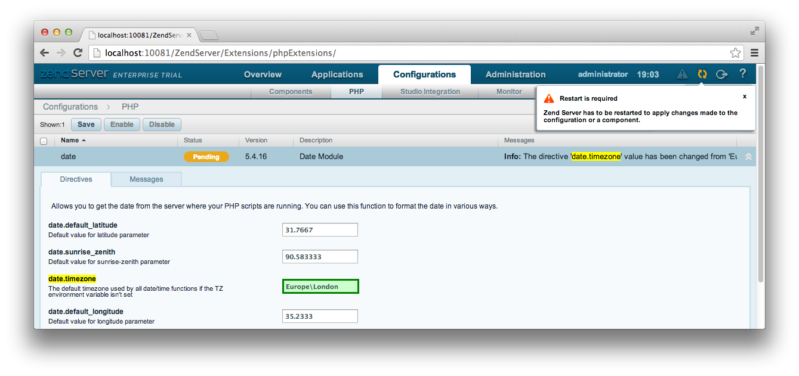
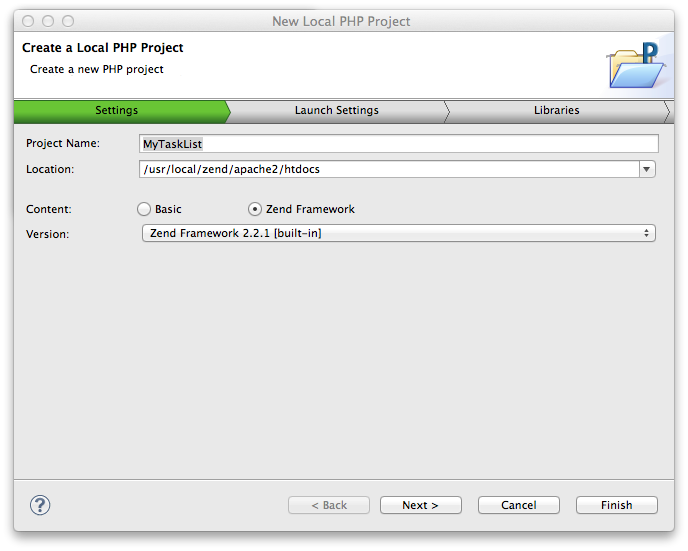
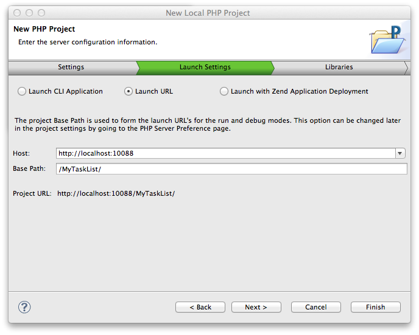
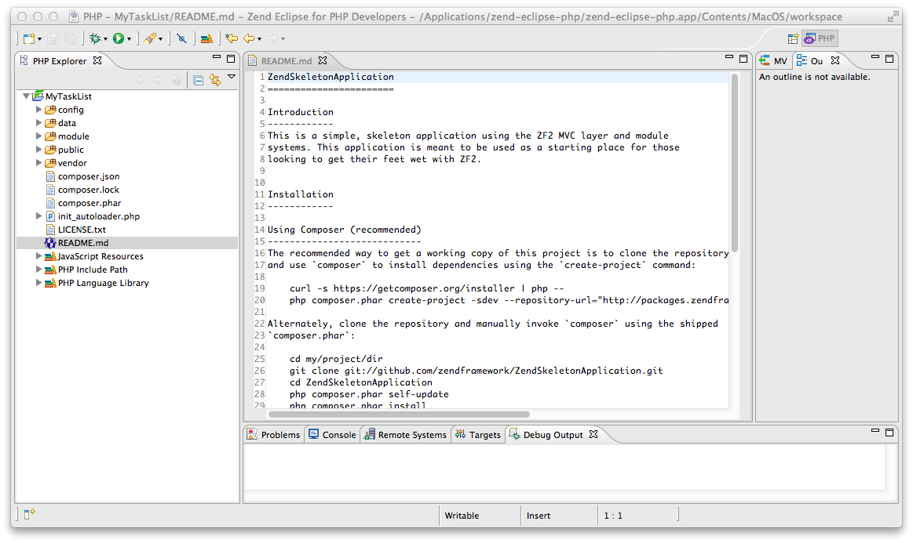
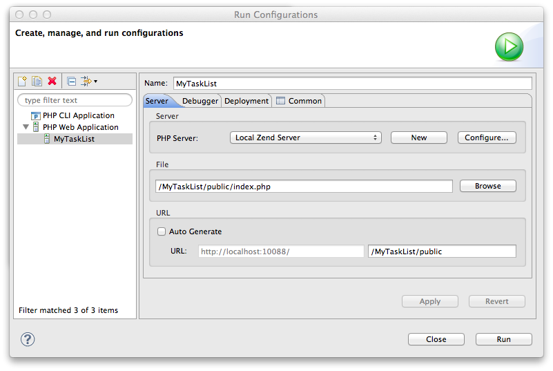
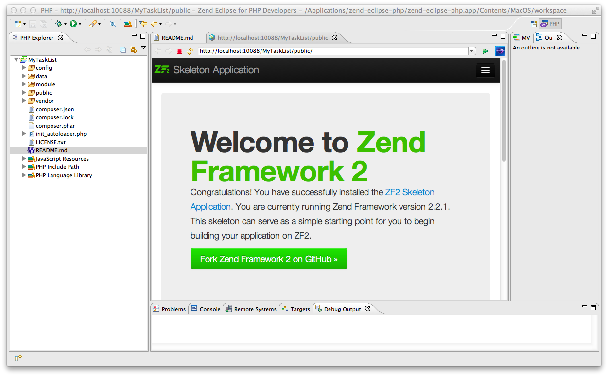

.. _getting-started-with-zend-studio.overview:

Getting Started with Zend Framework 2
=====================================

This tutorial is intended to give an introduction to using Zend Framework 2 by
creating a simple database driven application using the Model-View-Controller
paradigm. By the end you will have a working ZF2 application and you can then
poke around the code to find out more about how it all works and fits together.

We will develop this application using Zend Studio 10 and run the application on
Zend Server 6.

Zend Server is a PHP application server that includes the PHP runtime. It comes
in both free and paid editions, both of which provide lots of features; however
the most interesting ones for developers are the dead-simple environment setup
and the ability to investigate application problems, including profiling
performance and memory issues with code-tracing abilities. Zend Server also
ships with Zend Framework 2, which is convenient.

Zend Studio is a PHP-focused IDE based on Eclipse that comes in two flavours:
the free Eclipse PDT and Zend Studio, a paid-for product that provides enhanced
features and support options. Usefully, Eclipse PDT provides Zend Framework 2
support out of the box along with Zend Server integration. You don't get the
mobile features though, or integrated PHP Documenter & PHPUnit features.

In this tutorial we're going to build a small, simple database application to
manage a list of to-do items. We'll need a list of items along with the ability
to add, edit and delete items. We'll use a database to store information about
each to-do item.

Installation
------------

Firstly you'll need to install Zend Server and Eclipse PDT. If you have a
license for Zend Studio 10, you can use that too. You can download the latest
version of `Zend Server
<http://www.zend.com/en/products/server/downloads?src=zft>`_. Grab `Eclipse PDT
<http://www.zend.com/en/company/community/pdt/downloads?src=zft>`_ or `Zend
Studio <http://www.zend.com/en/products/studio/downloads?src=zft>`_ (which comes
with a free 30-day trial) and install it. In this tutorial we will use the
phrase Zend Studio, but it will all work with Eclipse PDT too.

On Linux, you can install Zend Server with either Apache or Nginx. This tutorial
has assumed that you have installed the Apache version. The only important
difference for this tutorial is the creation of rewrite rules.

Once you have installed Zend Server, enter the administration application, which
can usually be found at http://localhost:10081/. Set the time zone in
Configuration -> PHP, and then restart the server (third button from the right
in the top right corner).

You will also need to install MySQL using your Linux distribution's package
manager or from mysql.com if you are on Windows. For OS X users, Zend Server
already includes MySQL for you.

On OS X, the document root for the Zend Server installed Apache is at
``/usr/local/zend/apache2/htdocs``. On Linux, Zend Server uses the web server
supplied by the distribution. On Ubuntu 12.04, with Apache, it is ``/var/www``
and with nginx it is at ``/usr/share/nginx/html``. On Windows, it is
``C:\Program Files (x86)\Zend\Apache2\htdocs``.

Ensure that this folder is writeable by your own user. The easiest way to do
this is to change the owner of the html directory. On a Mac, this would be:

.. code-block:: bash

    $ sudo chown {your username} /usr/local/zend/apache2/htdocs

Getting Started
---------------

We start by creating a new Local PHP project in Zend Studio. Open Zend Studio
and select File -> New -> Local PHP Project. This will display the New Local PHP
Project wizard as shown:

Enter *MyTaskList* as the Project Name and set the location to the Zend Server
document root. Due to the integration between Zend Server and Zend Studio, you
should find the correct directory as an option in the drop down list. Select
Zend Framework as the Content and you can then select which version of Zend
Framework to use. Select the latest Zend Framework 2 version and press Next.

The next step is the Launch Settings tab. Choose Launch URL and set the host to
http://localhost (or http://localhost:10088 on OS X) and the Base Path to
``/MyTaskList/``:

Press Finish to create your new project in Zend Studio.

Zend Studio has now created a default Zend Framework project for us:

This is a standard Zend Framework 2 Skeleton Application and is a great starting
point for a new ZF2 application.

To set up Zend Studio to run this project, select Run -> Run Configurations...
and double click on PHP Web Application in the left hand list. Enter MyTaskList
as the name, Local Zend Server as the PHP Server and then click the Browse
button and select index.php within the public folder of the MyTaskList project.
Uncheck Auto Generate in the URL section and then set the path to
/MyTaskList/public and press Apply and then Close:

To test that all is working, press the run button in the toolbar (white arrow in
a green circle). The ZF2 Skeleton Application home page will display in a new
tab within Zend Studio:

You can also navigate to the same URL (http://localhost:10088/MyTaskList/public/
on a Mac) in any browser.

We have successfully installed both Zend Server and Zend Studio, created a
project and tested it. Let's start by looking at what we have so far in our Zend
Framework project.

