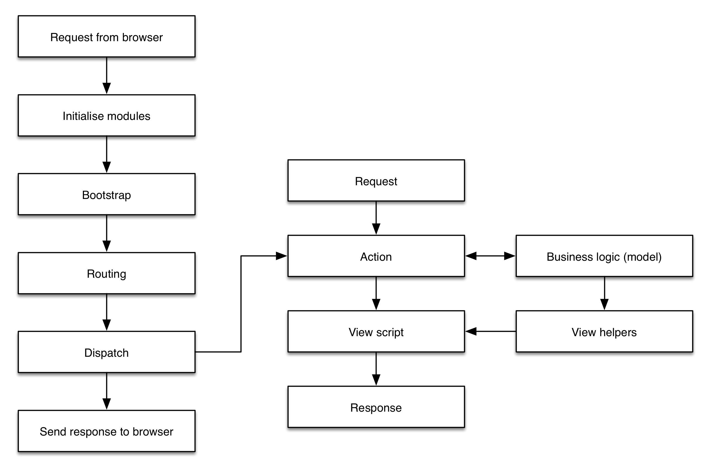

.. _getting-started-with-zend-studio.skeleton-application:

A quick tour of the skeleton application
========================================

The skeleton application provides a lot of files, so it's worth having a quick
high-level look at what has been generated for us. There are a number of high
level directories created for us (along with `Composer
<http://getcomposer.org>`_ and other support files):

+------------+------------------------------------------------------------------+
| Folder     | Information stored                                               |
+============+==================================================================+
| ``config`` | Application-level configuration files.                           |
+------------+------------------------------------------------------------------+
| ``data``   | Data files generated by the application, such as caches.         |
+------------+------------------------------------------------------------------+
| ``module`` | The source files that make up this application are stored within |
|            | separate modules within this folder.                             |
+------------+------------------------------------------------------------------+
| ``public`` | The web server's document root. All files served directly by the |
|            | web server are in here.                                          |
+------------+------------------------------------------------------------------+
| ``vendor`` | Third party libraries.                                           |
+------------+------------------------------------------------------------------+

One of the key features of Zend Framework 2 is its module system. This provides
organisation within your application; all application code lives within a
module. The skeleton provides the Application module for bootstrapping, error
and routing configuration. It also provides the application-level controllers
for the home page and error display.  The Application module contains these key
folders:

+----------------------+------------------------------------------------------------------+
| Folder               | Information stored                                               |
+======================+==================================================================+
| ``config``           | Module-specific configuration files.                             |
+----------------------+------------------------------------------------------------------+
| ``language``         | Translation files.                                               |
+----------------------+------------------------------------------------------------------+
| ``src/Application``  | PHP files for this module, including controller and model files. |
|                      | The controller for the                                           |
|                      | home page, ``IndexController.php``, is provided.                 |
+----------------------+------------------------------------------------------------------+
| ``view/application`` | View scripts for each controller action.                         |
+----------------------+------------------------------------------------------------------+
| ``view/error``       | Error view scripts for 404 and generic errors.                   |
+----------------------+------------------------------------------------------------------+
| ``view/layout``      | Layout view scripts. These contain the common HTML shared by a   |
|                      | number of pages within the                                       |
|                      | website. An initial default file, ``layout.phtml``, is provided. |
+----------------------+------------------------------------------------------------------+

Modules are simply namespaces containing a top level ``Module`` class. They are
intended to be reusable and no additional constraints are placed on how they are
organised. An application consists of multiple modules, both third party and
application specific, with the list of modules to load stored in
``config/application.config.php``.

The dispatch cycle
------------------

Zend Framework 2 applications use the `Front Controller
<http://www.martinfowler.com/eaaCatalog/frontController.html>`_ design pattern.
This means that all requests are directed to a single entry point, the
``public/index.php`` file. This is done using a .htaccess file containing
rewrite rules that serves all static files (such as CSS & Javascript) and
directs all other requests to the index.php. The index.php file initialises the
autoloader and then bootstraps ``Zend\Mvc\Application`` before finally running
the application. The process looks like this:

Starting up
~~~~~~~~~~~

To set up the application for running, a number of things happen. Firstly an
instance of ``Zend\ServiceManager`` is created as the master locator for all
class instances used by the application. The Module Manager is then used to load
all the application's modules. It does this by reading its configuration file,
``application.config.php``, which is solely for use by the Module Manager and
does not contain the configuration used by the application itself.

The modules are loaded in the order listed in the configuration file and for
each module a number of steps takes place:

* Configuration of autoloading.
* Loading of module configuration.
* Registration of event listeners.
* Configuration of the Service Manager.

The configuration information from all modules is merged together into one
configuration array. This means that configuration information in subsequent
modules can override information already set. Finally, the global configuration
files stored in the ``config/autoload`` directory are merged (the
``*.global.php`` and then the ``*.local.php`` files). This means that any
module's configuration can be overridden at the application level and is a key
feature that helps to ensure that the code within a third-party module does not
need to be changed.

The Service Manager and Event Manager are two other key features of a Zend
Framework 2 application. :ref:`Zend\\ServiceManager <zend.service-manager.intro>`
allows for decoupling the instantiation and configuration of a class and its
dependencies from where that class is used. This is known as Dependency
Injection and is used extensively in Zend Framework 2.
:ref:`Zend\\EventManager <zend.event-manager.event-manager>` is an
implementation of the Observer design pattern which allows decoupling of code.
In Zend Framework 2, every key process in the dispatch cycle is implemented as
an event. This means that you can write listeners for these events which can
then change the flow of operation or perform additional processes when something
else has happened.

Dispatching
~~~~~~~~~~~

Once all modules have been loaded, the application is run. This is done as a
series of events, with the first event, *route*, used to determine the
controller action that should be run based on the URL requested. Once this is
determined, the *dispatch* event is triggered which causes the action method
within the controller class to be executed. The view rendering event, *render*,
is then triggered if an HTML view is required. Finally the *finish* event is
triggered which sends the response back to the user's web browser.

While this is a typical dispatch cycle, Zend Framework 2's dispatch system is
very flexible and can be configured in a variety of ways depending on the
specific application. Now that we've looked at how Zend Framework works, let’s
move on and write the *MyTaskList* application.
