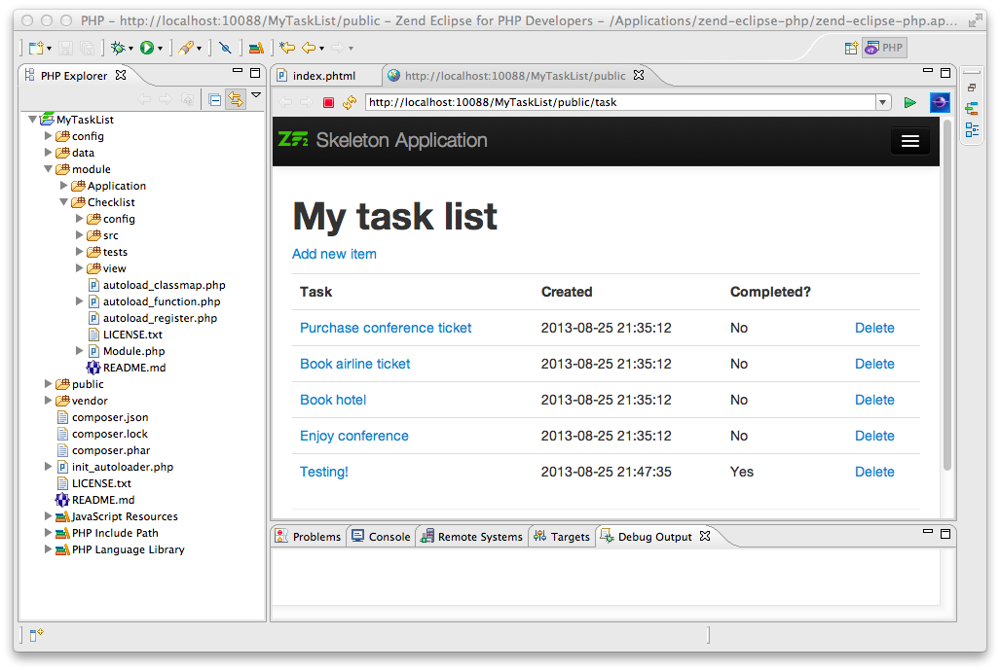
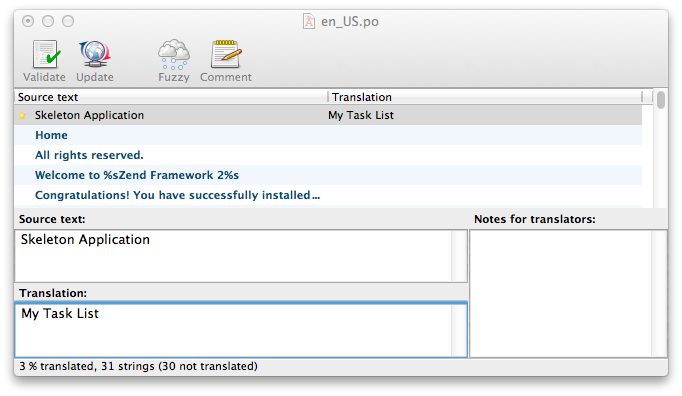
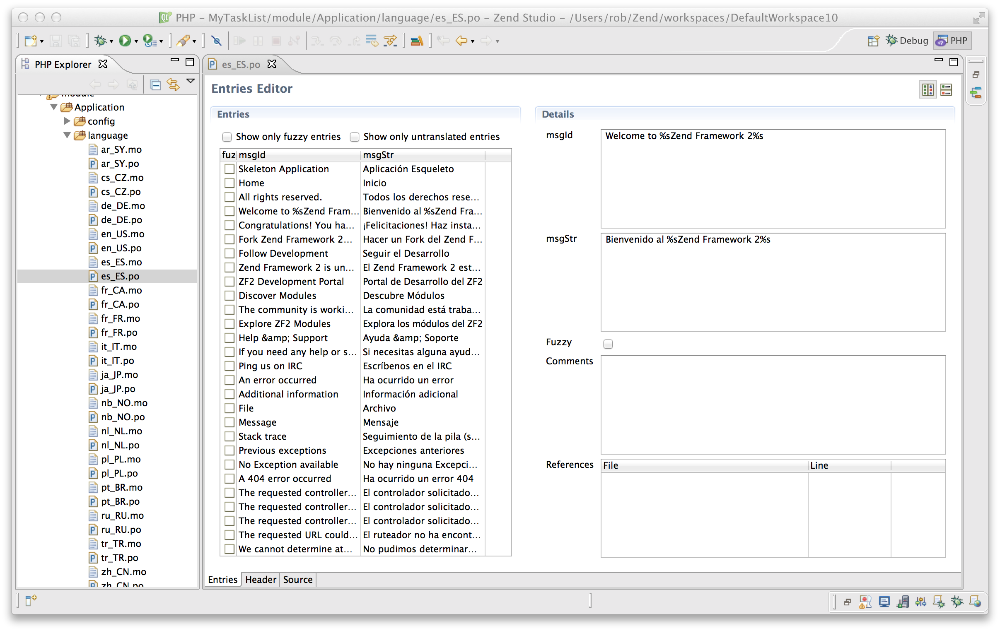
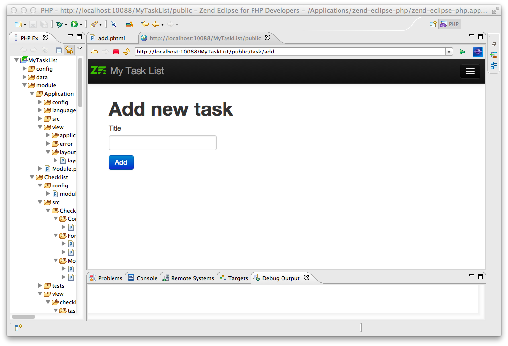

.. _getting-started-with-zend-studio.listing-tasks:

Listing tasks
=============

In order to list the tasks, we need to retrieve them from the model layer and
pass them to the view. To do this, we fill in ``indexAction()`` within
``TaskController``. Update the ``indexAction()`` like this:

**module/Checklist/src/Checklist/Controller/TaskController.php:**

.. code-block:: php
   :linenos:

    public function indexAction()
    {
        $mapper = $this->getTaskMapper();
        return new ViewModel(array('tasks' => $mapper->fetchAll()));
    }

You'll also need to add ``use Zend\View\Model\ViewModel;`` to list of ``use``
statements at the top of the file.

To provide variables to the view layer, we return a ``ViewModel`` instance where
the first parameter of the constructor is an array from the action containing
data we need. These are then automatically passed to the view script. The
``ViewModel`` object also allows us to change the view script that is used, but
the default is to use ``{controller name}/{action name}``. You can also return
an array from a controller as Zend Framework will construct a ``ViewModel``
behind the scenes for you.

We can now fill in the ``task/index.phtml`` view script. Replace the contents
with this new code:

**module/Checklist/view/checklist/task/index.phtml:**

.. code-block:: html+php
   :linenos:

    <?php
    $title = 'My task list';
    $this->headTitle($title);
    ?>
    <h1><?php echo $this->escapeHtml($title); ?></h1>
    
<a href="<?php echo $this->url('task', array(
            'action'=>'add'));?>">Add new item</a>

    <table class="table">
    <tr>
        <th>Task</th>
        <th>Created</th>
        <th>Completed?</th>
        <th>&nbsp;</th>
    </tr>
    <?php foreach ($tasks as $task): ?>
    <tr>
        <td>
            <a href="<?php echo $this->url('task',
                array('action'=>'edit', 'id' => $task->getId()));?>">
                <?php echo $this->escapeHtml($task->getTitle()); ?></a>
        </td>
        <td><?php echo $this->escapeHtml($task->getCreated()); ?></td>
        <td><?php echo $task->getCompleted() ? 'Yes' : 'No'; ?></td>
        <td>
            <a href="<?php echo $this->url('task',
                array('action'=>'delete', 'id' => $task->getId()));?>">Delete</a>
        </td>
    </tr>
    <?php endforeach; ?>
    </table>

The first thing we do is to set the title for the page (used in the layout) and
also set the title for the ``<head>`` section using the ``headTitle()`` view
helper which will display in the browser's title bar. We then create a link to
add a new item using the ``url()`` view helper.

The ``url()`` view helper is provided by Zend Framework and is used to create
the links we need. The first parameter to ``url()`` is the route name that we
wish to use for construction of the URL and then the second parameter is an
array of all the variables to fit into the place-holders to use. In this case we
use our task route  which is set up to accept two place-holder variables:
*action* and *id*.

We iterate over the $tasks that we assigned from the controller action within an
HTML table. The Zend Framework view system automatically ensures that these
variables are extracted into the scope of the view script. Alternatively, you
can also prefix with ``$this->`` if you would like.

For each row, we display each task's title, creation date, completion date and
provide links to allow for editing and deleting the record. A standard
``foreach:`` loop is used to iterate over the list of tasks, and we use the
alternate form using a colon and ``endforeach;`` as it is easier to scan than to
try and match up braces. Again, the ``url()`` view helper is used to create the
edit and delete links.

Note that we always use the ``escapeHtml()`` view helper to help protect
ourselves from `XSS vulnerabilities <http://en.wikipedia.org/wiki/Cross-
site_scripting>`_\ .

If you now run the application from within Zend Studio and navigate to
http://localhost:10088/MyTaskList/public/task you should see this:

Redirect the home page
----------------------

When you first pressed the Run button, you saw the application's home page which
is the skeleton's welcome page. It would be helpful if we could redirect
immediately to ``/tasks`` to save us having to edit the URL each time.

To do this, go to Navigate -> Open Type... in Zend Studio and type
IndexController in the search box of the Open PHP Type dialog and press return.
This will open
``module/Application/src/Application/Controller/IndexController.php`` for you.
Change the ``indexAction()`` method so that it reads:

**module/Application/src/Application/Controller/IndexController.php:**

.. code-block:: php
   :linenos:
    
    public function indexAction()
    {
        return $this->redirect()->toRoute('task');
    }

We use the ``redirect`` controller plugin to redirect the request for the home
page to the URL defined by the route name task which we set up earlier. Now,
when you press the green "Run" button, you will be taken directly to the list of
tasks.

Styling
=======

We've picked up the skeleton application's layout which is fine for this
tutorial, but we need to change the title and remove the copyright message.

The Zend Skeleton Application is set up to use ``Zend\I18n``\ 's `translation
functionality
<http://framework.zend.com/manual/2.2/en/modules/zend.i18n.translating.html>`_
for all the text. This allows you to translate all the text strings in the
application into a different language if you need to.

The translation data is stored in separate files in the `gettext
<http://www.gnu.org/software/gettext/>`_ format which have the extension ``.po``
and are stored in the ``application/language`` folder. The title of the
application is "Skeleton Application" and to change this, you need to use the
*poedit* application (http://www.poedit.net/download.php/). Start *poedit* and
open ``application/language/en_US.po``. Click on "Skeleton Application" in the
list of original strings and then type in "My Task List" as the translation.

Press Save in the toolbar and *poedit* will create an updated ``en_US.mo`` file.

Alternatively, the `gted <http://www.gted.org>`_ Eclipse plugin allows for
editing PO files directly in Zend Studio or PDT. To install *gted*, select the
Help > Install New Software menu, and press the "Add..." button. Enter the gted
for the Name, http://gted.sourceforge.net/update as the Location and then press
the "OK" button. You will see the gted name appear in the list. Click on the
checkbox next to gted and work through the install wizard by pressing "Next
button as required. At the end of the installation you will be able to create or
edit the PO files using the gted plugin:

It follows that as Zend Studio and PDT are based on Eclipse you can install any
other Eclipse plugins that are listed on http://marketplace.eclipse.org/ using
the same process.

The next thing to do is to remove the copyright message, we need to edit the
Application module's ``layout.phtml`` view script:

**module/Application/view/layout/layout.phtml:**

Remove this line:

.. code-block:: html+php
        
    
&copy; 2005 - <?php echo date('Y') ?> by Zend Technologies Ltd. <?php echo $this->translate('All rights reserved.') ?>

The page looks a little better now!

Adding new tasks
================

We can now write the functionality to add new tasks. There are two things we need to do:

* Display a form for user to provide the task information
* Process the form submission and store to database

We use ``Zend\Form`` to do this. The ``Zend\Form`` component manages the form
and works in tandem with the  ``Zend\InputFilter`` component which will provide
validation.

Create a new folder in ``module/Checklist/src/Checklist`` called ``Form`` and
then within the ``Form`` folder, create a new PHP file called ``TaskForm.php``
with these contents:

**module/Checklist/src/Checklist/Form/TaskForm.php:**

.. code-block:: php
   :linenos:

    <?php
    namespace Checklist\Form;

    use Zend\Form\Form;
    use Zend\Stdlib\Hydrator\ClassMethods;

    class TaskForm extends Form
    {
        public function __construct($name = null, $options = array())
        {
            parent::__construct('task');

            $this->setAttribute('method', 'post');
            $this->setInputFilter(new TaskFilter());
            $this->setHydrator(new ClassMethods());
            
            $this->add(array(
                'name' => 'id',
                'type' => 'hidden',
            ));

            $this->add(array(
                'name' => 'title',
                'type' => 'text',
                'options' => array(
                    'label' => 'Title',
                ),
                'attributes' => array(
                    'id' => 'title',
                    'maxlength' => 100,
                )
            ));

            $this->add(array(
                'name' => 'completed',
                'type' => 'checkbox',
                'options' => array(
                    'label' => 'Completed?',
                    'label_attributes' => array('class'=>'checkbox'),
                ),
            ));

            $this->add(array(
                'name' => 'submit',
                'attributes' => array(
                    'type'  => 'submit',
                    'value' => 'Go',
                    'class' => 'btn btn-primary',
                ),
            ));
        }
    }

Within the constructor of ``TaskForm``, we set the name when we call the
parent's constructor and then set the method and the input filter that we want
to use. We also set the form's hydrator to be ``ClassMethods``, as a form object
uses hydration to transfer data to and from an entity object in exactly the same
way as the ``Zend\Db`` components do. Finally, we create the form elements for
the id, title, whether the task is complete and the submit button. For each item
we set various attributes and options, including the label to be displayed.

We also need to set up validation for this form. In Zend Framework is this done
using an input filter which can either be standalone or within any class that
implements ``InputFilterAwareInterface``, such as a model entity. For this
application we are going to create a separate class for our input filter.

Create a new PHP file called ``TaskFilter.php`` in the
``module/Checklist/src/Checklist/Form`` folder with these contents:

**module/Checklist/src/Checklist/Form/TaskFilter.php:**

.. code-block:: php
   :linenos:
    
    <?php
    namespace Checklist\Form;

    use Zend\InputFilter\InputFilter;

    class TaskFilter extends InputFilter
    {
        public function __construct()
        {
            $this->add(array(
                'name' => 'id',
                'required' => true,
                'filters' => array(
                    array('name' => 'Int'),
                ),
            ));

            $this->add(array(
                'name' => 'title',
                'required' => true,
                'filters' => array(
                    array('name' => 'StripTags'),
                    array('name' => 'StringTrim'),
                ),
                'validators' => array(
                    array(
                        'name' => 'StringLength',
                        'options' => array(
                            'encoding' => 'UTF-8',
                            'max' => 100
                        ),
                    ),
                ),
            ));

            $this->add(array(
                'name' => 'completed',
                'required' => false,
            ));
        }
    }

In the constructor for the ``TaskFilter``, we create inputs for each property
that we want to filter. Each input can have a name, a required property a list
of filters and a list of validators. All are optional other than the name
property. The difference between filters and validators is that a filter changes
the data passed through it and a validator tests if the data matches some
specific criteria. For the title, we filter the string with ``StripTags`` and
``StringTrim`` and finally ensure that the string is no longer than 100
characters with the ``StringLength`` validator. For the *completed* element, we
simply set ``required`` to false.

We now need to display the form and process it on submission. This is done
within the ``TaskController``\ 's ``addAction()``. Open ``TaskController.php``
(Navigate -> Open Resource... is a convenient way to do this) and add a new
method called ``addAction()`` to the class that looks like this:

**module/Checklist/src/Checklist/Controller/TaskController.php:**

.. code-block:: php
   :linenos:

    public function addAction()
    {
        $form = new TaskForm();
        $task = new TaskEntity();
        $form->bind($task);
        
        $request = $this->getRequest();
        if ($request->isPost()) {
            $form->setData($request->getPost());
            if ($form->isValid()) {
                $this->getTaskMapper()->saveTask($task);
    
                // Redirect to list of tasks
                return $this->redirect()->toRoute('task');
            }
        }
    
        return array('form' => $form);
    }

Add ``use Checklist\Model\TaskEntity;`` and ``use Checklist\Form\TaskForm;`` to
the list of use statements at the top of the file.

Let's look at what the ``addAction()`` does in detail.

.. code-block:: php
   :linenos:
    
    $form = new TaskForm();
    $task = new TaskEntity();
    $form->bind($task);

We instantiate a new ``TaskForm`` object and an empty ``TaskEntity`` which we
bind to the form for use by the form later. The form's ``bind()`` method
attaches the model to the form. This is used in two ways:

1. When displaying the form, the initial values for each element are extracted
   from the model.
2. After successful validation in ``isValid()``, the data from the form is put
   back into the model.

When adding a new task, we only need to worry about point 2, however for editing
an item, we need data transfer in both directions.

.. code-block:: php
   :linenos:
    
    $request = $this->getRequest();
    if ($request->isPost()) {
        $form->setData($request->getPost());
        if ($form->isValid()) {

For a submitted form, we set the posted data to the form and check to see if it
is valid using the ``isValid()`` member function of the form. The ``isValid()``
method uses the form's input filter to test for validity and if it returns true,
it will then transfer the filtered data values to the entity object that is
bound to the form using the  registered hydrator. This means that after
``isValid()`` is called, ``$task`` now contains the submitted form data.

.. code-block:: php
   :linenos:

    $this->getTaskMapper()->saveTask($task);

As the form is valid, we can save ``$task`` to the database using the mapper's
``saveTask()`` method.

.. code-block:: php
   :linenos:

    // Redirect to list of tasks
    return $this->redirect()->toRoute('task');

After we have saved the new task, we redirect back to the list of tasks using
the ``Redirect`` controller plugin.

.. code-block:: php
   :linenos:

    return array('form' => $form);

Finally, if this request is not a POST, we return the variables that we want
assigned to the view. In this case, just the form object.

We also need to add the ``saveTask()`` method to the ``TaskMapper`` class. Open
``module/Checklist/src/Checklist/Model/TaskMapper.php`` and add this method to
the end of the class:

**module/Checklist/src/Checklist/Model/TaskMapper.php:**

.. code-block:: php
   :linenos:

    public function saveTask(TaskEntity $task)
    {
        $hydrator = new ClassMethods();
        $data = $hydrator->extract($task);

        if ($task->getId()) {
            // update action
            $action = $this->sql->update();
            $action->set($data);
            $action->where(array('id' => $task->getId()));
        } else {
            // insert action
            $action = $this->sql->insert();
            unset($data['id']);
            $action->values($data);
        }
        $statement = $this->sql->prepareStatementForSqlObject($action);
        $result = $statement->execute();
        
        if (!$task->getId()) {
            $task->setId($result->getGeneratedValue());
        }
        return $result;

    }

The ``saveTask()`` method handles both inserting a new record if ``$task``
doesn't have an ``id`` or updating it if it does. In either case, we need the
data from the entity as an array, so we can use the hydrator to do this. If we
are updating, then we use the ``Sql`` object's ``update()`` method to create an
``Update`` object where we can set the data and a where clause. For inserting,
we need an ``Insert`` object to which we set the values. Obviously, when
inserting, the database will auto-increment the ``id``, so we do not need the
``id`` property in the values list. In either case, we create a statement object
and then execute it. Finally, if we are inserting, we populate the task entity's
``id`` with the value of the auto-generated id.

We now need to render the form in the ``add.phtml`` view script. Create a new
PHP file called ``add.phtml`` in the ``module/Checklist/view/checklist/task``
folder and add this code:

**module/Checklist/view/checklist/task/add.phtml:**

.. code-block:: html+php
   :linenos:

    <?php
    $title = 'Add new task';
    $this->headTitle($title);
    ?>
    <h1><?php echo $this->escapeHtml($title); ?></h1>

    <?php
    $form = $this->form;
    $form->setAttribute('action', $this->url('task', array('action' => 'add')));
    $form->get('submit')->setAttribute('value', 'Add');
    $form->prepare();

    echo $this->form()->openTag($form);
    echo $this->formHidden($form->get('id'));
    echo $this->formRow($form->get('title'));
    ?>
    

    <?php echo $this->formInput($form->get('submit')); ?>
    

    <?php
    echo $this->form()->closeTag($form);

Again, we display a title as before and then we render the form. Zend Framework
provides some view helpers to make this a little easier. The ``form()`` view
helper has an ``openTag()`` and ``closeTag()`` method which we use to open and
close the form. Then for the title element, which has a label, we can use
``formRow()`` view helper which will render the HTML for the label, the element
and any validator messages that may exist. For the id and submit elements, we
use ``formHidden()`` and ``formInput()`` respectively as we only need to render
the element itself. We also want the submit button on its own line, so we put it
within a div. Note that the ``formRow`` view helper is just a convenience - we
could have used ``formInput()``, ``formLabel()`` and ``formElementErrors()``
separately had we wanted to.

If you now run the application from within Zend Studio and click the "Add new
item" link from the task list page, you should see:

You can now add a new task item and see it in the list of tasks.

Editing a task
==============

Editing a task is almost identical to adding one, so the code is very similar.
This time we use ``editAction()`` in the ``TaskController``. Open
``TaskController.php`` and add this method to it:

**module/Checklist/src/Checklist/Controller/TaskController.php:**

.. code-block:: php
   :linenos:
    
    public function editAction()
    {
        $id = (int)$this->params('id');
        if (!$id) {
            return $this->redirect()->toRoute('task', array('action'=>'add'));
        }
        $task = $this->getTaskMapper()->getTask($id);
    
        $form = new TaskForm();
        $form->bind($task);
    
        $request = $this->getRequest();
        if ($request->isPost()) {
            $form->setData($request->getPost());
            if ($form->isValid()) {
                $this->getTaskMapper()->saveTask($task);
    
                return $this->redirect()->toRoute('task');
            }
        }
    
        return array(
            'id' => $id,
            'form' => $form,
        );
    }

This code should look familiar. Let's look at the only difference from adding a
task: We look for the id that is in the matched route and use it to load the
task to be edited:

.. code-block:: php
   :linenos:

    $id = (int)$this->params('id');
    if (!$id) {
        return $this->redirect()->toRoute('task', array('action'=>'add'));
    }
    $task = $this->getTaskMapper()->getTask($id);

The ``params()`` method is a controller plugin that provides a convenient way to
retrieve parameters from the matched route. We use it to retrieve the id
parameter  that we defined in the task route that we created in the
``module.config.php``. If the id is zero, then we redirect to the *add* action,
otherwise, we continue by getting the task entity from the database.

As we use the form's ``bind()`` method with its hydrator, we do not need to
populate the ``$task``'s data into the form manually as it will automatically be
transferred for us.

We also need to write a ``getTask()`` method in the TaskMapper to get a single
record from the database, so let's do that now. Open ``TaskMapper.php`` and add
this method:

**module/Checklist/src/Checklist/Model/TaskMapper.php:**

.. code-block:: php
   :linenos:

    public function getTask($id)
    {
        $select = $this->sql->select();
        $select->where(array('id' => $id));

        $statement = $this->sql->prepareStatementForSqlObject($select);
        $result = $statement->execute()->current();
        if (!$result) {
            return null;
        }
        
        $hydrator = new ClassMethods();
        $task = new TaskEntity();
        $hydrator->hydrate($result, $task);

        return $task;
    }

This method simply sets a where clause on the ``Sql``\ 's  ``Select`` object and
then executes it. Calling ``current()`` on the result from ``execute()`` will
return either the array of data for the row or ``false``. If we retrieved data,
then we use the hydrator to populate a new ``TaskEntity`` (``$task``) with
``$data``.

In the same way as with the action methods, the view template, ``edit.phtml``,
looks very similar to the one for adding an task. Create a new PHP file called
``edit.phtml`` in in the ``module/Checklist/view/checklist/task`` folder and add
this code:

**module/Checklist/view/checklist/task/edit.phtml:**

.. code-block:: html+php
   :linenos:

    <?php
    $title = 'Edit task';
    $this->headTitle($title);
    ?>
    <h1><?php echo $this->escapeHtml($title); ?></h1>

    <?php
    $form = $this->form;
    $url = $this->url('task', array('action' => 'edit', 'id' => $id));
    $form->setAttribute('action', $url);
    $form->get('submit')->setAttribute('value', 'Edit');
    $form->prepare();

    echo $this->form()->openTag($form);
    echo $this->formHidden($form->get('id'));
    echo $this->formRow($form->get('title'));
    echo $this->formRow($form->get('completed'));
    ?>
    

    <?php echo $this->formInput($form->get('submit')); ?>
    

    <?php
    echo $this->form()->closeTag($form);

Compared to the add view script, we set the title to ‚'Edit Task', and update
the action URL to the edit action with the correct id. We also change the label
of the button to ‚'edit' and render the completed form element.

You should now be able to edit tasks.

Deleting a task
===============

To round out the core functionality of our application, we need to be able to
delete a task. We have a *Delete* link next to each task on our list page and
the naïve approach would be to run the delete action when it's clicked. This
would be wrong. Remembering the HTTP specification, we recall that you shouldn't
do an irreversible action using GET and should use POST instead.

We shall therefore show a confirmation form when the user clicks delete and if
they then click "Yes", we will do the deletion. As the form is trivial, we'll
code it directly into our view (``Zend\Form`` is, after all, optional!).

Let's start by adding the ``deleteAction()`` method to the ``TaskController``.
Open ``TaskController.php`` and add this method to it:

**module/Checklist/src/Checklist/Controller/TaskController.php:**

.. code-block:: php
   :linenos:
    
    public function deleteAction()
    {
        $id = $this->params('id');
        $task = $this->getTaskMapper()->getTask($id);
        if (!$task) {
            return $this->redirect()->toRoute('task');
        }
    
        $request = $this->getRequest();
        if ($request->isPost()) {
            if ($request->getPost()->get('del') == 'Yes') {
                $this->getTaskMapper()->deleteTask($id);
            }
    
            return $this->redirect()->toRoute('task');
        }
    
        return array(
            'id' => $id,
            'task' => $task
        );
    }

As before, we get the id from the matched route and retrieve the task object. We
then check the ``Request`` object's ``isPost()`` to determine whether to show
the confirmation page or to delete the task. We use the ``TaskMapper``\ 's
``deleteTask()`` method to delete the row and then redirect back to the list of
tasks. If the request is not a POST, then we assign the task to the view, along
with the id.

We also need to write ``deleteTask()``, so open ``TaskMapper.php`` and add this
method:

**module/Checklist/src/Checklist/Model/TaskMapper.php:**

.. code-block:: php
   :linenos:

    public function deleteTask($id)
    {
        $delete = $this->sql->delete();
        $delete->where(array('id' => $id));
        
        $statement = $this->sql->prepareStatementForSqlObject($delete);
        return $statement->execute();
    }

This code should look fairly familiar as we again use a ``Delete`` object from
``Zend\Db\Sql`` and execute the statement from it. As we are using a ``Delete``
object, we set the where clause to avoid deleting every row in the table.

The view script is a simple HTML form. Create a new PHP file, ``delete.phtml``
in the ``module/Checklist/view/checklist/task`` folder with this content:

**module/Checklist/view/checklist/task/delete.phtml:**

.. code-block:: html+php
   :linenos:

    <?php
    $title = 'Delete task';
    $this->headTitle($title);
    ?>
    <h1><?php echo $this->escapeHtml($title); ?></h1>

    
Are you sure that you want to delete the
      '<?php echo $this->escapeHtml($task->getTitle()); ?>' task?
    

    <?php
    $url = $this->url('task', array('action' => 'delete', 'id'=>$id)); ?>
    <form action="<?php echo $url; ?>" method="post">
    

      <input type="submit" name="del" value="Yes" />
      <input type="submit" name="del" value="No" />
    

    </form>

In this view script, we display a confirmation message and then a form with just
Yes and No buttons. In the action, we checked specifically for the "Yes" value
when doing the deletion.

*That's it* - you now have a fully working application!
