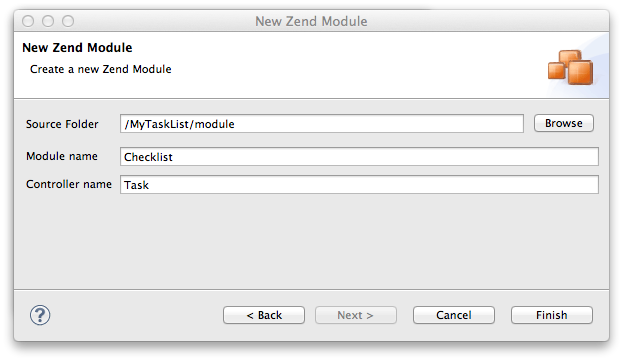
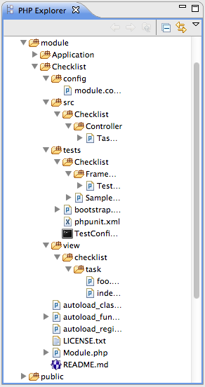
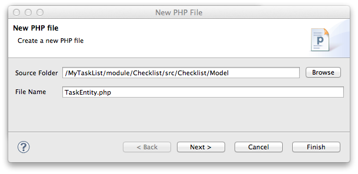

.. _getting-started-with-zend-studio.the-application:

The MyTaskList application
==========================

The application we are going to create is a to-do list manager. The application
will allow us to create to-do items and check them off.  We'll also need the
ability to edit and delete an item. As we are building a simple application, we
need just four pages:

+--------------------+---------------------------------------------------------------------------+
| Page               | Notes                                                                     |
+====================+===========================================================================+
| Checklist homepage | This will display the list of to-do items.                                |
+--------------------+---------------------------------------------------------------------------+
| Add new item       | This page will provide a form for adding a new item.                      |
+--------------------+---------------------------------------------------------------------------+
| Edit item          | This page will provide a form for editing an item.                        |
+--------------------+---------------------------------------------------------------------------+
| Delete item        | This page will confirm that we want to delete an item and then delete it. |
+--------------------+---------------------------------------------------------------------------+

Each page of the application is known as an action, and actions are grouped into
controllers within modules. Generally, related actions are placed into a single
controller; for instance, a news controller might have actions of ``current``,
``archived`` and ``view``.

We will store information about our to-do items in a database. A single table
will suffice with the following fields:

+------------+--------------+-------+--------------------------------------+
| Field name | Type         | Null? | Notes                                |
+============+==============+=======+======================================+
| id         | integer      | No    | Primary key, auto-increment          |
+------------+--------------+-------+--------------------------------------+
| title      | varchar(100) | No    | Name of the file on disk             |
+------------+--------------+-------+--------------------------------------+
| completed  | tinyint      | No    | Zero if not done, one if done        |
+------------+--------------+-------+--------------------------------------+
| created    | datetime     | No    | Date that the to-do item was created |
+------------+--------------+-------+--------------------------------------+

We are going to use MySQL, via PHP's PDO driver, so create a database called
``mytasklist`` using your preferred MySQL client, and run these SQL statements
to create the task_item table and some sample data:

.. code:: sql

    CREATE TABLE task_item (
        id INT NOT NULL AUTO_INCREMENT,
        title VARCHAR(100) NOT NULL,
        completed TINYINT NOT NULL DEFAULT '0',
        created DATETIME NOT NULL,

        PRIMARY KEY (id)
    );

    INSERT INTO task_item (title, completed, created)
        VALUES ('Purchase conference ticket', 0, NOW());
    INSERT INTO task_item (title, completed, created)
        VALUES ('Book airline ticket', 0, NOW());
    INSERT INTO task_item (title, completed, created)
        VALUES ('Book hotel', 0, NOW());
    INSERT INTO task_item (title, completed, created)
        VALUES ('Enjoy conference', 0, NOW());

Note that if you have Zend Studio, you can use the built-in Database
Connectivity features. This if found in the Database Development perspective
(Window | Open Perspective | Other | Database Development menu item) and further
details are in the `Zend Studio manual <http://files.zend.com/help/Zend-
Studio/content/data_tools_platform.htm>`_\ .

The Checklist module
--------------------

We will create all our code within a module called *Checklist*. The
``Checklist`` module will, therefore, contain our controllers, models, forms and
views, along with specific configuration files.

We create our new ``Checklist`` module in Zend Studio. In the PHP Explorer on
the left, right click on the MyTaskList project folder and choose New -> Zend
Framework Item. Click on Zend Module and press Next. The Source Folder should
already be set to ``/MyTaskList/module``. Enter *Checklist* as the Module name
and *Task* as the Controller name and then press Finish:

The wizard will now go ahead and create a blank module for us and register it
with the Module Manager's ``application.config.php``. You can see what it has
done in the PHP Explorer view under the ``module`` folder:

As you can see the Checklist module has separate directories for the different
types of files we will have. The ``config`` folder contains configuration files,
and the PHP files that contain classes within the ``Checklist`` namespace live
in the ``src/Checklist`` directory.  The ``view`` directory also has a sub-
folder called ``checklist`` for our module's view scripts, and the ``tests``
folder contains PHPUnit test files.

The Module class
----------------

As mentioned earlier, a module's ``Module`` class contains methods that are
called during the start-up process and is also used to register listeners that
will be triggered during the dispatch process. The ``Module`` class created for
us contains three methods: ``getAutoloaderConfig()``, ``getConfig()`` and
``onBootstrap()`` which are called by the Module Manager during start-up.

Autoloading files
~~~~~~~~~~~~~~~~~

Our ``getAutoloaderConfig()`` method returns an array that is compatible with
ZF2's ``AutoloaderFactory``. It is configured for us with both a classmap file
(``autoload_classmap.php``) and a standard autoloader to load any files in
``src/Checklist`` according to the `PSR-0 <https://github.com/php-fig/fig-
standards/blob/master/accepted/PSR-0.md>`_ rules .

Classmap autoloading is faster, but requires adding each new class you create to
the array within the autoload_classmap.php file, which slows down development.
The standard autoloader, however, doesn't have this requirement and will always
load a class if its file is named correctly. This allows us to develop quickly
by creating new classes when we need them and then gain a performance boost by
using the classmap autoloader in production. Zend Framework 2 provides
``bin/classmap_generator.php`` to create and update the file.

Configuration
~~~~~~~~~~~~~

The ``getConfig()`` method in ``Checklist\Module`` is called by the Module
Manager to retrieve the configuration information for this module. By tradition,
this method simply loads the ``config/module.config.php`` file which is an
associative array. In practice, the Module Manager requires that the returned
value from ``getConfig()`` be a ``Traversable``, which means that you can use
any configuration format that ``Zend\Config`` supports. You will find, though,
that most examples use arrays as they are easy to understand and fast.

The actual configuration information is placed in ``config/module.config.php``.
This nested array provides the key configuration for our module. The
``controllers`` sub-array is used to register this module's controller classes
with the Controller Service Manager which is used by the dispatcher to
instantiate a controller. The one controller that we need, ``TaskController``,
is already registered for us.

The ``router`` sub-array provides the configuration of the routes that are used
by this module. A route is the way that a URL is mapped to a to a particular
action method within a controller class. Zend Studio's default configuration is
set up so that a URL of ``/checklist/foo/bar`` maps to the ``barAction()``
method of the ``FooController`` within the ``Checklist`` module. We will modify
this later.

Finally, the ``view_manager`` sub-array within the ``module.config.php`` file is
used to register the directory where our view files are with the View sub-
system. This means that within the ``view/checklist`` sub-folder, there is a
folder for each controller. We have one controller, ``TaskController``, so there
is a single sub-folder in ``view/checklist`` called ``task``. Within this
folder, there are separate ``.phtml`` files which contain the specific HTML for
each action of our module.

Registering events
~~~~~~~~~~~~~~~~~~

The ``onBootstrap()`` method in the ``Module`` class is the easiest place to
register listeners for the MVC events that are triggered by the Event Manager.
Note that the default method body provided by Zend Studio is not needed as the
``ModuleRouteListener`` is already registered by the ``Application`` module. We
do not have to register any events for this tutorial, so go ahead and delete the
entire ``OnBootstrap()`` method.

The application's pages
=======================

As we have four pages that all apply to tasks, we will group them in a single
controller called ``TaskController`` within our ``Checklist`` module as four
actions. Each action has a related URL which will result in that action being
dispatched. The four actions and URLs are:

+--------------+------------------+------------+
| Page         | URL              | Action     |
+==============+==================+============+
| Homepage     | ``/task``        | ``index``  |
+--------------+------------------+------------+
| Add new task | ``/task/add``    | ``add``    |
+--------------+------------------+------------+
| Edit task    | ``/task/edit``   | ``edit``   |
+--------------+------------------+------------+
| Delete task  | ``/task/delete`` | ``delete`` |
+--------------+------------------+------------+

The mapping of a URL to a particular action is done using routes that are
defined in the module's ``module.config.php`` file. As noted earlier, the
configuration file, ``module.config.php`` created by Zend Studio has a route
called ``checklist`` set up for us.

Routing
-------

The default route provided for us isn't quite what we need. The ``checklist``
route is defined like this:

**module/Checklist/src/config/module.config.php:**

.. code-block:: php
   :linenos:

    'router' => array(
        'routes' => array(
            'checklist' => array(
                'type'    => 'Literal',
                'options' => array(
                    'route'    => '/task',
                    'defaults' => array(
                        '__NAMESPACE__' => 'Checklist\Controller',
                        'controller'    => 'Task',
                        'action'        => 'index',
                    ),
                ),
                'may_terminate' => true,
                'child_routes' => array(
                    'default' => array(
                        'type'    => 'Segment',
                        'options' => array(
                            'route'    => '/[:controller[/:action]]',
                        ),
                    ),
                ),
            ),

This defines a main route called ``checklist``, which maps the URL ``/task`` to
the index action of the Task controller and then there is a child route called
``default`` which maps ``/task/{controller name}/{action name}`` to the *{action
name}* action of the *{controller name}* controller. This means that, by
default, the URL to call the *add* action of the Task controller would be
``/task/task/add``. This doesn't look very nice and we would like to shorten it
to ``/task/add``.

To fix this, we will rename the route from ``checklist`` to ``task`` because
this route will be solely for the Task controller. We will then redefine it to
be a single ``Segment`` type route that can handle actions as well as just route
to the index action

Open ``module/Checklist/config/module.config.php`` in Zend Studio and change the
entire router section of the array to be:

**module/Checklist/src/config/module.config.php:**

.. code-block:: php

    'router' => array(
        'routes' => array(
            'task' => array(
                'type'    => 'Segment',
                'options' => array(
                    'route'    => '/task[/:action[/:id]]',
                    'defaults' => array(
                        '__NAMESPACE__' => 'Checklist\Controller',
                        'controller'    => 'Task',
                        'action'        => 'index',
                    ),
                    'constraints' => array(
                        'action' => '(add|edit|delete)',
                        'id'     => '[0-9]+',
                    ),
                ),
            ),
        ),
    ),

We have now renamed the route to task and have set it up as a ``Segment`` route
with two optional parameters in the URL: ``action`` and ``id``. We have set a
default of ``index`` for the ``action``, so that if the URL is simply ``/task``,
then we shall use the *index* action in our controller.

The optional ``constraints`` section allow us to specify regular expression
patterns that match the characters that we expect for a given parameter. For
this route, we have specified that the ``action`` parameter must be either add,
edit or delete and that the ``id`` parameter must only contain numbers.

The routing for our Checklist module is now set up, so we can now turn our
attention to the controller.

The TaskController
------------------

In Zend Framework 2, the controller is a class that is generally called
``{Controller name}Controller``. Note that ``{Controller name}`` starts with a
capital letter. This class lives in a file called ``{Controller
name}Controller.php`` within the ``Controller`` directory for the module. In our
case that's the ``module/Checklist/src/Checklist/Controller`` directory. Each
action is a public function within the controller class that is named ``{action
name}Action``. In this case ``{action name}`` should start with a lower case
letter.

Note that this is merely a convention. Zend Framework 2's only restrictions on a
controller is that it must implement the ``Zend\Stdlib\Dispatchable`` interface.
The framework provides two abstract classes that do this for us:
``Zend\Mvc\Controller\ActionController`` and
``Zend\Mvc\Controller\RestfulController``. We'll be using the
``AbstractActionController``, but if you're intending to write a RESTful web service,
``AbstractRestfulController`` may be useful.

Zend Studio's module creation wizard has already created ``TaskController`` for
us with two action methods in it: ``indexAction()`` and ``fooAction()``. Remove
the ``fooAction()`` method and the default “Copyright Zend” DocBlock comment at
the top of the file. Your controller should now look like this:

**module/Checklist/src/Checklist/Controller/TaskController.php:**

.. code-block:: php
   :linenos:

    namespace Checklist\Controller;

    use Zend\Mvc\Controller\AbstractActionController;

    class TaskController extends AbstractActionController
    {
        public function indexAction()
        {
            return array();
        }

    }

This controller now contains the action for the home page which will display our
list of to-do items. We now need to create a model-layer that can retrieve the
tasks from the database for display.

The model
---------

It is time to look at the model section of our application. Remember that the
model is the part that deals with the application's core purpose (the so-called
"business rules") and, in our case, deals with the database. Zend Framework does
not provide a ``Zend\Model`` component because the model is your business logic
and it's up to you to decide how you want it to work.

There are many components that you can use for this depending on your needs. One
approach is to have model classes represent each entity in your application and
then use mapper objects that load and save entities to the database. Another is
to use an Object-relational mapping (ORM) technology, such as Doctrine or
Propel. For this tutorial, we are going to create a fairly simple model layer
using an entity and a mapper that uses the ``Zend\Db`` component. In a larger,
more complex, application, you would probably also have a service class that
interfaces between the controller and the mapper.

We already have created the database table and added some sample data, so let’s
start by creating an entity object. An entity object is a simple PHP object that
represents a thing in the application. In our case, it represents a task to be
completed, so we will call it ``TaskEntity``.

Create a new folder in ``module/Checklist/src/Checklist`` called ``Model`` and
then right click on the new ``Model`` folder and choose New -> PHP File. In the
New PHP File dialog, set the File Name to ``TaskEntity.php`` as shown and then
press Finish.

This will create a blank PHP file. Update it so that it looks like this:

**module/Checklist/src/Checklist/Model/TaskEntity.php:**

.. code-block:: php
   :linenos:
    
    <?php
    namespace Checklist\Model;

    class TaskEntity
    {
        protected $id;
        protected $title;
        protected $completed = 0;
        protected $created;
        
        public function __construct()
        {
            $this->created = date('Y-m-d H:i:s');
        }
        
        public function getId()
        {
          return $this->id;
        }
        
        public function setId($Value)
        {
          $this->id = $Value;
        }
        
        public function getTitle()
        {
          return $this->title;
        }
        
        public function setTitle($Value)
        {
          $this->title = $Value;
        }
        
        public function getCompleted()
        {
          return $this->completed;
        }
        
        public function setCompleted($Value)
        {
          $this->completed = $Value;
        }
            
        public function getCreated()
        {
          return $this->created;
        }
        
        public function setCreated($Value)
        {
          $this->created = $Value;
        }
    }

The ``Task`` entity is a simple PHP class with four properties with getter and
setter methods for each property. We also have a constructor to fill in the
``created`` property. If you are using Zend Studio rather than Eclipse PDT, then
you can generate the getter and setter methods by right clicking in the file and
choosing `Source -> Generate Getters and Setters <http://files.zend.com/help
/Zend-Studio-10/zend-studio.htm#creating_getters_and_setters.htm>`_\ .

We now need a mapper class which is responsible for persisting task entities to
the database and populating them with new data. Again, right click on the Model
folder and choose New -> PHP File and create a PHP file called
``TaskMapper.php``. Update it so that it looks like this:

**module/Checklist/src/Checklist/Model/TaskMapper.php:**

.. code-block:: php
   :linenos:
    
    <?php
    namespace Checklist\Model;

    use Zend\Db\Adapter\Adapter;
    use Checklist\Model\TaskEntity;
    use Zend\Stdlib\Hydrator\ClassMethods;
    use Zend\Db\Sql\Sql;
    use Zend\Db\Sql\Select;
    use Zend\Db\ResultSet\HydratingResultSet;

    class TaskMapper
    {
        protected $tableName = 'task_item';
        protected $dbAdapter;
        protected $sql;

        public function __construct(Adapter $dbAdapter)
        {
            $this->dbAdapter = $dbAdapter;
            $this->sql = new Sql($dbAdapter);
            $this->sql->setTable($this->tableName);
        }
        
        public function fetchAll()
        {
            $select = $this->sql->select();
            $select->order(array('completed ASC', 'created ASC'));

            $statement = $this->sql->prepareStatementForSqlObject($select);
            $results = $statement->execute();
            
            $entityPrototype = new TaskEntity();
            $hydrator = new ClassMethods();
            $resultset = new HydratingResultSet($hydrator, $entityPrototype);
            $resultset->initialize($results);
            return $resultset;
        }
    }

Within this mapper class we have implemented the ``fetchAll()`` method and a
constructor. There's quite a lot going on here as we're dealing with the
``Zend\Db`` component, so let's break it down. Firstly we have the constructor
which takes a ``Zend\Db\Adapter\Adapter`` parameter as we can't do anything
without a database adapter. ``Zend\Db\Sql`` is an object that abstracts SQL
statements that are compatible with the underlying database adapter in use. We
are going to use this object for all of our interaction with the database, so we
create it in the constructor.

The ``fetchAll()`` method retrieves data from the database and places it into a
``HydratingResultSet`` which is able to return populated ``TaskEntity`` objects
when iterating. To do this, we have three distinct things happening. Firstly we
retrieve a ``Select`` object from the ``Sql`` object and use the ``order()``
method to place completed items last. We then create a ``Statement`` object and
execute it to retrieve the data from the database. The ``$results`` object can
be iterated over, but will return an array for each row retrieved but we want a
`` TaskEntity`` object. To get this, we create a ``HydratingResultSet`` which
requires a hydrator and an entity prototype to work.

The hydrator is an object that knows how to populate an entity. As there are
many ways to create an entity object, there are multiple hydrator objects
provided with ZF2 and you can create your own. For our ``TaskEntity``, we use
the ``ClassMethods`` hydrator which expects a getter and a setter method for
each column in the resultset. Another useful hydrator is ``ArraySerializable``
which will call ``getArrayCopy()`` and ``populate()`` on the entity object when
transferring data. The ``HydratingResultSet`` uses the prototype design pattern
when creating the entities when iterating. This means that instead of
instantiating a new instance of the entity class on each iteration, it clones
the provided instantiated object.  See http://ralphschindler.com/2012/03/09/php-
constructor-best-practices-and-the-prototype-pattern for more details.

Finally, ``fetchAll()`` returns the result set object with the correct data in it.

Using Service Manager to configure the database credentials and inject into the controller
------------------------------------------------------------------------------------------

In order to always use the same instance of our ``TaskMapper``, we will use the
Service Manager to define how to create the mapper and also to retrieve it when
we need it. This is most easily done in the ``Module`` class where we create a
method called ``getServiceConfig()`` which is automatically called by the Module
Manager and applied to the Service Manager. We'll then be able to retrieve it in
our controller when we need it.

To configure the Service Manager we can either supply the name of the class to
be instantiated or create a factory  (closure or callback) method that
instantiates the object when the Service Manager needs it. We start by
implementing getServiceConfig() and write a closure that creates a
``TaskMapper`` instance. Add this method to the ``Module`` class:

**module/Checklist/Module.php:**

.. code-block:: php
   :linenos:

    class Module
    {
        public function getServiceConfig()
        {
            return array(
                'factories' => array(
                    'TaskMapper' => function ($sm) {
                        $dbAdapter = $sm->get('Zend\Db\Adapter\Adapter');
                        $mapper = new TaskMapper($dbAdapter);
                        return $mapper;
                    }
                ),
            );
        }
    // ...

Don't forget to add ``use Checklist\Model\TaskMapper;`` to the list of use
statements at the top of the file.

The ``getServiceConfig()`` method returns an array of class creation definitions
that are all merged together by the Module Manager before passing to the Service
Manager.  To create a service within the Service Manager we use a unique key
name, ``TaskMapper``. As this has to be unique, it's common (but not a
requirement) to use the fully qualified class name as the Service Manager key
name. We then define a closure that the Service Manager will call when it is
asked for an instance of ``TaskMapper``. We can do anything we like in this
closure, as long as we return an instance of the required class. In this case,
we retrieve an instance of the database adapter from the Service Manager and
then instantiate a ``TaskMapper`` object and return it. This is an example of
the `Dependency Injection pattern
<http://www.martinfowler.com/articles/injection.html>`_ at work as we have
injected the database adapter into the mapper. This also means that Service
Manager can be used as a Dependency Injection Container in addition to a Service
Locator.

As we have requested an instance of ``Zend\Db\Adapter\Adapter`` from the Service
Manager, we also need to configure the Service Manager so that it knows how to
instantiate a ``Zend\Db\Adapter\Adapter``. This is done using a class provided
by Zend Framework called ``Zend\Db\Adapter\AdapterServiceFactory`` which we can
configure within the merged configuration system. As we noted earlier, the
Module Manager merges all the configuration from each module and then merges in
the files in the ``config/autoload`` directory (``*.global.php`` and then
``*.local.php`` files). We'll add our database configuration information to
``global.php`` which you should commit to your version control system.You can
then use ``local.php`` (outside of the VCS) to store the credentials for your
database.

Open ``config/autoload/global.php`` and replace the empty array with:

**config/autoload/global.php:**

.. code-block:: php
   :linenos:

    return array(
        'service_manager' => array(
            'factories' => array(
                'Zend\Db\Adapter\Adapter' =>
                    'Zend\Db\Adapter\AdapterServiceFactory',
            ),
        ),
        'db' => array(
            'driver' => 'Pdo',
            'dsn' => 'mysql:dbname=mytasklist;hostname=localhost',
            'driver_options' => array(
                PDO::MYSQL_ATTR_INIT_COMMAND => 'SET NAMES \'UTF8\''
            ),
        ),
    );

Firstly, we provide additional Service Manager configuration in the
service_manager section, This array works exactly the same as the one in
``getServiceConfig()``, except that you should not use closures in a config file
as if you do Module Manager will not be able to cache the merged configuration
information. As we already have an implementation for creating a
``Zend\Db\Adapter\Adapter``, we use the ``factories`` sub-array to map the key
name of ``Zend\Db\Adapter\Adapter`` to the string name of the factory class
(``Zend\Db\Adapter\AdapterServiceFactory``') and the Service Manager will then
use Zend\Db\Adapter\AdapterServiceFactory to instantiate a database adapter for
us.

The ``Zend\Db\Adapter\AdapterServiceFactory`` object looks for a key called
``db`` in the configuration array and uses this to configure the database
adapter. Therefore, we create the ``db`` key in our ``global.php`` file with the
relevant configuration data. The only data that is missing is the username and
password required to connect to the database. We do not want to store this in
the version control system, so we store this in the ``local.php`` configuration
file, which, by default, is ignored by git.

Open ``config/autoload/local.php`` and replace the empty array with:

**config/autoload/local.php:**

.. code-block:: php
   :linenos:

    return array(
        'db' => array(
            'username' => 'YOUR_USERNAME',
            'password' => 'YOUR_PASSWORD',
        ),
    );

Obviously you should replace YOUR_USERNAME and YOUR_PASSWORD with the correct
credentials.

Now that the Service Manager can create a ``TaskMapper`` instance for us, we can
add a method to the controller to retrieve it. Add ``getTaskMapper()`` to the
``TaskController`` class:

**module/Checklist/src/Checklist/Controller/TaskController.php:**

.. code-block:: php
   :linenos:

    public function getTaskMapper()
    {
        $sm = $this->getServiceLocator();
        return $sm->get('TaskMapper');
    }

We can now call ``getTaskMapper()`` from within our controller whenever we need
to interact with our model layer. Let's start with a list of tasks when the
index action is called.
