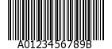
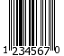

.. _zend.barcode.objects.details:

Description of shipped barcodes
-------------------------------

You will find below detailed information about all barcode types shipped by default with Zend Framework.

.. _zend.barcode.objects.details.error:

Zend\\Barcode\\Object\\Error
^^^^^^^^^^^^^^^^^^^^^^^^^^^^

.. image:: ../images/zend.barcode.objects.details.error.png
   :width: 400
   :align: center

This barcode is a special case. It is internally used to automatically render an exception caught by the
``Zend\Barcode`` component.

.. _zend.barcode.objects.details.code128:

Zend\\Barcode\\Object\\Code128
^^^^^^^^^^^^^^^^^^^^^^^^^^^^^^

- **Name:** Code 128

- **Allowed characters:** the complete ASCII-character set

- **Checksum:** optional (modulo 103)

- **Length:** variable

There are no particular options for this barcode.

.. _zend.barcode.objects.details.codabar:

Zend\\Barcode\\Object\\Codabar
^^^^^^^^^^^^^^^^^^^^^^^^^^^^^^

- **Name:** Codabar (or Code 2 of 7)

- **Allowed characters:**'0123456789-$:/.+' with 'ABCD' as start and stop characters

- **Checksum:** none

- **Length:** variable

There are no particular options for this barcode.

.. _zend.barcode.objects.details.code25:

Zend\\Barcode\\Object\\Code25
^^^^^^^^^^^^^^^^^^^^^^^^^^^^^

.. image:: ../images/zend.barcode.objects.details.code25.png
   :width: 152
   :align: center

- **Name:** Code 25 (or Code 2 of 5 or Code 25 Industrial)

- **Allowed characters:**'0123456789'

- **Checksum:** optional (modulo 10)

- **Length:** variable

There are no particular options for this barcode.

.. _zend.barcode.objects.details.code25interleaved:

Zend\\Barcode\\Object\\Code25interleaved
^^^^^^^^^^^^^^^^^^^^^^^^^^^^^^^^^^^^^^^^

.. image:: ../images/zend.barcode.objects.details.int25.png
   :width: 101
   :align: center

This barcode extends ``Zend\Barcode\Object\Code25`` (Code 2 of 5), and has the same particulars and options, and
adds the following:

- **Name:** Code 2 of 5 Interleaved

- **Allowed characters:**'0123456789'

- **Checksum:** optional (modulo 10)

- **Length:** variable (always even number of characters)

Available options include:

.. _zend.barcode.objects.details.code25interleaved.table:

.. table:: Zend\\Barcode\\Object\\Code25interleaved Options

   +--------------+---------+-------------+----------------------------------------------------------+
   |Option        |Data Type|Default Value|Description                                               |
   +==============+=========+=============+==========================================================+
   |withBearerBars|Boolean  |FALSE        |Draw a thick bar at the top and the bottom of the barcode.|
   +--------------+---------+-------------+----------------------------------------------------------+

.. note::

   If the number of characters is not even, ``Zend\Barcode\Object\Code25interleaved`` will automatically prepend
   the missing zero to the barcode text.

.. _zend.barcode.objects.details.ean2:

Zend\\Barcode\\Object\\Ean2
^^^^^^^^^^^^^^^^^^^^^^^^^^^

.. image:: ../images/zend.barcode.objects.details.ean2.png
   :width: 41
   :align: center

This barcode extends ``Zend\Barcode\Object\Ean5`` (*EAN* 5), and has the same particulars and options, and adds the
following:

- **Name:** *EAN*-2

- **Allowed characters:**'0123456789'

- **Checksum:** only use internally but not displayed

- **Length:** 2 characters

There are no particular options for this barcode.

.. note::

   If the number of characters is lower than 2, ``Zend\Barcode\Object\Ean2`` will automatically prepend the missing
   zero to the barcode text.

.. _zend.barcode.objects.details.ean5:

Zend\\Barcode\\Object\\Ean5
^^^^^^^^^^^^^^^^^^^^^^^^^^^

.. image:: ../images/zend.barcode.objects.details.ean5.png
   :width: 68
   :align: center

This barcode extends ``Zend\Barcode\Object\Ean13`` (*EAN* 13), and has the same particulars and options, and adds
the following:

- **Name:** *EAN*-5

- **Allowed characters:**'0123456789'

- **Checksum:** only use internally but not displayed

- **Length:** 5 characters

There are no particular options for this barcode.

.. note::

   If the number of characters is lower than 5, ``Zend\Barcode\Object\Ean5`` will automatically prepend the missing
   zero to the barcode text.

.. _zend.barcode.objects.details.ean8:

Zend\\Barcode\\Object\\Ean8
^^^^^^^^^^^^^^^^^^^^^^^^^^^

.. image:: ../images/zend.barcode.objects.details.ean8.png
   :width: 82
   :align: center

This barcode extends ``Zend\Barcode\Object\Ean13`` (*EAN* 13), and has the same particulars and options, and adds
the following:

- **Name:** *EAN*-8

- **Allowed characters:**'0123456789'

- **Checksum:** mandatory (modulo 10)

- **Length:** 8 characters (including checksum)

There are no particular options for this barcode.

.. note::

   If the number of characters is lower than 8, ``Zend\Barcode\Object\Ean8`` will automatically prepend the missing
   zero to the barcode text.

.. _zend.barcode.objects.details.ean13:

Zend\\Barcode\\Object\\Ean13
^^^^^^^^^^^^^^^^^^^^^^^^^^^^

.. image:: ../images/zend.barcode.objects.details.ean13.png
   :width: 113
   :align: center

- **Name:** *EAN*-13

- **Allowed characters:**'0123456789'

- **Checksum:** mandatory (modulo 10)

- **Length:** 13 characters (including checksum)

There are no particular options for this barcode.

.. note::

   If the number of characters is lower than 13, ``Zend\Barcode\Object\Ean13`` will automatically prepend the
   missing zero to the barcode text.

   The option ``withQuietZones`` has no effect with this barcode.

.. _zend.barcode.objects.details.code39:

Zend\\Barcode\\Object\\Code39
^^^^^^^^^^^^^^^^^^^^^^^^^^^^^

.. image:: ../images/zend.barcode.introduction.example-1.png
   :width: 275
   :align: center

- **Name:** Code 39

- **Allowed characters:**'0123456789ABCDEFGHIJKLMNOPQRSTUVWXYZ -.$/+%'

- **Checksum:** optional (modulo 43)

- **Length:** variable

.. note::

   ``Zend\Barcode\Object\Code39`` will automatically add the start and stop characters ('\*') for you.

There are no particular options for this barcode.

.. _zend.barcode.objects.details.identcode:

Zend\\Barcode\\Object\\Identcode
^^^^^^^^^^^^^^^^^^^^^^^^^^^^^^^^

.. image:: ../images/zend.barcode.objects.details.identcode.png
   :width: 137
   :align: center

This barcode extends ``Zend\Barcode\Object\Code25interleaved`` (Code 2 of 5 Interleaved), and inherits some of its
capabilities; it also has a few particulars of its own.

- **Name:** Identcode (Deutsche Post Identcode)

- **Allowed characters:**'0123456789'

- **Checksum:** mandatory (modulo 10 different from Code25)

- **Length:** 12 characters (including checksum)

There are no particular options for this barcode.

.. note::

   If the number of characters is lower than 12, ``Zend\Barcode\Object\Identcode`` will automatically prepend
   missing zeros to the barcode text.

.. _zend.barcode.objects.details.itf14:

Zend\\Barcode\\Object\\Itf14
^^^^^^^^^^^^^^^^^^^^^^^^^^^^

.. image:: ../images/zend.barcode.objects.details.itf14.png
   :width: 155
   :align: center

This barcode extends ``Zend\Barcode\Object\Code25interleaved`` (Code 2 of 5 Interleaved), and inherits some of its
capabilities; it also has a few particulars of its own.

- **Name:** *ITF*-14

- **Allowed characters:**'0123456789'

- **Checksum:** mandatory (modulo 10)

- **Length:** 14 characters (including checksum)

There are no particular options for this barcode.

.. note::

   If the number of characters is lower than 14, ``Zend\Barcode\Object\Itf14`` will automatically prepend missing
   zeros to the barcode text.

.. _zend.barcode.objects.details.leitcode:

Zend\\Barcode\\Object\\Leitcode
^^^^^^^^^^^^^^^^^^^^^^^^^^^^^^^

.. image:: ../images/zend.barcode.objects.details.leitcode.png
   :width: 155
   :align: center

This barcode extends ``Zend\Barcode\Object\Identcode`` (Deutsche Post Identcode), and inherits some of its
capabilities; it also has a few particulars of its own.

- **Name:** Leitcode (Deutsche Post Leitcode)

- **Allowed characters:**'0123456789'

- **Checksum:** mandatory (modulo 10 different from Code25)

- **Length:** 14 characters (including checksum)

There are no particular options for this barcode.

.. note::

   If the number of characters is lower than 14, ``Zend\Barcode\Object\Leitcode`` will automatically prepend
   missing zeros to the barcode text.

.. _zend.barcode.objects.details.planet:

Zend\\Barcode\\Object\\Planet
^^^^^^^^^^^^^^^^^^^^^^^^^^^^^

.. image:: ../images/zend.barcode.objects.details.planet.png
   :width: 286
   :align: center

- **Name:** Planet (PostaL Alpha Numeric Encoding Technique)

- **Allowed characters:**'0123456789'

- **Checksum:** mandatory (modulo 10)

- **Length:** 12 or 14 characters (including checksum)

There are no particular options for this barcode.

.. _zend.barcode.objects.details.postnet:

Zend\\Barcode\\Object\\Postnet
^^^^^^^^^^^^^^^^^^^^^^^^^^^^^^

.. image:: ../images/zend.barcode.objects.details.postnet.png
   :width: 286
   :align: center

- **Name:** Postnet (POSTal Numeric Encoding Technique)

- **Allowed characters:**'0123456789'

- **Checksum:** mandatory (modulo 10)

- **Length:** 6, 7, 10 or 12 characters (including checksum)

There are no particular options for this barcode.

.. _zend.barcode.objects.details.royalmail:

Zend\\Barcode\\Object\\Royalmail
^^^^^^^^^^^^^^^^^^^^^^^^^^^^^^^^

.. image:: ../images/zend.barcode.objects.details.royalmail.png
   :width: 158
   :align: center

- **Name:** Royal Mail or *RM4SCC* (Royal Mail 4-State Customer Code)

- **Allowed characters:**'0123456789ABCDEFGHIJKLMNOPQRSTUVWXYZ'

- **Checksum:** mandatory

- **Length:** variable

There are no particular options for this barcode.

.. _zend.barcode.objects.details.upca:

Zend\\Barcode\\Object\\Upca
^^^^^^^^^^^^^^^^^^^^^^^^^^^

.. image:: ../images/zend.barcode.objects.details.upca.png
   :width: 115
   :align: center

This barcode extends ``Zend\Barcode\Object\Ean13`` (*EAN*-13), and inherits some of its capabilities; it also has a
few particulars of its own.

- **Name:** *UPC*-A (Universal Product Code)

- **Allowed characters:**'0123456789'

- **Checksum:** mandatory (modulo 10)

- **Length:** 12 characters (including checksum)

There are no particular options for this barcode.

.. note::

   If the number of characters is lower than 12, ``Zend\Barcode\Object\Upca`` will automatically prepend missing
   zeros to the barcode text.

   The option ``withQuietZones`` has no effect with this barcode.

.. _zend.barcode.objects.details.upce:

Zend\\Barcode\\Object\\Upce
^^^^^^^^^^^^^^^^^^^^^^^^^^^

This barcode extends ``Zend\Barcode\Object\Upca`` (*UPC*-A), and inherits some of its capabilities; it also has a
few particulars of its own. The first character of the text to encode is the system (0 or 1).

- **Name:** *UPC*-E (Universal Product Code)

- **Allowed characters:**'0123456789'

- **Checksum:** mandatory (modulo 10)

- **Length:** 8 characters (including checksum)

There are no particular options for this barcode.

.. note::

   If the number of characters is lower than 8, ``Zend\Barcode\Object\Upce`` will automatically prepend missing
   zeros to the barcode text.

.. note::

   If the first character of the text to encode is not 0 or 1, ``Zend\Barcode\Object\Upce`` will automatically
   replace it by 0.

   The option ``withQuietZones`` has no effect with this barcode.

