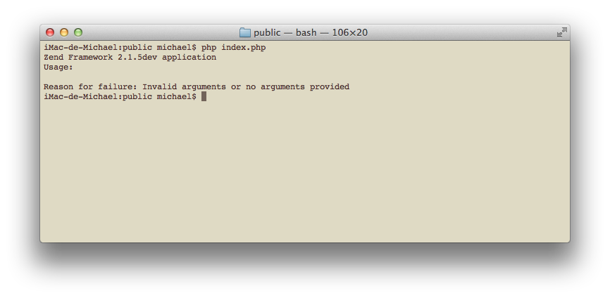
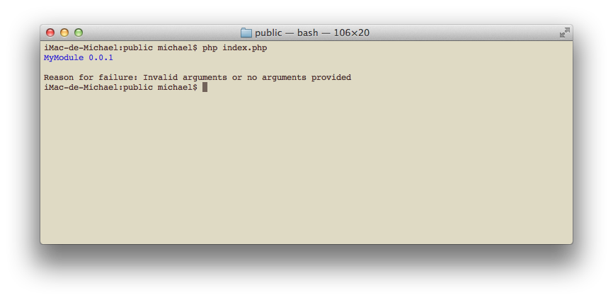
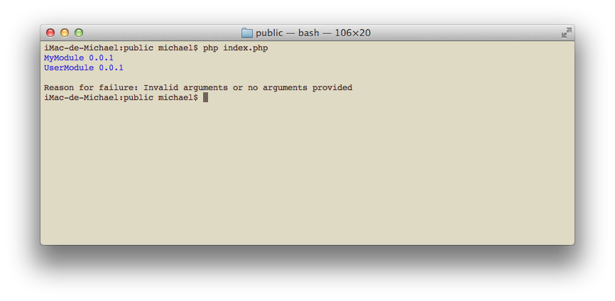
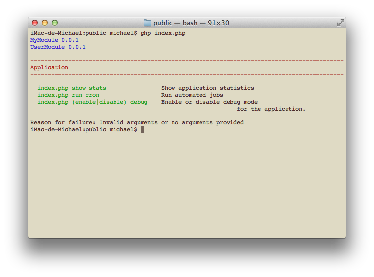
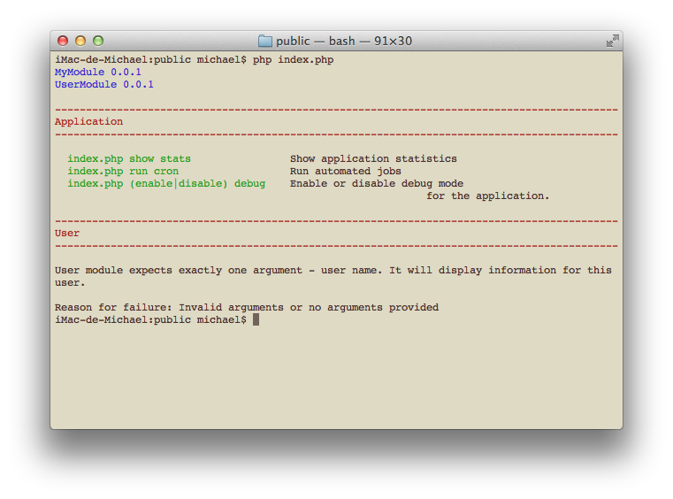
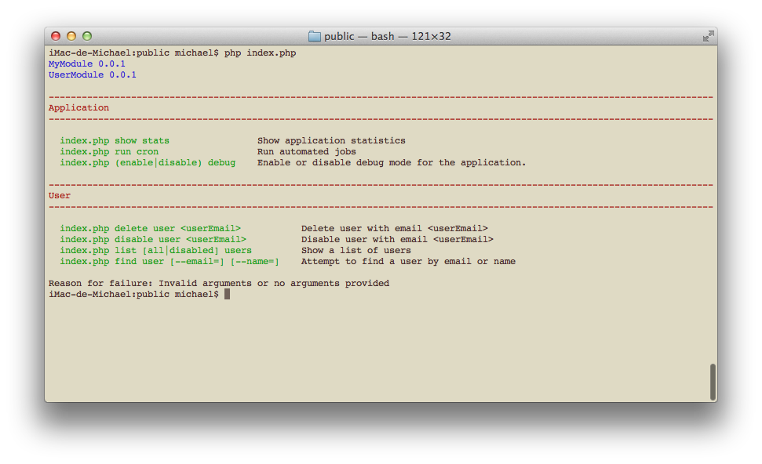
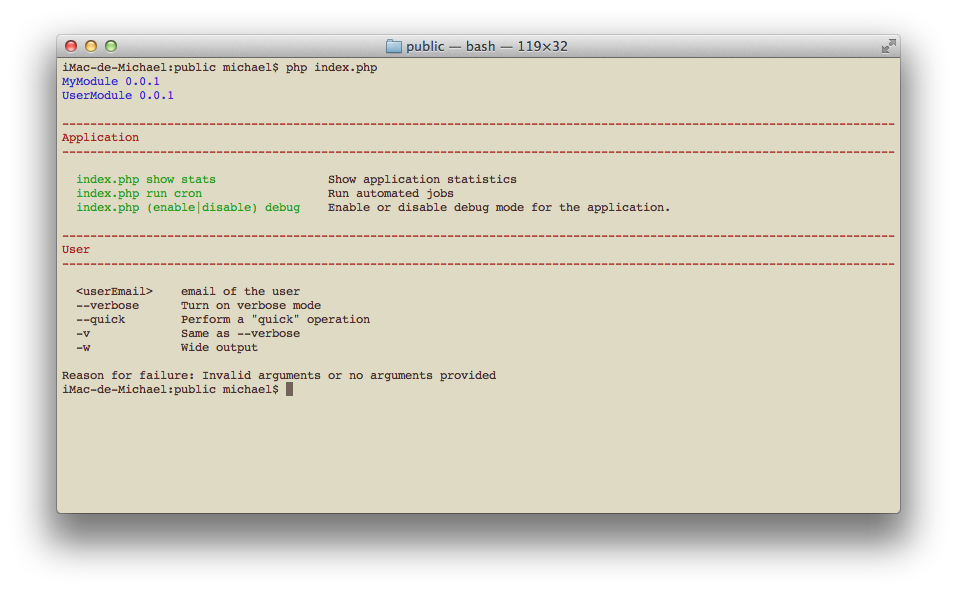
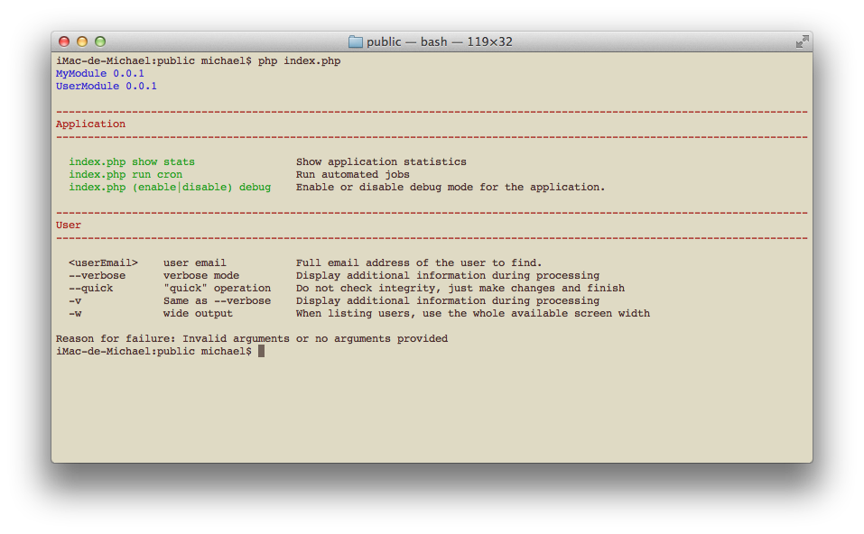
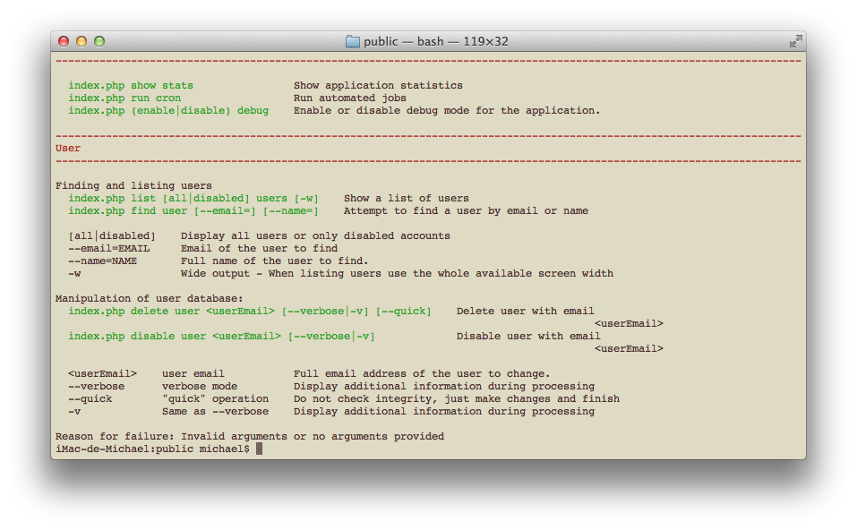

.. _zend.console.modules:

Console-aware modules
===========================

Zend Framework 2 has :doc:`native MVC integration with console<zend.console.introduction>`. The integration also
works with :doc:`modules loaded with Module Manager <zend.module-manager.intro>`.

ZF2 ships with ``RouteNotFoundStrategy`` which is responsible of displaying usage information inside Console,
in case the user has not provided any arguments, or arguments could not be understood. The strategy currently
supports two types of information: :ref:`application banners <banner>` and :ref:`usage information<usage>`.

.. _banner:

Application banner
------------------

The first time you run your ZF2 application in a Console, it will not be able to display any usage information or
present itself. You will see something like this:

Our Application module (and any other module) can provide **application banner**. In order to do so,
our Module class has to implement ``Zend\ModuleManager\Feature\ConsoleBannerProviderInterface``. Let's do this now.

.. code-block:: php
    :linenos:

    // modules/Application/Module.php
    <?php
    namespace Application;

    use Zend\ModuleManager\Feature\ConsoleBannerProviderInterface;
    use Zend\Console\Adapter\AdapterInterface as Console;

    class Module implements ConsoleBannerProviderInterface
    {
        /**
         * This method is defined in ConsoleBannerProviderInterface
         */
        public function getConsoleBanner(Console $console){
            return
                "==------------------------------------------------------==\n" .
                "        Welcome to my ZF2 Console-enabled app             \n" .
                "==------------------------------------------------------==\n" .
                "Version 0.0.1\n"
            ;
        }
    }

After running our application, we'll see our newly created banner.

Console banners can be provided by 1 or more modules. They will be joined together in the order modules are loaded.

Let's create and load second module that provides a banner.

.. code-block:: php
    :linenos:
    :emphasize-lines: 6

    <?php
    // config/application.config.php
    return array(
        'modules' => array(
            'Application',
            'User',     // < load user module in modules/User
        ),

User module will add-on a short info about itself:

.. code-block:: php
    :linenos:
    :emphasize-lines: 13-5

    // modules/User/Module.php
    <?php
    namespace User;

    use Zend\ModuleManager\Feature\ConsoleBannerProviderInterface;
    use Zend\Console\Adapter\AdapterInterface as Console;

    class Module implements ConsoleBannerProviderInterface
    {
        /**
         * This method is defined in ConsoleBannerProviderInterface
         */
        public function getConsoleBanner(Console $console){
            return "User Module BETA1";
        }
    }

Because ``User`` module is loaded after ``Application`` module, the result will look like this:

.. note::

    Application banner is displayed as-is - no trimming or other adjustments will be performed on the text. If you'd
    like to fit your banner inside console window, you could check its width with ``$console->getWidth()``.

.. _usage:

Usage information
------------------

In order to display usage information, our Module class has to implement
``Zend\ModuleManager\Feature\ConsoleUsageProviderInterface``. Let's modify our example and add new method:

.. code-block:: php
    :linenos:

    // modules/Application/Module.php
    <?php
    namespace Application;

    use Zend\ModuleManager\Feature\ConsoleBannerProviderInterface;
    use Zend\ModuleManager\Feature\ConsoleUsageProviderInterface;
    use Zend\Console\Adapter\AdapterInterface as Console;

    class Module implements ConsoleBannerProviderInterface, ConsoleUsageProviderInterface
    {
        public function getConsoleBanner(Console $console){ // ... }

        /**
         * This method is defined in ConsoleUsageProviderInterface
         */
        public function getConsoleUsage(Console $console){
            return array(
                'show stats'             => 'Show application statistics',
                'run cron'               => 'Run automated jobs',
                '(enable|disable) debug' => 'Enable or disable debug mode for the application.'
            );
        }
    }

This will display the following information:

Similar to :ref:`application banner <banner>` multiple modules can provide usage information,
which will be joined together and displayed to the user. The order in which usage information is displayed is the
order in which modules are loaded.

.. note::

    Usage info provided in modules **does not connect** with :doc:`console routing <zend.console.routes>`. You can
    describe console usage in any form you prefer and it does not affect how MVC handles console commands.
    In order to handle real console requests you need to define 1 or more :doc:`console routes <zend.console.routes>`.

.. _free-form:

Free-form text
^^^^^^^^^^^^^^^

In order to output free-form text as usage information, ``getConsoleUsage()`` can return a string,
or an array of strings, for example:

.. code-block:: php
    :linenos:

    public function getConsoleUsage(Console $console){
        return 'User module expects exactly one argument - user name. It will display information for this user.';
    }

.. note::

    The text provided is displayed as-is - no trimming or other adjustments will be performed. If you'd
    like to fit your usage information inside console window, you could check its width with ``$console->getWidth()``.

List of commands
^^^^^^^^^^^^^^^^^^

If ``getConsoleUsage()`` returns and associative array, it will be automatically aligned in 2 columns. The first
column will be prepended with script name (the entry point for the application). This is useful to display different
ways of running the application.

.. code-block:: php
    :linenos:

    public function getConsoleUsage(Console $console){
         return array(
            'delete user <userEmail>'        => 'Delete user with email <userEmail>',
            'disable user <userEmail>'       => 'Disable user with email <userEmail>',
            'list [all|disabled] users'      => 'Show a list of users',
            'find user [--email=] [--name=]' => 'Attempt to find a user by email or name',
         );
    }

.. note::

    Commands and their descriptions will be aligned in two columns, that fit inside Console window. If the window is
    resized, some texts might be wrapped but all content will be aligned accordingly. If you don't like this
    behavior, you can always return :ref:`free-form text <free-form>` that will not be transformed in any way.

List of params and flags
^^^^^^^^^^^^^^^^^^^^^^^^^

Returning an array of arrays from ``getConsoleUsage()`` will produce a listing of parameters. This is useful for
explaining flags, switches, possible values and other information. The output will be aligned in multiple columns for
readability.

Below is an example:

.. code-block:: php
    :linenos:

    public function getConsoleUsage(Console $console){
        return array(
            array( '<userEmail>'   , 'email of the user' ),
            array( '--verbose'     , 'Turn on verbose mode' ),
            array( '--quick'       , 'Perform a "quick" operation' ),
            array( '-v'            , 'Same as --verbose' ),
            array( '-w'            , 'Wide output')
        );
    }

Using this method, we can display more than 2 columns of information, for example:

.. code-block:: php
    :linenos:

    public function getConsoleUsage(Console $console){
        return array(
            array( '<userEmail>' , 'user email'        , 'Full email address of the user to find.' ),
            array( '--verbose'   , 'verbose mode'      , 'Display additional information during processing' ),
            array( '--quick'     , '"quick" operation' , 'Do not check integrity, just make changes and finish' ),
            array( '-v'          , 'Same as --verbose' , 'Display additional information during processing' ),
            array( '-w'          , 'wide output'       , 'When listing users, use the whole available screen width' )
        );
    }

.. note::

    All info will be aligned in one or more columns that fit inside Console window. If the window is
    resized, some texts might be wrapped but all content will be aligned accordingly. In case the number of columns
    changes (i.e. the array() contains different number of elements) a new table will be started,
    with new alignment and different column widths.

    If you don't like this behavior, you can always return :ref:`free-form text <free-form>` that will not be
    transformed in any way.

Mixing styles
^^^^^^^^^^^^^^

You can use mix together all of the above styles to provide comprehensive usage information, for example:

.. code-block:: php
    :linenos:

    public function getConsoleUsage(Console $console){
        return array(
            'Finding and listing users',
            'list [all|disabled] users [-w]'    => 'Show a list of users',
            'find user [--email=] [--name=]'    => 'Attempt to find a user by email or name',

            array('[all|disabled]',    'Display all users or only disabled accounts'),
            array('--email=EMAIL',     'Email of the user to find'),
            array('--name=NAME',       'Full name of the user to find.'),
            array('-w',                'Wide output - When listing users use the whole available screen width' ),

            'Manipulation of user database:',
            'delete user <userEmail> [--verbose|-v] [--quick]'  => 'Delete user with email <userEmail>',
            'disable user <userEmail> [--verbose|-v]'           => 'Disable user with email <userEmail>',

            array( '<userEmail>' , 'user email'        , 'Full email address of the user to change.' ),
            array( '--verbose'   , 'verbose mode'      , 'Display additional information during processing' ),
            array( '--quick'     , '"quick" operation' , 'Do not check integrity, just make changes and finish' ),
            array( '-v'          , 'Same as --verbose' , 'Display additional information during processing' ),

        );
    }

