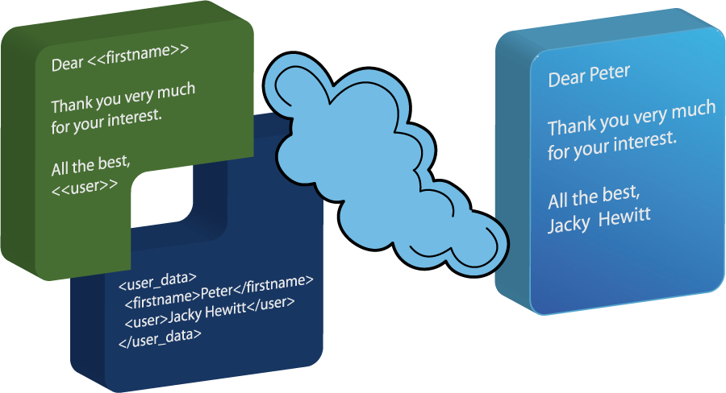
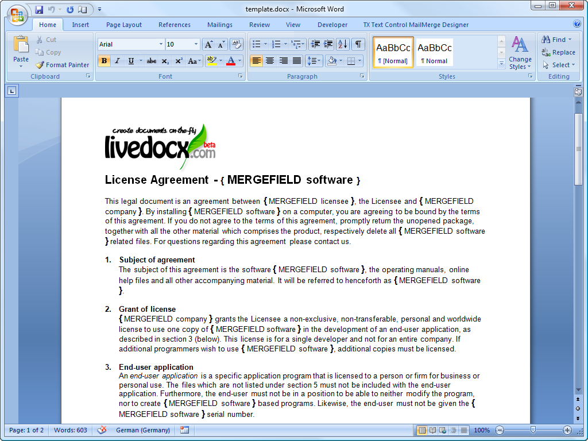
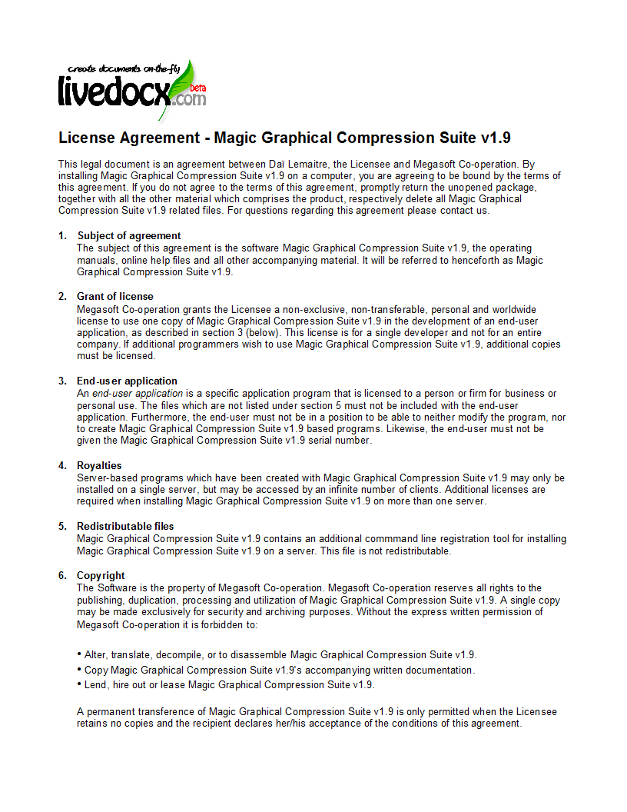

.. _zend.service.livedocx:

ZendService\LiveDocx
=====================

.. _zend.service.livedocx.introduction:

Introduction to LiveDocx
------------------------

LiveDocx is a *SOAP* service that allows developers to generate word processing documents by combining structured
data from *PHP* with a template, created in a word processor. The resulting document can be saved as a *PDF*,
*DOCX*, *DOC*, *HTML* or *RTF* file. LiveDocx implements `mail-merge`_ in *PHP*.

The family of ``ZendService\LiveDocx`` components provides a clean and simple interface to the `LiveDocx API`_ and
additionally offers functionality to improve network performance. ``ZendService\LiveDocx`` is part of the official Zend Framework family, but has to be downloaded and installed in addition to the core components of the Zend Framework. Please refer to GitHub at https://github.com/zendframework/ZendServiceLiveDocx for download and installation instructions.

In addition to this section of the manual, to learn more about ``ZendService\LiveDocx`` and the backend *SOAP* service LiveDocx, please take a look at the following resources:

- **Shipped demonstration applications**. There are a large number of demonstration applications in the directory
  ``/demos``. These are designed to
  get you up to speed with ``ZendService\LiveDocx`` within a matter of minutes. They illustrate all functionality offered
  by the LiveDocx service.

- `ZendService\LiveDocx blog and web site`_.

- `LiveDocx SOAP API documentation`_.

- `LiveDocx WSDL`_.

- `LiveDocx blog and web site`_.

.. _zend.service.livedocx.account:

Sign Up for an Account
^^^^^^^^^^^^^^^^^^^^^^

Before you can start using LiveDocx, you must first `sign up`_ for an account. The account is completely free of
charge and you only need to specify a **username**, **password** and **e-mail address**. Your login credentials
will be dispatched to the e-mail address you supply, so please type carefully. If, or when, your application
gets really popular and you require high performance, or additional features only supplied in the premium service, you can upgrade from the free service to the
premium service for a minimal monthly charge. For details of the various services, please refer to http://www.livedocx.com/pub/pricing.

.. _zend.service.livedocx.templates-documents:

Templates and Documents
^^^^^^^^^^^^^^^^^^^^^^^

LiveDocx differentiates between the following terms: 1) **template** and 2) **document**. In order to fully
understand the documentation and indeed the actual *API*, it is important that any programmer deploying LiveDocx
understands the difference.

The term **template** is used to refer to the input file, created in a word processor, containing formatting and
text fields. You can download an `example template`_, stored as a *DOCX* file. The term **document** is used to
refer to the output file that contains the template file, populated with data - i.e. the finished document. You can
download an `example document`_, stored as a *PDF* file.

.. _zend.service.livedocx.formats:

Supported File Formats
^^^^^^^^^^^^^^^^^^^^^^

LiveDocx supports the following file formats:

.. _zend.service.livedocx.formats.template:

Template File Formats (input)
^^^^^^^^^^^^^^^^^^^^^^^^^^^^^

Templates can be saved in any of the following file formats:

- `DOCX`_- Office Open *XML* format

- `DOC`_- Microsoft Word *DOC* format

- `RTF`_- Rich text file format

- `TXD`_- TX Text Control format

.. _zend.service.livedocx.formats.document:

Document File Formats (output):
^^^^^^^^^^^^^^^^^^^^^^^^^^^^^^^

The resulting document can be saved in any of the following file formats:

- `DOCX`_- Office Open *XML* format

- `DOC`_- Microsoft Word *DOC* format

- `HTML`_-*XHTML* 1.0 transitional format

- `RTF`_- Rich text file format

- `PDF`_- Acrobat Portable Document Format

- `PDF/A`_- Acrobat Portable Document Format (ISO-standardized version)

- `TXD`_- TX Text Control format

- `TXT`_-*ANSI* plain text

.. _zend.service.livedocx.formats.image:

Image File Formats (output):
^^^^^^^^^^^^^^^^^^^^^^^^^^^^

The resulting document can be saved in any of the following graphical file formats:

- `BMP`_- Bitmap image format

- `GIF`_- Graphics Interchange Format

- `JPG`_- Joint Photographic Experts Group format

- `PNG`_- Portable Network Graphics format

- `TIFF`_- Tagged Image File Format

- `WMF`_- Windows Meta File format

.. _zend.service.livedocx.mailmerge:

MailMerge
-------------------------------

``MailMerge`` is the mail-merge object in the ``ZendService\LiveDocx`` family.

.. _zend.service.livedocx.mailmerge.generation:

Document Generation Process
^^^^^^^^^^^^^^^^^^^^^^^^^^^

The document generation process can be simplified with the following equation:

**Template + Data = Document**

Or expressed by the following diagram:

Data is inserted into template to create a document.

A template, created in a word processing application, such as Microsoft Word, is loaded into LiveDocx. Data is then
inserted into the template and the resulting document is saved to any supported format.

.. _zend.service.livedocx.mailmerge.templates:

Creating Templates in Microsoft Word 2007
^^^^^^^^^^^^^^^^^^^^^^^^^^^^^^^^^^^^^^^^^

Start off by launching Microsoft Word and creating a new document. Next, open up the **Field** dialog box. This
looks as follows:

.. image:: ../images/zend.service.livedocx.mailmerge.templates-msworddialog_zoom.png

Microsoft Word 2007 Field dialog box.

Using this dialog, you can insert the required merge fields into your document. Below is a screenshot of a license
agreement in Microsoft Word 2007. The merge fields are marked as ``{ MERGEFIELD FieldName }``:

Template in Microsoft Word 2007.

Now, save the template as **template.docx**.

In the next step, we are going to populate the merge fields with textual data from *PHP*.

.. image:: ../images/zend.service.livedocx.mailmerge.templates-mswordtemplatecropped_zoom.png

Cropped template in Microsoft Word 2007.

To populate the merge fields in the above cropped screenshot of the `template`_ in Microsoft Word, all we have to
code is as follows:

.. code-block:: php

   use ZendService\LiveDocx\MailMerge;

   $mailMerge = new MailMerge();

   $mailMerge->setUsername('myUsername')
             ->setPassword('myPassword')
             ->setService (MailMerge::SERVICE_FREE);

   $mailMerge->setLocalTemplate('template.docx');

   $mailMerge->assign('software', 'Magic Graphical Compression Suite v1.9')
             ->assign('licensee', 'Henry Döner-Meyer')
             ->assign('company',  'Co-Operation');

   $mailMerge->createDocument();

   $document = $mailMerge->retrieveDocument('pdf');

   file_put_contents('document.pdf', $document);

The resulting document is written to disk in the file **document.pdf**. This file can now be post-processed, sent
via e-mail or simply displayed, as is illustrated below in **Document Viewer 2.26.1** on **Ubuntu 9.04**:

.. image:: ../images/zend.service.livedocx.mailmerge.templates-msworddocument_zoom.png

Resulting document as *PDF* in Document Viewer 2.26.1.

.. _zend.service.livedocx.mailmerge.advanced:

Advanced Mail-Merge
^^^^^^^^^^^^^^^^^^^

``MailMerge`` allows designers to insert any number of text fields into a template. These
text fields are populated with data when **createDocument()** is called.

In addition to text fields, it is also possible specify regions of a document, which should be repeated.

For example, in a telephone bill it is necessary to print out a list of all connections, including the destination
number, duration and cost of each call. This repeating row functionality can be achieved with so called blocks.

**Blocks** are simply regions of a document, which are repeated when ``createDocument()`` is called. In a block any
number of **block fields** can be specified.

Blocks consist of two consecutive document targets with a unique name. The following screenshot illustrates these
targets and their names in red:

The format of a block is as follows:

.. code-block:: text

   blockStart_ + unique name
   blockEnd_ + unique name

For example:

.. code-block:: text

   blockStart_block1
   blockEnd_block1

The content of a block is repeated, until all data assigned in the block fields has been injected into the
template. The data for block fields is specified in *PHP* as a multi-assoc array.

The following screenshot of a template in Microsoft Word 2007 shows how block fields are used:

.. image:: ../images/zend.service.livedocx.mailmerge.advanced-mswordblockstemplate_zoom.png

Template, illustrating blocks in Microsoft Word 2007.

The following code populates the above template with data.

.. code-block:: php

   use ZendService\LiveDocx\MailMerge;

   $mailMerge = new MailMerge();

   $mailMerge->setUsername('myUsername')
             ->setPassword('myPassword')
             ->setService (MailMerge::SERVICE_FREE);

   $mailMerge->setLocalTemplate('template.doc');

   $billConnections = array(
       array(
           'connection_number'   => '+49 421 335 912',
           'connection_duration' => '00:00:07',
           'fee'                 => '€ 0.03',
       ),
       array(
           'connection_number'   => '+49 421 335 913',
           'connection_duration' => '00:00:07',
           'fee'                 => '€ 0.03',
       ),
       array(
           'connection_number'   => '+49 421 335 914',
           'connection_duration' => '00:00:07',
           'fee'                 => '€ 0.03',
       ),
       array(
           'connection_number'   => '+49 421 335 916',
           'connection_duration' => '00:00:07',
           'fee'                 => '€ 0.03',
       ),
   );

   $mailMerge->assign('connection', $billConnections);

   // ... assign other data here ...

   $mailMerge->createDocument();
   $document = $mailMerge->retrieveDocument('pdf');
   file_put_contents('document.pdf', $document);

The data, which is specified in the array ``$billConnections`` is repeated in the template in the block connection.
The keys of the array (``connection_number``, ``connection_duration`` and ``fee``) are the block field names -
their data is inserted, one row per iteration.

The resulting document is written to disk in the file **document.pdf**. This file can now be post-processed, sent
via e-mail or simply displayed, as is illustrated below in **Document Viewer 2.26.1** on **Ubuntu 9.04**:

.. image:: ../images/zend.service.livedocx.mailmerge.advanced-mswordblocksdocument_zoom.png

Resulting document as *PDF* in Document Viewer 2.26.1.

You can download the *DOC* `template file`_ and the resulting `PDF document`_.

**NOTE:** blocks may not be nested.

.. _zend.service.livedocx.mailmerge.bitmaps:

Generating bitmaps image files
^^^^^^^^^^^^^^^^^^^^^^^^^^^^^^

In addition to document file formats, ``MailMerge`` also allows documents to be saved to a
number of image file formats (*BMP*, *GIF*, *JPG*, *PNG* and *TIFF*). Each page of the document is saved to one
file.

The following sample illustrates the use of ``getBitmaps($fromPage, $toPage, $zoomFactor, $format)`` and
``getAllBitmaps($zoomFactor, $format)``.

``$fromPage`` is the lower-bound page number of the page range that should be returned as an image and ``$toPage``
the upper-bound page number. ``$zoomFactor`` is the size of the images, as a percent, relative to the original page
size. The range of this parameter is 10 to 400. ``$format`` is the format of the images returned by this method.
The supported formats can be obtained by calling ``getImageExportFormats()``.

.. code-block:: php

    use ZendService\LiveDocx\MailMerge;

    $date = new DateTime();
    $date->setLocale('en_US');

    $mailMerge = new MailMerge();

    $mailMerge->setUsername('myUsername')
              ->setPassword('myPassword')
              ->setService (MailMerge::SERVICE_FREE);

    $mailMerge->setLocalTemplate('template.docx');

    $mailMerge->assign('software', 'Magic Graphical Compression Suite v1.9')
              ->assign('licensee', 'Daï Lemaitre')
              ->assign('company',  'Megasoft Co-operation')
              ->assign('date',     $date->format('Y-m-d'))
              ->assign('time',     $date->format('H:i:s'))
              ->assign('city',     'Lyon')
              ->assign('country',  'France');

    $mailMerge->createDocument();

    // Get all bitmaps
    // (zoomFactor, format)
    $bitmaps = $mailMerge->getAllBitmaps(100, 'png');

    // Get just bitmaps in specified range
    // (fromPage, toPage, zoomFactor, format)
    // $bitmaps = $mailMerge->getBitmaps(2, 2, 100, 'png');

    foreach ($bitmaps as $pageNumber => $bitmapData) {
        $filename = sprintf('documentPage%d.png', $pageNumber);
        file_put_contents($filename, $bitmapData);
    }

This produces two files (``documentPage1.png`` and ``documentPage2.png``) and writes them to disk in the same
directory as the executable *PHP* file.

documentPage1.png.

.. image:: ../images/zend.service.livedocx.mailmerge.bitmaps-documentpage2_zoom.png

documentPage2.png.

.. _zend.service.livedocx.mailmerge.templates-types:

Local vs. Remote Templates
^^^^^^^^^^^^^^^^^^^^^^^^^^

Templates can be stored **locally**, on the client machine, or **remotely**, on the server. There are advantages
and disadvantages to each approach.

In the case that a template is stored locally, it must be transfered from the client to the server on every
request. If the content of the template rarely changes, this approach is inefficient. Similarly, if the template is
several megabytes in size, it may take considerable time to transfer it to the server. Local template are useful in
situations in which the content of the template is constantly changing.

The following code illustrates how to use a local template.

.. code-block:: php

    use ZendService\LiveDocx\MailMerge;

    $mailMerge = new MailMerge();

    $mailMerge->setUsername('myUsername')
              ->setPassword('myPassword')
              ->setService (MailMerge::SERVICE_FREE);

    $mailMerge->setLocalTemplate('./template.docx');

    // assign data and create document

In the case that a template is stored remotely, it is uploaded once to the server and then simply referenced on all
subsequent requests. Obviously, this is much quicker than using a local template, as the template does not have to
be transfered on every request. For speed critical applications, it is recommended to use the remote template
method.

The following code illustrates how to upload a template to the server:

.. code-block:: php

    use ZendService\LiveDocx\MailMerge;

    $mailMerge = new MailMerge();

    $mailMerge->setUsername('myUsername')
              ->setPassword('myPassword')
              ->setService (MailMerge::SERVICE_FREE);

    $mailMerge->uploadTemplate('template.docx');

The following code illustrates how to reference the remotely stored template on all subsequent requests:

.. code-block:: php

    use ZendService\LiveDocx\MailMerge; 

    $mailMerge = new MailMerge();

    $mailMerge->setUsername('myUsername')
              ->setPassword('myPassword')
              ->setService (MailMerge::SERVICE_FREE);

    $mailMerge->setRemoteTemplate('template.docx');

    // assign data and create document

.. _zend.service.livedocx.mailmerge.information:

Getting Information
^^^^^^^^^^^^^^^^^^^

``MailMerge`` provides a number of methods to get information on field names, available fonts
and supported formats.

.. _zend.service.livedocx.mailmerge.information.getfieldname:

.. rubric:: Get Array of Field Names in Template

The following code returns and displays an array of all field names in the specified template. This functionality
is useful, in the case that you create an application, in which an end-user can update a template.

.. code-block:: php

    use ZendService\LiveDocx\MailMerge;

    $mailMerge = new MailMerge();

    $mailMerge->setUsername('myUsername')
              ->setPassword('myPassword')
              ->setService (MailMerge::SERVICE_FREE);;

    $templateName = 'template-1-text-field.docx';
    $mailMerge->setLocalTemplate($templateName);

    $fieldNames = $mailMerge->getFieldNames();
    foreach ($fieldNames as $fieldName) {
        printf('- %s%s', $fieldName, PHP_EOL);
    }

.. _zend.service.livedocx.mailmerge.information.getblockfieldname:

.. rubric:: Get Array of Block Field Names in Template

The following code returns and displays an array of all block field names in the specified template. This
functionality is useful, in the case that you create an application, in which an end-user can update a template.
Before such templates can be populated, it is necessary to find out the names of the contained block fields.

.. code-block:: php

    use ZendService\LiveDocx\MailMerge;

    $mailMerge = new MailMerge();

    $mailMerge->setUsername('myUsername')
              ->setPassword('myPassword')
              ->setService (MailMerge::SERVICE_FREE);

    $templateName = 'template-block-fields.doc';
    $mailMerge->setLocalTemplate($templateName);

    $blockNames = $mailMerge->getBlockNames();
    foreach ($blockNames as $blockName) {
        $blockFieldNames = $mailMerge->getBlockFieldNames($blockName);
        foreach ($blockFieldNames as $blockFieldName) {
            printf('- %s::%s%s', $blockName, $blockFieldName, PHP_EOL);
        }
    }

.. _zend.service.livedocx.mailmerge.information.getfontnames:

.. rubric:: Get Array of Fonts Installed on Server

The following code returns and displays an array of all fonts installed on the server. You can use this method to
present a list of fonts which may be used in a template. It is important to inform the end-user about the fonts
installed on the server, as only these fonts may be used in a template. In the case that a template contains fonts,
which are not available on the server, font-substitution will take place. This may lead to undesirable results.

.. code-block:: php

    use ZendService\LiveDocx\MailMerge;
    use Zend\Debug;

    $mailMerge = new MailMerge();

    $mailMerge->setUsername('myUsername')
              ->setPassword('myPassword')
              ->setService (MailMerge::SERVICE_FREE);

    Debug::dump($mailMerge->getFontNames());

**NOTE:** As the return value of this method changes very infrequently, it is highly recommended to use a cache,
such as ``Zend\Cache\Cache``- this will considerably speed up your application.

.. _zend.service.livedocx.mailmerge.information.gettemplateformats:

.. rubric:: Get Array of Supported Template File Formats

The following code returns and displays an array of all supported template file formats. This method is
particularly useful in the case that a combo list should be displayed that allows the end-user to select the input
format of the documentation generation process.

.. code-block:: php

    use ZendService\LiveDocx\MailMerge;
    use Zend\Debug;

    $mailMerge = new MailMerge()

    $mailMerge->setUsername('myUsername')
              ->setPassword('myPassword')
              ->setService (MailMerge::SERVICE_FREE);

    Debug::dump($mailMerge->getTemplateFormats());

**NOTE:** As the return value of this method changes very infrequently, it is highly recommended to use a cache,
such as ``Zend\Cache\Cache``- this will considerably speed up your application.

.. _zend.service.livedocx.mailmerge.information.getdocumentformats:

.. rubric:: Get Array of Supported Document File Formats

The following code returns and displays an array of all supported document file formats. This method is
particularly useful in the case that a combo list should be displayed that allows the end-user to select the output
format of the documentation generation process.

.. code-block:: php

    use ZendService\LiveDocx\MailMerge;
    use Zend\Debug;

    $mailMerge = new MailMerge();

    $mailMerge->setUsername('myUsername')
              ->setPassword('myPassword')
              ->setService (MailMerge::SERVICE_FREE);

    Debug::dump($mailMerge->getDocumentFormats());

.. _zend.service.livedocx.mailmerge.information.getimageexportformats:

.. rubric:: Get Array of Supported Image File Formats

The following code returns and displays an array of all supported image file formats. This method is particularly
useful in the case that a combo list should be displayed that allows the end-user to select the output format of
the documentation generation process.

.. code-block:: php

    use ZendService\LiveDocx\MailMerge;
    use Zend\Debug;

    $mailMerge = new MailMerge();

    $mailMerge->setUsername('myUsername')
              ->setPassword('myPassword')
              ->setService (MailMerge::SERVICE_FREE);

    Debug::dump($mailMerge->getImageExportFormats());

**NOTE:** As the return value of this method changes very infrequently, it is highly recommended to use a cache,
such as ``Zend\Cache\Cache``- this will considerably speed up your application.

.. _`mail-merge`: http://en.wikipedia.org/wiki/Mail_merge
.. _`LiveDocx API`: http://www.livedocx.com
.. _`ZendService\LiveDocx blog and web site`: http://www.phplivedocx.org/
.. _`LiveDocx SOAP API documentation`: http://www.livedocx.com/pub/documentation/api.aspx
.. _`LiveDocx WSDL`: https://api.livedocx.com/1.2/mailmerge.asmx?wsdl
.. _`LiveDocx blog and web site`: https://www.livedocx.com/
.. _`sign up`: https://www.livedocx.com/user/account_registration.aspx
.. _`example template`: http://www.phplivedocx.org/wp-content/uploads/2009/01/license-agreement-template.docx
.. _`example document`: http://www.phplivedocx.org/wp-content/uploads/2009/01/license-agreement-document.pdf
.. _`DOCX`: http://en.wikipedia.org/wiki/Office_Open_XML
.. _`DOC`: http://en.wikipedia.org/wiki/DOC_(computing)
.. _`RTF`: http://en.wikipedia.org/wiki/Rich_Text_Format
.. _`TXD`: http://www.textcontrol.com/
.. _`HTML`: http://en.wikipedia.org/wiki/Xhtml
.. _`PDF`: http://en.wikipedia.org/wiki/Portable_Document_Format
.. _`PDF/A`: http://en.wikipedia.org/wiki/PDF/A
.. _`TXT`: http://en.wikipedia.org/wiki/Text_file
.. _`BMP`: http://en.wikipedia.org/wiki/BMP_file_format
.. _`GIF`: http://en.wikipedia.org/wiki/GIF
.. _`JPG`: http://en.wikipedia.org/wiki/Jpg
.. _`PNG`: http://en.wikipedia.org/wiki/Portable_Network_Graphics
.. _`TIFF`: http://en.wikipedia.org/wiki/Tagged_Image_File_Format
.. _`WMF`: http://en.wikipedia.org/wiki/Windows_Metafile
.. _`template`: http://www.phplivedocx.org/wp-content/uploads/2009/01/license-agreement-template.docx
.. _`template file`: http://www.phplivedocx.org/wp-content/uploads/2009/01/telephone-bill-template.doc
.. _`PDF document`: http://www.phplivedocx.org/wp-content/uploads/2009/01/telephone-bill-document.pdf
