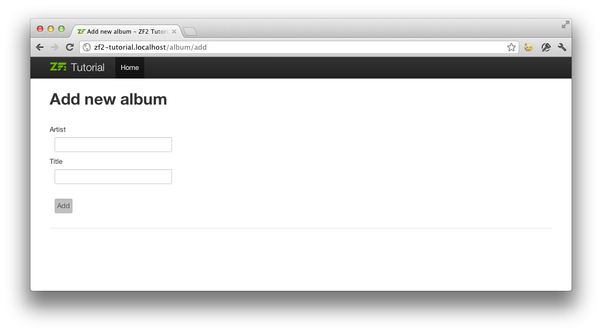

.. _user-guide-forms-and-actions:

Forms and actions
=================

Adding new albums
-----------------

We can now code up the functionality to add new albums. There are two bits to
this part:

* Display a form for user to provide details
* Process the form submission and store to database

We use ``Zend\Form`` to do this. The ``Zend\Form`` component manages the form
and, form validation, we add a ``Zend\InputFilter`` to our ``Album`` entity. We
start by creating a new class ``Album\Form\AlbumForm`` that extends from
``Zend\Form\Form`` to define our form.
Create a file called ``AlbumForm.php`` in ``module/Album/src/Album/Form``:

.. code-block:: php
   :linenos:

    namespace Album\Form;

    use Zend\Form\Form;

    class AlbumForm extends Form
    {
        public function __construct($name = null)
        {
            // we want to ignore the name passed
            parent::__construct('album');

            $this->add(array(
                'name' => 'id',
                'type' => 'Hidden',
            ));
            $this->add(array(
                'name' => 'title',
                'type' => 'Text',
                'options' => array(
                    'label' => 'Title',
                ),
            ));
            $this->add(array(
                'name' => 'artist',
                'type' => 'Text',
                'options' => array(
                    'label' => 'Artist',
                ),
            ));
            $this->add(array(
                'name' => 'submit',
                'type' => 'Submit',
                'attributes' => array(
                    'value' => 'Go',
                    'id' => 'submitbutton',
                ),
            ));
        }
    }

Within the constructor of ``AlbumForm`` we do several things.  First, we set the name 
of the form as we call the parent’s constructor.  We then set the form's method, in this case, ``post``.  
Finally, we create four form elements: the id, title, artist, and submit button. For each item we set 
various attributes and options, including the label to be displayed.

We also need to set up validation for this form. In Zend Framework 2 this is
done using an input filter, which can either be standalone or defined within any class
that implements the ``InputFilterAwareInterface`` interface, such as a model entity. In our case, we are
going to add the input filter to the Album class, which resides in the ``Album.php`` file in ``module/Album/src/Album/Model``:

.. code-block:: php
   :linenos:
   :emphasize-lines: 5-7,9,14,23-84

    namespace Album\Model;

    // Add these import statements
    use Zend\InputFilter\InputFilter;
    use Zend\InputFilter\InputFilterAwareInterface;
    use Zend\InputFilter\InputFilterInterface;

    class Album implements InputFilterAwareInterface
    {
        public $id;
        public $artist;
        public $title;
        protected $inputFilter;                       // <-- Add this variable

        public function exchangeArray($data)
        {
            $this->id     = (isset($data['id']))     ? $data['id']     : null;
            $this->artist = (isset($data['artist'])) ? $data['artist'] : null;
            $this->title  = (isset($data['title']))  ? $data['title']  : null;
        }

        // Add content to these methods:
        public function setInputFilter(InputFilterInterface $inputFilter)
        {
            throw new \Exception("Not used");
        }

        public function getInputFilter()
        {
            if (!$this->inputFilter) {
                $inputFilter = new InputFilter();

                $inputFilter->add(array(
                    'name'     => 'id',
                    'required' => true,
                    'filters'  => array(
                        array('name' => 'Int'),
                    ),
                ));

                $inputFilter->add(array(
                    'name'     => 'artist',
                    'required' => true,
                    'filters'  => array(
                        array('name' => 'StripTags'),
                        array('name' => 'StringTrim'),
                    ),
                    'validators' => array(
                        array(
                            'name'    => 'StringLength',
                            'options' => array(
                                'encoding' => 'UTF-8',
                                'min'      => 1,
                                'max'      => 100,
                            ),
                        ),
                    ),
                ));

                $inputFilter->add(array(
                    'name'     => 'title',
                    'required' => true,
                    'filters'  => array(
                        array('name' => 'StripTags'),
                        array('name' => 'StringTrim'),
                    ),
                    'validators' => array(
                        array(
                            'name'    => 'StringLength',
                            'options' => array(
                                'encoding' => 'UTF-8',
                                'min'      => 1,
                                'max'      => 100,
                            ),
                        ),
                    ),
                ));

                $this->inputFilter = $inputFilter;
            }

            return $this->inputFilter;
        }
    }

The ``InputFilterAwareInterface`` defines two methods: ``setInputFilter()`` and
``getInputFilter()``. We only need to implement ``getInputFilter()`` so we
simply throw an exception  in ``setInputFilter()``.

Within ``getInputFilter()``, we instantiate an ``InputFilter`` and then add the
inputs that we require. We add one input for each property that we wish to
filter or validate. For the ``id`` field we add an ``Int`` filter as we only
need integers. For the text elements, we add two filters, ``StripTags`` and
``StringTrim``, to remove unwanted HTML and unnecessary white space. We also set
them to be *required* and add a ``StringLength`` validator to ensure that the
user doesn’t enter more characters than we can store into the database.

We now need to get the form to display and then process it on submission. This
is done within the ``AlbumController``’s ``addAction()``:

.. code-block:: php
   :linenos:
   :emphasize-lines: 6-7,10-31

    // module/Album/src/Album/Controller/AlbumController.php:

    //...
    use Zend\Mvc\Controller\AbstractActionController;
    use Zend\View\Model\ViewModel;
    use Album\Model\Album;          // <-- Add this import
    use Album\Form\AlbumForm;       // <-- Add this import
    //...

        // Add content to this method:
        public function addAction()
        {
            $form = new AlbumForm();
            $form->get('submit')->setValue('Add');

            $request = $this->getRequest();
            if ($request->isPost()) {
                $album = new Album();
                $form->setInputFilter($album->getInputFilter());
                $form->setData($request->getPost());

                if ($form->isValid()) {
                    $album->exchangeArray($form->getData());
                    $this->getAlbumTable()->saveAlbum($album);

                    // Redirect to list of albums
                    return $this->redirect()->toRoute('album');
                }
            }
            return array('form' => $form);
        }
    //...

After adding the ``AlbumForm`` to the use list, we implement ``addAction()``.
Let’s look at the ``addAction()`` code in a little more detail:

.. code-block:: php
   :linenos:

    $form = new AlbumForm();
    $form->get('submit')->setValue('Add');

We instantiate ``AlbumForm`` and set the label on the submit button to “Add”. We
do this here as we’ll want to re-use the form when editing an album and will use
a different label.

.. code-block:: php
   :linenos:

    $request = $this->getRequest();
    if ($request->isPost()) {
        $album = new Album();
        $form->setInputFilter($album->getInputFilter());
        $form->setData($request->getPost());
        if ($form->isValid()) {

If the ``Request`` object’s ``isPost()`` method is true, then the form has been
submitted and so we set the form’s input filter from an album instance. We then
set the posted data to the form and check to see if it is valid using the
``isValid()`` member function of the form.

.. code-block:: php
   :linenos:

    $album->exchangeArray($form->getData());
    $this->getAlbumTable()->saveAlbum($album);

If the form is valid, then we  grab the data from the form and store to the
model using ``saveAlbum()``.

.. code-block:: php
   :linenos:

    // Redirect to list of albums
    return $this->redirect()->toRoute('album');

After we have saved the new album row, we redirect back to the list of albums
using the ``Redirect`` controller plugin.

.. code-block:: php
   :linenos:

    return array('form' => $form);

Finally, we return the variables that we want assigned to the view. In this
case, just the form object. Note that Zend Framework 2 also allows you to simply
return an array containing the variables to be assigned to the view and it will
create a ``ViewModel`` behind the scenes for you. This saves a little typing.

We now need to render the form in the add.phtml view script:

.. code-block:: php
   :linenos:

    <?php
    // module/Album/view/album/album/add.phtml:

    $title = 'Add new album';
    $this->headTitle($title);
    ?>
    <h1><?php echo $this->escapeHtml($title); ?></h1>
    <?php
    $form->setAttribute('action', $this->url('album', array('action' => 'add')));
    $form->prepare();

    echo $this->form()->openTag($form);
    echo $this->formHidden($form->get('id'));
    echo $this->formRow($form->get('title'));
    echo $this->formRow($form->get('artist'));
    echo $this->formSubmit($form->get('submit'));
    echo $this->form()->closeTag();

Again, we display a title as before and then we render the form. Zend Framework
provides some view helpers to make this a little easier. The ``form()`` view
helper has an ``openTag()`` and ``closeTag()`` method which we use to open and
close the form.  Then for each element with a label, we can use ``formRow()``,
but for the two elements that are standalone, we use ``formHidden()`` and
``formSubmit()``.

Alternatively, the process of rendering the form can be simplified by using the
bundled ``formCollection`` view helper.  For example, in the view script above replace
all the form-rendering echo statements with:

.. code-block:: php
   :linenos:

    echo $this->formCollection($form);

Note: You still need to call the ``openTag`` and ``closeTag`` methods of the form.  You replace 
the other echo statements with the call to ``formCollection``, above.

This will iterate over the form structure, calling the appropriate label, element
and error view helpers for each element, but you still have to wrap formCollection($form) with the open and close form tags.
This helps reduce the complexity of your view script in situations where the default
HTML rendering of the form is acceptable.

You should now be able to use the “Add new album” link on the home page of the
application to add a new album record.

Editing an album
----------------

Editing an album is almost identical to adding one, so the code is very similar.
This time we use ``editAction()`` in the ``AlbumController``:

.. code-block:: php
   :linenos:

    // module/Album/src/Album/Controller/AlbumController.php:
    //...

        // Add content to this method:
        public function editAction()
        {
            $id = (int) $this->params()->fromRoute('id', 0);
            if (!$id) {
                return $this->redirect()->toRoute('album', array(
                    'action' => 'add'
                ));
            }

            // Get the Album with the specified id.  An exception is thrown
            // if it cannot be found, in which case go to the index page.
            try {
                $album = $this->getAlbumTable()->getAlbum($id);
            }
            catch (\Exception $ex) {
                return $this->redirect()->toRoute('album', array(
                    'action' => 'index'
                ));
            }

            $form  = new AlbumForm();
            $form->bind($album);
            $form->get('submit')->setAttribute('value', 'Edit');

            $request = $this->getRequest();
            if ($request->isPost()) {
                $form->setInputFilter($album->getInputFilter());
                $form->setData($request->getPost());

                if ($form->isValid()) {
                    $this->getAlbumTable()->saveAlbum($album);

                    // Redirect to list of albums
                    return $this->redirect()->toRoute('album');
                }
            }

            return array(
                'id' => $id,
                'form' => $form,
            );
        }
    //...

This code should look comfortably familiar. Let’s look at the differences from
adding an album. Firstly, we look for the ``id`` that is in the matched route
and use it to load the album to be edited:

.. code-block:: php
   :linenos:

    $id = (int) $this->params()->fromRoute('id', 0);
    if (!$id) {
        return $this->redirect()->toRoute('album', array(
            'action' => 'add'
        ));
    }

    // Get the album with the specified id.  An exception is thrown 
    // if it cannot be found, in which case go to the index page.
    try {
        $album = $this->getAlbumTable()->getAlbum($id);
    }
    catch (\Exception $ex) {
        return $this->redirect()->toRoute('album', array(
            'action' => 'index'
        ));
    }

``params`` is a controller plugin that provides a convenient way to retrieve
parameters from the matched route.  We use it to retrieve the ``id`` from the
route we created in the modules’ ``module.config.php``. If the ``id`` is zero,
then we redirect to the add action, otherwise, we continue by getting the album
entity from the database.

We have to check to make sure that the Album with the specified ``id`` can actually be found.
If it cannot, then the data access method throws an exception.  We catch that exception and re-route the user
to the index page.

.. code-block:: php
   :linenos:

    $form = new AlbumForm();
    $form->bind($album);
    $form->get('submit')->setAttribute('value', 'Edit');

The form’s ``bind()`` method attaches the model to the form. This is used in two
ways:

* When displaying the form, the initial values for each element are extracted
  from the model.
* After successful validation in isValid(), the data from the form is put back
  into the model.

These operations are done using a hydrator object. There are a number of
hydrators, but the default one is ``Zend\Stdlib\Hydrator\ArraySerializable``
which expects to find two methods in the model: ``getArrayCopy()`` and
``exchangeArray()``. We have already written ``exchangeArray()`` in our
``Album`` entity, so just need to write ``getArrayCopy()``:

.. code-block:: php
   :linenos:
   :emphasize-lines: 10-14

    // module/Album/src/Album/Model/Album.php:
    // ...
        public function exchangeArray($data)
        {
            $this->id     = (isset($data['id']))     ? $data['id']     : null;
            $this->artist = (isset($data['artist'])) ? $data['artist'] : null;
            $this->title  = (isset($data['title']))  ? $data['title']  : null;
        }

        // Add the following method:
        public function getArrayCopy()
        {
            return get_object_vars($this);
        }
    // ...

As a result of using ``bind()`` with its hydrator, we do not need to populate the
form’s data back into the ``$album`` as that’s already been done, so we can just
call the mappers’ ``saveAlbum()`` to store the changes back to the database.

The view template, ``edit.phtml``, looks very similar to the one for adding an
album:

.. code-block:: php
   :linenos:

    <?php
    // module/Album/view/album/album/edit.phtml:

    $title = 'Edit album';
    $this->headTitle($title);
    ?>
    <h1><?php echo $this->escapeHtml($title); ?></h1>

    <?php
    $form = $this->form;
    $form->setAttribute('action', $this->url(
        'album',
        array(
            'action' => 'edit',
            'id'     => $this->id,
        )
    ));
    $form->prepare();

    echo $this->form()->openTag($form);
    echo $this->formHidden($form->get('id'));
    echo $this->formRow($form->get('title'));
    echo $this->formRow($form->get('artist'));
    echo $this->formSubmit($form->get('submit'));
    echo $this->form()->closeTag();

The only changes are to use the ‘Edit Album’ title and set the form’s action to
the ‘edit’ action too.

You should now be able to edit albums.

Deleting an album
-----------------

To round out our application, we need to add deletion. We have a Delete link
next to each album on our list page and the naive approach would be to do a
delete when it’s clicked. This would be wrong. Remembering our HTTP spec, we
recall that you shouldn’t do an irreversible action using GET and should use
POST instead.

We shall show a confirmation form when the user clicks delete and if they then
click “yes”, we will do the deletion. As the form is trivial, we’ll code it
directly into our view (``Zend\Form`` is, after all, optional!).

Let’s start with the action code in ``AlbumController::deleteAction()``:

.. code-block:: php
   :linenos:

    // module/Album/src/Album/Controller/AlbumController.php:
    //...
        // Add content to the following method:
        public function deleteAction()
        {
            $id = (int) $this->params()->fromRoute('id', 0);
            if (!$id) {
                return $this->redirect()->toRoute('album');
            }

            $request = $this->getRequest();
            if ($request->isPost()) {
                $del = $request->getPost('del', 'No');

                if ($del == 'Yes') {
                    $id = (int) $request->getPost('id');
                    $this->getAlbumTable()->deleteAlbum($id);
                }

                // Redirect to list of albums
                return $this->redirect()->toRoute('album');
            }

            return array(
                'id'    => $id,
                'album' => $this->getAlbumTable()->getAlbum($id)
            );
        }
    //...

As before, we get the ``id`` from the matched route, and check the request
object’s ``isPost()`` to determine whether to show the confirmation page or to
delete the album. We use the table object to delete the row using the
``deleteAlbum()`` method and then redirect back the list of albums. If the
request is not a POST, then we retrieve the correct database record and assign
to the view, along with the ``id``.

The view script is a simple form:

.. code-block:: php
   :linenos:

    <?php
    // module/Album/view/album/album/delete.phtml:

    $title = 'Delete album';
    $this->headTitle($title);
    ?>
    <h1><?php echo $this->escapeHtml($title); ?></h1>

    
Are you sure that you want to delete
        '<?php echo $this->escapeHtml($album->title); ?>' by
        '<?php echo $this->escapeHtml($album->artist); ?>'?
    

    <?php
    $url = $this->url('album', array(
        'action' => 'delete',
        'id'     => $this->id,
    ));
    ?>
    <form action="<?php echo $url; ?>" method="post">
    

        <input type="hidden" name="id" value="<?php echo (int) $album->id; ?>" />
        <input type="submit" name="del" value="Yes" />
        <input type="submit" name="del" value="No" />
    

    </form>

In this script, we display a confirmation message to the user and then a form
with "Yes" and "No" buttons. In the action, we checked specifically for the “Yes”
value when doing the deletion.

Ensuring that the home page displays the list of albums
-------------------------------------------------------

One final point. At the moment, the home page, http://zf2-tutorial.localhost/
doesn’t display the list of albums.

This is due to a route set up in the ``Application`` module’s
``module.config.php``. To change it, open
``module/Application/config/module.config.php`` and find the home route:

.. code-block:: php
   :linenos:

    'home' => array(
        'type' => 'Zend\Mvc\Router\Http\Literal',
        'options' => array(
            'route'    => '/',
            'defaults' => array(
                'controller' => 'Application\Controller\Index',
                'action'     => 'index',
            ),
        ),
    ),

Change the ``controller`` from ``Application\Controller\Index`` to
``Album\Controller\Album``:

.. code-block:: php
   :linenos:
   :emphasize-lines: 6

    'home' => array(
        'type' => 'Zend\Mvc\Router\Http\Literal',
        'options' => array(
            'route'    => '/',
            'defaults' => array(
                'controller' => 'Album\Controller\Album', // <-- change here
                'action'     => 'index',
            ),
        ),
    ),

That’s it - you now have a fully working application!
