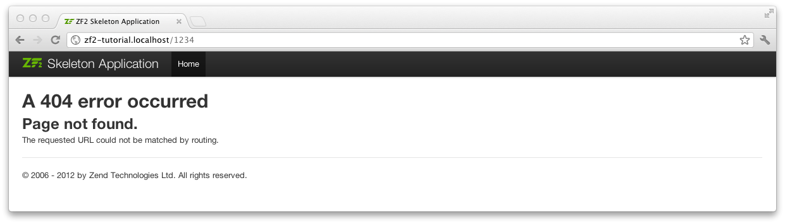

.. _user-guide.skeleton-application:

#######################################
Getting started: A skeleton application
#######################################

In order to build our application, we will start with the
`ZendSkeletonApplication <https://github.com/zendframework/ZendSkeletonApplication>`_ 
available on `github <https://github.com/>`_. 
Go to https://github.com/zendframework/ZendSkeletonApplication and click the “Zip”
button. This will download a file with a name like
``zendframework-ZendSkeletonApplication-zfrelease-2.0.0beta5-2-gc2c7315.zip`` or
similar. 

Unzip this file into the directory where you keep all your vhosts and rename the
resultant directory to ``zf2-tutorial``. 

ZendSkeletonApplication is set up to use Composer (http://getcomposer.org) to
resolve its dependencies. In this case, the dependency is Zend Framework 2
itself.

To install Zend Framework 2 into our application we simply type:

.. code-block:: bash

    php composer.phar self-update
    php composer.phar install

from the ``zf2-tutorial`` folder. This takes a while. You should see an output like:

.. code-block:: bash

    Installing dependencies from lock file
    - Installing zendframework/zendframework (dev-master)
      Cloning 18c8e223f070deb07c17543ed938b54542aa0ed8

    Generating autoload files

.. note::

    If you see this message: 

    .. code-block:: bash

        [RuntimeException]      
          The process timed out. 

    then your connection was too slow to download the entire package in time, and composer
    timed out. To avoid this, instead of running:

    .. code-block:: bash

        php composer.phar install

    run instead:

    .. code-block:: bash

        COMPOSER_PROCESS_TIMEOUT=5000 php composer.phar install

We can now move on to the virtual host.

Virtual host
------------

You now need to create an Apache virtual host for the application and edit your
hosts file so that http://zf2-tutorial.localhost will serve ``index.php`` from the
``zf2-tutorial/public`` directory.

Setting up the virtual host is usually done within ``httpd.conf`` or
``extra/httpd-vhosts.conf``. (If you are using ``httpd-vhosts.conf``, ensure
that this file is included by your main ``httpd.conf`` file.) 

Ensure that ``NameVirtualHost`` is defined and set to “\*:80” or similar, and then
define a virtual host along these lines:

.. code-block:: apache

    <VirtualHost *:80>
        ServerName zf2-tutorial.localhost
        DocumentRoot /path/to/zf2-tutorial/public
        SetEnv APPLICATION_ENV "development"
        <Directory /path/to/zf2-tutorial/public>
            DirectoryIndex index.php
            AllowOverride All
            Order allow,deny
            Allow from all
        </Directory>
    </VirtualHost>

Make sure that you update your ``/etc/hosts`` or
``c:\windows\system32\drivers\etc\hosts`` file so that ``zf2-tutorial.localhost``
is mapped to ``127.0.0.1``. The website can then be accessed using
http://zf2-tutorial.localhost.  

.. code-block:: txt

    127.0.0.1               zf2-tutorial.localhost localhost

If you’ve done it right, you should see something like this:

.. image:: ../images/user-guide.skeleton-application.hello-world.png
    :width: 940 px

To test that your ``.htaccess`` file is working, navigate to
http://zf2-tutorial.localhost/1234 and you should see this:

If you see a standard Apache 404 error, then you need to fix ``.htaccess`` usage
before continuing.

You now have a working skeleton application and we can start adding the specifics
for our application.
