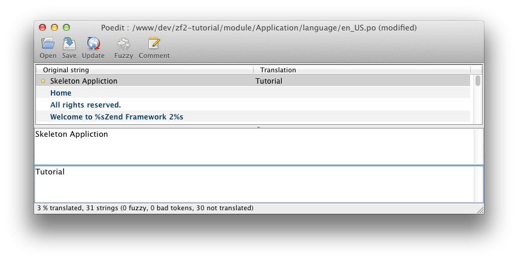

.. _user-guide.styling-and-translations:

Styling and Translations
========================

We’ve picked up the SkeletonApplication’s styling, which is fine, but we need to
change the title and remove the copyright message. 

The ZendSkeletonApplication is set up to use ``Zend\I18n``’s translation
functionality for all the text. It uses ``.po`` files that live in
``module/Application/language``, and you need to use `poedit
<http://www.poedit.net/download.php>`_ to change the text. Start poedit and
open ``module/Application/language/en_US.po``. Click on “Skeleton Application” in the
list of ``Original`` strings and then type in “Tutorial” as the translation.

Press Save in the toolbar and poedit will create an ``en_US.mo`` file for us.  
If you find that no ``.mo`` file is generated, check ``Preferences -> Editor -> Behavior`` 
and see if the checkbox marked ``Automatically compile .mo file on save`` is checked.

To remove the copyright message, we need to edit the ``Application`` module’s
``layout.phtml`` view script:

.. code-block:: php
   :linenos:

    // module/Application/view/layout/layout.phtml:
    // Remove this line:
    
&copy; 2005 - 2013 by Zend Technologies Ltd. <?php echo $this->translate('All 
    rights reserved.') ?>

The page now looks ever so slightly better now!

.. image:: ../images/user-guide.styling-and-translations.translated-image.png
    :width: 940 px
