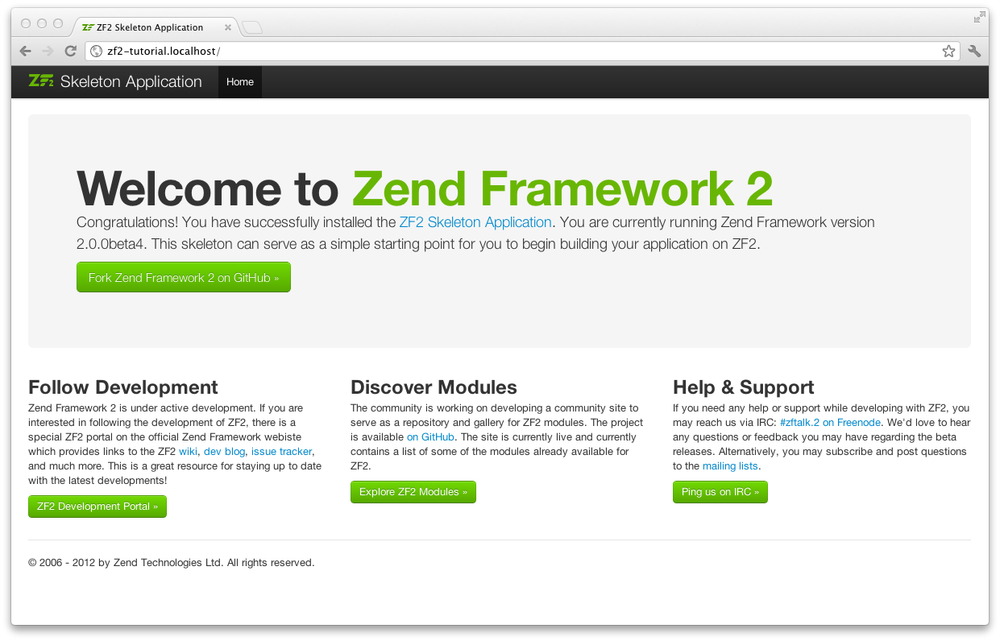

.. _user-guide.skeleton-application:

###################################
Comenzando: la aplicación esqueleto
###################################

Para construir nuestra aplicación, vamos a comenzar con 
`ZendSkeletonApplication <https://github.com/zendframework/ZendSkeletonApplication>`_
disponible en `github <https://github.com/>`_.
Vaya a https://github.com/zendframework/ZendSkeletonApplication y haga clic en el botón “Zip”.
Esto descargará un archivo con un nombre similar a
``zendframework-ZendSkeletonApplication-zfrelease-2.0.0beta5-2-gc2c7315.zip``.

Descomprima este archivo en el directorio donde mantiene todos sus vhosts y renombre el
directorio resultante a ``zf2-tutorial``.

ZendSkeletonApplication está montado para utilizar Composer (http://getcomposer.org) para
resolver sus dependencias. En este caso, la dependencia es Zend Framework 2 en sí mismo.

Para instalar Zend Framework 2 en nuestra aplicación simplemente escribimos:

.. code-block:: bash

    php composer.phar self-update
    php composer.phar install

desde el directorio ``zf2-tutorial``. Esto lleva un tiempo. Debería ver una salida como:

.. code-block:: bash

    Installing dependencies from lock file
    - Installing zendframework/zendframework (dev-master)
      Cloning 18c8e223f070deb07c17543ed938b54542aa0ed8

    Generating autoload files

.. note::

    Si ve este mensaje:

    .. code-block:: bash

        [RuntimeException]      
          The process timed out. 

    entonces su conexión fue demasiado lenta para descargar el paquete completo a tiempo,
    y composer expiró. Para evitar esto, en vez de ejecutar:

    .. code-block:: bash

        php composer.phar install

    Ejecute:

    .. code-block:: bash

        COMPOSER_PROCESS_TIMEOUT=5000 php composer.phar install

Ahora podemos movernos al virtual host.

Virtual host
------------

Ahora necesita crear un virtual host Apache para la aplicación y editar su
archivo hosts para que http://zf2-tutorial.localhost acceda a ``index.php`` desde el
directorio ``zf2-tutorial/public``.

Para configurar el virtual host normalmente se realiza a través del archivo ``httpd.conf`` o
``extra/httpd-vhosts.conf``. (Si está utilizando ``httpd-vhosts.conf``, asegúrese
de que este archivo esté incluido en el archivo principal ``httpd.conf``.)

Asegúrese de que ``NameVirtualHost`` esté definido y apuntando a “\*:80” o similar, y después
defina un virtual host según las siguientes líneas:

.. code-block:: apache

    <VirtualHost \*:80>
        ServerName zf2-tutorial.localhost
        DocumentRoot /path/to/zf-2tutorial/public
        SetEnv APPLICATION_ENV "development"
        <Directory /path/to/zf2-tutorial/public>
            DirectoryIndex index.php
            AllowOverride All
            Order allow,deny
            Allow from all
        </Directory>
    </VirtualHost>

Asegúrese de que actualiza su fichero ``/etc/hosts`` o 
``c:\windows\system32\drivers\etc\hosts`` para que ``zf2-tutorial.localhost``
apunte a ``127.0.0.1``. De esta manera, el sitio web puede ser accedido usando
http://zf2-tutorial.localhost. 

.. code-block:: txt

    127.0.0.1               zf2-tutorial.localhost localhost

Si lo hizo correctamente, debería ver algo parecido a esto:

Para verificar que el archivo ``.htaccess`` funciona, navegue a
http://zf2-tutorial.localhost/1234 y debería ver esto:

.. image:: ../images/user-guide.skeleton-application.404.png
    :width: 940 px

Si lo que ve es un error estándar 404 de Apache, entonces necesita arreglar ``.htaccess``
antes de continuar.

Ahora tiene una aplicación esqueleto funcionando y podemos comenzar a añadir contenido
a nuestra aplicación.
