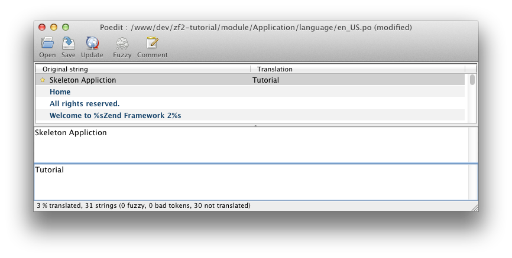

.. _user-guide.styling-and-translations:

########################
Estilos y Traducciones
########################

Hemos elegido el diseno "SkeltonApplication", que esta bien, pero necesitamos
cambiar el título y eliminar el message de derechos de autor.

El ZendSkeletonApplication está configurado para utilizar la función de traducción 
``Zend\I18n`` para todo el texto. Utiliza los archivos ``.po`` que  
residen en ``application/language``, y usted necesita `poedit
<http://www.poedit.net/download.php/>`_ para modificar el texto. Inicia poedit y
abra ``application/language/en_US.po``. Haga click en “Skeleton Application” en la 
lista ``Texto Original`` y luego escriba en “Tutorial” como la traducción.

Pressione Guardar en la barra de herramientas y poedit creará el archivo ``en_US.mo`` por usted.

Para eliminar el mensaje de derechos de autor, necesitamos editar el modulo ``Application``
``layout.phtml`` view script:

.. code-block:: php

    // module/Application/view/layout/layout.phtml:
    // Remove this line:
    
&copy; 2005 - 2012 by Zend Technologies Ltd. <?php echo $this->translate('All 
    rights reserved.') ?>

La página ahora se ve ligeramente mejor!

.. image:: ../images/user-guide.styling-and-translations.translated-image.png
    :width: 940 px
