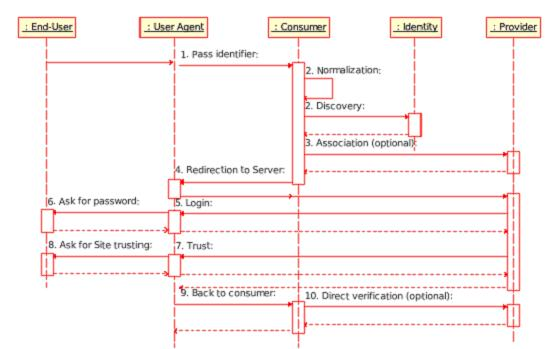

.. EN-Revision: none
.. _zend.openid.introduction:

Introduction
============

``ZendOpenId`` est le composant de Zend Framework qui propose une *API* simple pour l'utilisation de la
technologie OpenID dans son applicatif internet.

.. _zend.openid.introduction.what:

Qu'est ce qu'OpenID ?
---------------------

OpenID est un ensemble de protocole permettant une gestion centralisée de l'identification d'une personne. Ces
protocoles permettent la création d'une identité en ligne, via un fournisseur d'identité. Cette identité peut
alors être utilisée n'importe où, où OpenID est supporté. Sur les sites utilisant OpenID, il n'est plus
nécessaire de se souvenir d'identifiants différents, la seule et unique identité OpenID est la même partout.
Une identité OpenID est en général matérialisée par une *URL* et un utilisateur est libre de choisir son
fournisseur OpenID, ou alors même de créer son propre serveur d'identification OpenID, ceci ne nécessitant pas
d'autorisation centrale.

Visitez donc `le site officiel de OpenID`_ pour plus d'information, voyez aussi `le OpenID Book, par Rafeeq
Rehman`_ ou `OpenIDFrance`_.

.. _zend.openid.introduction.how:

Comment cela fonctionne-t-il ?
------------------------------

Le but de ``ZendOpenId`` est d'implémenter le protocole d'identification OpenID, comme décrit dans le diagramme
suivant :

. L'authentification est initialisée par l'utilisateur final, qui passe son identifiant OpenID, via son
  navigateur.

. Le service protégé par OpenID normalise l'identifiant de l'utilisateur. Il en résulte un identifiant validé,
  une *URL* du serveur OpenID, et une version du protocole OpenID.

. Le service protégé par OpenID établit optionnellement une connexion avec le serveur OpenID en utilisant des
  clés `Diffie-Hellman`_. Les deux parties partagent alors un "secret" utilisé pour signer et vérifier les
  messages suivants.

. Le service protégé par OpenID redirige le navigateur vers l'URL du serveur OpenID, en effectuant une requête
  d'authentification.

. Le serveur OpenID vérifie si le navigateur n'est pas déjà identifié.

. L'utilisateur entre son mot de passe.

. Le serveur OpenID effectue une vérification pour savoir si l'utilisateur a le droit d'accéder au service
  protégé par OpenID.

. L'utilisateur final accepte alors ou non de partager ses informations d'identité pour le service protégé par
  OpenID.

. Le serveur OpenID redirige le navigateur vers le service protégé par OpenID, avec un message "authentification
  approuvée" ou "échouée".

. Le service protégé par OpenID vérifie l'information du serveur OpenID en utilisant le "secret" obtenu étape 3
  ou en envoyant des informations supplémentaires.

.. _zend.openid.introduction.structure:

ZendOpenId Structure
---------------------

``ZendOpenId`` contient deux sous-classes. ``ZendOpenId\Consumer`` est un client, il sera utilisé sur les sites
nécessitant l'identification OpenID. ``ZendOpenId\Provider``, elle, permet de créer son propre serveur OpenID.
Ces deux classes sont totalement indépendantes l'une de l'autre.

Les seuls points communs entre ces deux classes sont l'extension Simple Registration Extension, implémentée par
la classe ``ZendOpenId_Extension\Sreg``, ainsi que les fonctions utilitaires présentes dans la classe
``ZendOpenId``.

.. note::

   ``ZendOpenId`` utilise `l'extension GMP`_, lorsqu'elle est disponible. Activez cette extension si possible,
   ceci améliorera les performances avec ``ZendOpenId``.

.. _zend.openid.introduction.standards:

Standards OpenID supportés
--------------------------

Le composant ``ZendOpenId`` est conforme aux standards suivants :

- OpenID Authentication protocol version 1.1

- OpenID Authentication protocol version 2.0 draft 11

- OpenID Simple Registration Extension version 1.0

- OpenID Simple Registration Extension version 1.1 draft 1

.. _`le site officiel de OpenID`: http://www.openid.net/
.. _`le OpenID Book, par Rafeeq Rehman`: http://www.openidbook.com/
.. _`OpenIDFrance`: http://www.openidfrance.fr
.. _`Diffie-Hellman`: http://fr.wikipedia.org/wiki/%C3%89change_de_cl%C3%A9s_Diffie-Hellman
.. _`l'extension GMP`: http://www.php.net/manual/fr/ref.gmp.php
