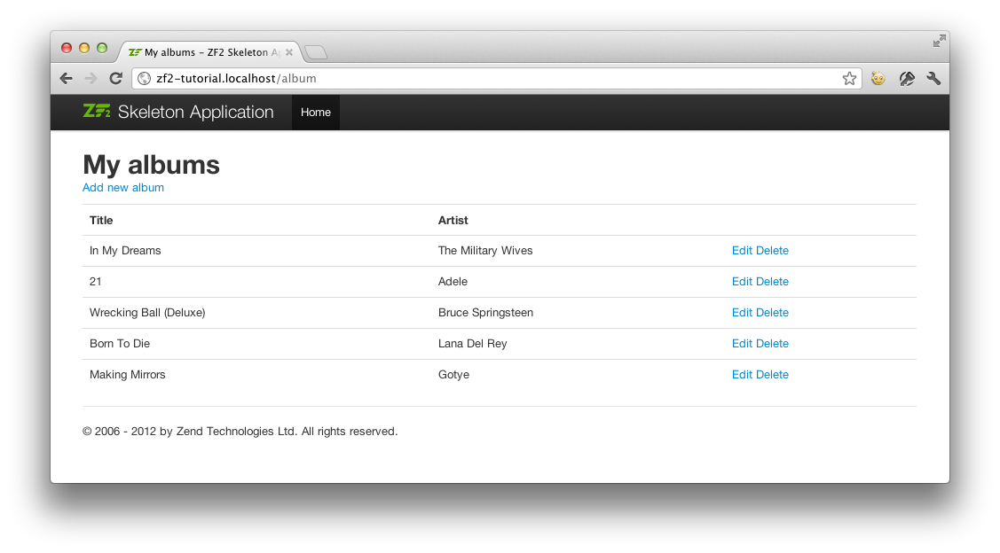

.. EN-Revision: 96c6ad3
.. _user-guide.database-and-models:

Bando de Dados e Models
=======================

O Banco de Dados
----------------

Agora que nos temos o módulo ``Album`` configurado com controllers, ações e
views, está na hora de olhar para a seção de models de nossa aplicação.
Lembre-se que os models são a parte que lida com o proposito pricipal de
uma aplicação (também chamado de "regras de negócio") e, em nosso caso, lida
com o banco de dados. Nos iremos usar a classe ``Zend\Db\TableGateway\TableGateway``
do Zend Framework que serve para procurar, inserir, atualizar e deletar linhas 
dobanco de dados.

Também vamos usar MySQL, atraves do driver PDO do PHP, portanto crie um banco de dados
com o nome de ``zf2tutorial``, e rode as seguintes instruções SQL para criar a tabela
de albuns com alguns dados nela.

.. code-block:: sql

    CREATE TABLE album (
      id int(11) NOT NULL auto_increment,
      artist varchar(100) NOT NULL,
      title varchar(100) NOT NULL,
      PRIMARY KEY (id)
    );
    INSERT INTO album (artist, title)
        VALUES  ('The  Military  Wives',  'In  My  Dreams');
    INSERT INTO album (artist, title)
        VALUES  ('Adele',  '21');
    INSERT INTO album (artist, title)
        VALUES  ('Bruce  Springsteen',  'Wrecking Ball (Deluxe)');
    INSERT INTO album (artist, title)
        VALUES  ('Lana  Del  Rey',  'Born  To  Die');
    INSERT INTO album (artist, title)
        VALUES  ('Gotye',  'Making  Mirrors');

(Os dados de teste escolhidos são os mais vendidos na Amazon UK no momento que esse 
tutorial foi escrito em sua versão original)

Nos temos alguns dados em um banco de dados e podemos escrever um model bastante simples
para eles.

Os Arquivos de Models
---------------------

O Zend Framework não possui um componente ``Zend\Model`` por que os models são nossas
regras de negócios e depende de você decidir como quer que elas funcionem, Existem
muitos componentes que você pode usar para isso dependendo de suas necessidades. 
Um dos métodos e ter uma classe model representando cada uma das entidades de sua
aplicação e então usar objetos mapeadores que carregam e salvam essas entidades no
banco de dados. Outro abordagem pode ser utilizar um Object-relational mapping (ORM),
como Doctrine ou Propel.

Para esse tutorial nos vamos criar um model basnte simples atraves da criação de uma classe
``AlbumTable`` que usa a classe ``Zend\Db\TableGateway\TableGateway`` na qual cada um dos
albuns será um Objeto ``Album`` (conhecido com *entity*). Essa é a implementação do modelo
padrão Table Data Gateway que permite interação com os dados contidos na tabela do banco de
dados. Esteja ciente de que esse modelo Table Data Gateway pode se tornar limitado em 
sistemas maiores. Também existe uma tentação por colocar o acesso ao banco de dados
dentro das ações do controller já que essas são implementadas pela classe
``Zend\Db\TableGateway\AbstractTableGateway``. *Não Faça Isso*!

Vamos começar criando um arquivo chamado ``Album.php`` em ``module/Album/src/Album/Model``:

.. code-block:: php

    <?php
    namespace Album\Model;

    class Album
    {
        public $id;
        public $artist;
        public $title;

        public function exchangeArray($data)
        {
            $this->id     = (!empty($data['id'])) ? $data['id'] : null;
            $this->artist = (!empty($data['artist'])) ? $data['artist'] : null;
            $this->title  = (!empty($data['title'])) ? $data['title'] : null;
        }
    }

Nosso objeto de entidade ``Album`` é uma classe PHP cimples. Para que ela funcione com a classe 
``TableGateway`` do ``Zend\Db``, nos precisamos implementar o método``exchangeArray()``.
Esse método simplesmente copia os dados passados em um array para as propriedades de nossa
entidade. Nós iremos implementar filtros para usar com os formulários posteriormente.

Em seguida nos criamos um arquivo``AlbumTable.php`` no diretório ``module/Album/src/Album/Model``
com o seguinte código:

.. code-block:: php

    <?php
    namespace Album\Model;

    use Zend\Db\TableGateway\TableGateway;

    class AlbumTable
    {
        protected $tableGateway;

        public function __construct(TableGateway $tableGateway)
        {
            $this->tableGateway = $tableGateway;
        }

        public function fetchAll()
        {
            $resultSet = $this->tableGateway->select();
            return $resultSet;
        }

        public function getAlbum($id)
        {
            $id  = (int) $id;
            $rowset = $this->tableGateway->select(array('id' => $id));
            $row = $rowset->current();
            if (!$row) {
                throw new \Exception("Could not find row $id");
            }
            return $row;
        }

        public function saveAlbum(Album $album)
        {
            $data = array(
                'artist' => $album->artist,
                'title'  => $album->title,
            );

            $id = (int) $album->id;
            if ($id == 0) {
                $this->tableGateway->insert($data);
            } else {
                if ($this->getAlbum($id)) {
                    $this->tableGateway->update($data, array('id' => $id));
                } else {
                    throw new \Exception('Album id does not exist');
                }
            }
        }

        public function deleteAlbum($id)
        {
            $this->tableGateway->delete(array('id' => $id));
        }
    }

Existe muita coisa acontecendo aqui. Primeiramente, nos configuramos uma propriedade
protegida ``$tableGateway`` para a instancia de ``TableGateway`` que será passada no
construtor. Nos iremos usar isso para realizar operações na tabela de nosso albuns no
banco de dados.

Nos então criamos alguns métodos ajudantes que nossa aplicação irá utilizar para interagir com
o table gateway.  ``fetchAll()`` retorna todas as linhas de albuns do banco de dados como um 
``ResultSet``, ``getAlbum()`` retorna uma única linha como um objeto ``Album``, ``saveAlbum()``
tanto cria uma nova linha no banco de dados quanto atualiza uma linha existente e ``deleteAlbum()`` 
remove completamente uma linha. O código de cada um desses métodos e, esperadamente, auto-explicativo.

Usando o ServiceManager para configurar o Table Gateway e injetar no AlbumTable
-------------------------------------------------------------------------------

Com o objetivo de sempre termos a mesma instancia do nosso ``AlbumTable``, no siremos
usar o ``ServiceManager`` para definir como criar um. Isso é geralemnte feito na classe 
Module onde nos criamos o método chamado ``getServiceConfig()`` que é automaticamente
chamado pelo ``ModuleManager`` e aplicado ao ``ServiceManager``. Nos então estaremos
aptos a solicita-lo no nosso controller quando precisarmos dele.

Para configurar o ``ServiceManager``, nos podemos ou disponibilizar o nome da classe
para ser instanciado ou uma factory (closure ou callback) que instancia o objeto quando
o ``ServiceManager`` precisar dele. Nos vamos começar implementando o ``getServiceConfig()``
para prover a factory que criará o ``AlbumTable``. Adicione esse método ao final do arquivo
 ``Module.php`` no diretório ``module/Album``.

.. code-block:: php
    :emphasize-lines: 5-8,14-32

    <?php
    namespace Album;

    // Inclua essas instruções
    use Album\Model\Album;
    use Album\Model\AlbumTable;
    use Zend\Db\ResultSet\ResultSet;
    use Zend\Db\TableGateway\TableGateway;

    class Module
    {
        // métodps getAutoloaderConfig() e getConfig() aqui

        // Inclua esse método:
        public function getServiceConfig()
        {
            return array(
                'factories' => array(
                    'Album\Model\AlbumTable' =>  function($sm) {
                        $tableGateway = $sm->get('AlbumTableGateway');
                        $table = new AlbumTable($tableGateway);
                        return $table;
                    },
                    'AlbumTableGateway' => function ($sm) {
                        $dbAdapter = $sm->get('Zend\Db\Adapter\Adapter');
                        $resultSetPrototype = new ResultSet();
                        $resultSetPrototype->setArrayObjectPrototype(new Album());
                        return new TableGateway('album', $dbAdapter, null, $resultSetPrototype);
                    },
                ),
            );
        }
    }

Esse método retorna um array de ``factories`` que irão ser mescladas pelo
``ModuleManager`` antes de serem passadas para o ``ServiceManager``. A factory
para ``Album\Model\AlbumTable`` usa o ``ServiceManager`` para criar um
``AlbumTableGateway`` que será passado para o ``AlbumTable``. Nos também informamos
ao ``ServiceManager``que um ``AlbumTableGateway`` é criado solicitando um 
``Zend\Db\Adapter\Adapter`` (também do ``ServiceManager``) e usando ele para criar
o objeto ``TableGateway``. Ao ``TableGateway`` é dito para usar um objeto
``Album`` sempre que ele criar uma nova linha de resultado. A classe TableGateway
use o padrão de prototipagem para criar o conjunto de resultado e as entidades.
Isso significa que ao inves de instanciar um novo objet quando solicitado o sistema
clona um objeto previamente solicitado. veja
`PHP Constructor Best Practices and the Prototype Pattern <http://ralphschindler.com/2012/03/09/php-constructor-best-practices-and-the-prototype-pattern>`_
Para mais detalhes (N.T.: em inglês).

Finalmente nos precisamos configurar o ``ServiceManager`` para que ele saiba como conseguir
a classe ``Zend\Db\Adapter\Adapter``. Isso é feito usando uma factory chamada
``Zend\Db\Adapter\AdapterServiceFactory`` a qual podemos configurar atraves do sistema de 
arquivos de configuração. O ``ModuleManager`` do Zend Framework 2 junta todas as configrações
de cado um dos arquivos ``module.config.php`` dos módulos juntamente com os arquivos definidos
em ``config/autoload`` (os arquivos ``*.global.php`` e depois ``*.local.php``). Nos vamos
adicionar nossa configuração de banco de dados no arquivo ``global.php`` que você deve enviar para
seu sistema de controle de versão. Você pode usar ``local.php`` (fora do VCS) para armazenar
as credenciais do seu banco de dados caso queira. Modifique o arquivo ``config/autoload/global.php`` 
(no diretório raiz do Zend Skeleton, não dentro do módulo Album)  com o seguinte código:

.. code-block:: php

    <?php
    return array(
        'db' => array(
            'driver'         => 'Pdo',
            'dsn'            => 'mysql:dbname=zf2tutorial;host=localhost',
            'driver_options' => array(
                PDO::MYSQL_ATTR_INIT_COMMAND => 'SET NAMES \'UTF8\''
            ),
        ),
        'service_manager' => array(
            'factories' => array(
                'Zend\Db\Adapter\Adapter'
                        => 'Zend\Db\Adapter\AdapterServiceFactory',
            ),
        ),
    );

Voê deve então inserir as credenciais de acesso ao seu banco de dados em ``config/autoload/local.php`` 
para que elas não estejam no seu repositório público (já que ``local.php`` é ignorado):

.. code-block:: php

    <?php
    return array(
        'db' => array(
            'username' => 'YOUR USERNAME HERE',
            'password' => 'YOUR PASSWORD HERE',
        ),
    );

Voltando ao Controller
----------------------

Agora que o ``ServiceManager`` consegue criar uma instancia de ``AlbumTable`` para nos, nos
podemos adcionar um método ao controler para requisita-lo. Inclua ``getAlbumTable()`` à classe
``AlbumController``:

.. code-block:: php

    // module/Album/src/Album/Controller/AlbumController.php:
        public function getAlbumTable()
        {
            if (!$this->albumTable) {
                $sm = $this->getServiceLocator();
                $this->albumTable = $sm->get('Album\Model\AlbumTable');
            }
            return $this->albumTable;
        }

Você tamém deve adicionar:

.. code-block:: php

    protected $albumTable;

No topo da classe.

Nos aora podemos chamar ``getAlbumTable()`` a partir de nosso controller sempre que precisarmos
de interação com nosso model.

Caso o service locator tenha sido configurado conrretamente em ``Module.php``, nos devemos obter
uma instancia de ``Album\Model\AlbumTable`` quando chamarmos ``getAlbumTable()``.

Listando os Albuns
------------------

Para listar os albuns nos precisamos solicita-los do model e passa-los para a view.
Para fazer isso nos preenchemos a ``indexAction()`` do ``AlbumController``. 
Atualize a ``indexAction()`` do ``AlbumController`` como a seguir:

.. code-block:: php

    // module/Album/src/Album/Controller/AlbumController.php:
    // ...
        public function indexAction()
        {
            return new ViewModel(array(
                'albums' => $this->getAlbumTable()->fetchAll(),
            ));
        }
    // ...

Com o Zend Framework 2 para passar variáveis para a view nos retornamos uma
instancia de ``ViewModel`` que tem como primeiro parametro do construtor um
array contendo os dados que nos precisamos. Esses são automaticamente passados
para o arquivo de view. O objeto ``ViewModel`` também permite que você altere o
arquivo de view que será usando, ma spor padrão é usado ``{nome do controller}/
{nome da ação}``. Nos agora podemos preencher o arquivo ``index.phtml``:

.. code-block:: php

    <?php
    // module/Album/view/album/album/index.phtml:

    $title = 'My albums';
    $this->headTitle($title);
    ?>
    <h1><?php echo $this->escapeHtml($title); ?></h1>
    

        <a href="<?php echo $this->url('album', array('action'=>'add'));?>">Add new album</a>
    

    <table class="table">
    <tr>
        <th>Title</th>
        <th>Artist</th>
        <th>&nbsp;</th>
    </tr>
    <?php foreach ($albums as $album) : ?>
    <tr>
        <td><?php echo $this->escapeHtml($album->title);?></td>
        <td><?php echo $this->escapeHtml($album->artist);?></td>
        <td>
            <a href="<?php echo $this->url('album',
                array('action'=>'edit', 'id' => $album->id));?>">Edit</a>
            <a href="<?php echo $this->url('album',
                array('action'=>'delete', 'id' => $album->id));?>">Delete</a>
        </td>
    </tr>
    <?php endforeach; ?>
    </table>

A primeira coisa que fizemos foi configurar o titulo da nossa página (usado no layout)
e também passar esse titulo para a seção ``<head>`` usando o view helper ``headTitle()``
que irá ser exibido no barra de título do navegador. Nos então criamos um link para
adcionar um novo album.

O Helper de view ``url()`` é fornecido pelo Zend Framework 2 e usado para criar os links
que nos precisamos. O primeiro parâmetro de ``url()`` é o nome da rota que queremos usar
para a construção da url, e o segundo parametro é um array com todas as variáveis que irão
substituir os coringas dessa rota. Nesse caso nos usamos a nossa rota ‘album’ que está
configurada para aceitar duas variáveis coringa: ``action`` e ``id``.

Nos então iremos percorrer os ``$albums`` que forma passados pela ação do controller.
O sistema de views do Zend Framweork 2 garante automaticamente que essas variáveis
sejam extraidas paa o escopo do nosso arquivo de view, portanto nos não precisamos nos
preocupar com prefixar elas com ``$this->`` como faziamos com Zend Framework 1; mas você
usa-lo se assim desejar.

Nos então criamos uma tabela para exibir o titulo e artista de cada um dos albuns e 
exibimos também links que possibilitam editar e excluir essas entradas. Um loop
``foreach:`` padrão é usado para percorrer a lista de albuns, e nos usamos a forma
alternativa atraves do uso de dois-pontos e ``endforeach;`` já que essa forma é mais
fácil de ser percebida do que tentar posicionar os colchetes. Novamente o helper de
view ``url()`` é usado para criar os links de edição e exclusão.

.. note::

    Nos sempre usamos o helper ``escapeHtml()`` para ajudar na nossa proteção 
    contra vunerabilidades de Cross Site Scripting (XSS)
    (veja http://en.wikipedia.org/wiki/Cross-site_scripting).

Se você abrir http://zf2-tutorial.localhost/album você deve ver isso:

