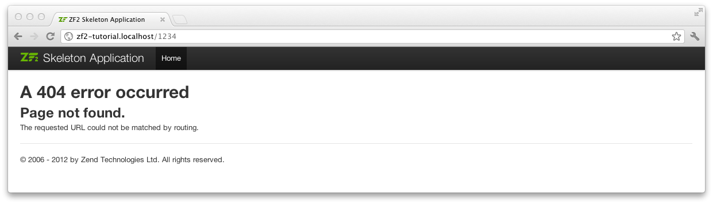

.. EN-Revision: 1551c1d
.. _user-guide.skeleton-application:

Iniciando: A Aplicação Skeleton
===============================

Com o objetivo de desenvolver nossa aplicação vamos começar utilizando a
`ZendSkeletonApplication <https://github.com/zendframework/ZendSkeletonApplication>`_ 
disponível no `github <https://github.com/>`_. Use o Composer (http://getcomposer.org)
para criar um novo projeto inicial com Zend Framework da seguinte forma:

.. code-block:: bash

    php composer.phar create-project -s dev zendframework/skeleton-application path/to/install

.. note::

    Outra maneira de instalar a ZendSkeletonApplication é usando o github. Para isso acesse 
    https://github.com/zendframework/ZendSkeletonApplication e clique no botão “Zip”. 
    Isso irá disparar um download de um arquivo com um nome parecido com
    ``ZendSkeletonApplication-master.zip``. 

    Extraia esse arquivo no diretório onde você guarda suas vhosts e renomeie o
    diretório resultante para ``zf2-tutorial``. 

    ZendSkeletonApplication está preparado para usar composer (http://getcomposer.org)
    para resolver as dependências. Nesse caso a dependência é o próprio Zend Framework.

    Para instalar o Zend Framework na sua aplicação é preciso apenas executar o seguinte comando:

    .. code-block:: bash

        php composer.phar self-update
        php composer.phar install

    a partir do diretório ``zf2-tutorial``. Isso pode levar um tempo e após esse tempo você 
    deverá ver uma mensagem parecida com:

    .. code-block:: bash

        Installing dependencies from lock file
        - Installing zendframework/zendframework (dev-master)
          Cloning 18c8e223f070deb07c17543ed938b54542aa0ed8

        Generating autoload files

.. note::

    Se a seguinte mensagem for exibida: 

    .. code-block:: bash

        [RuntimeException]      
          The process timed out. 

    Então sua conexão foi muito lenta para realizar o download do pacote completo a tempo
    e o composer atingiu seu tempo limite. Para evitar isso, ao invês de executar:

    .. code-block:: bash

        php composer.phar install

    execute:

    .. code-block:: bash

        COMPOSER_PROCESS_TIMEOUT=5000 php composer.phar install

Você pode agora prosseguir para as configurações de Virtual Host.

Virtual Host
------------

Você agora precisará criar um Virtual Host no Apache para sua aplicação e editar seu
arquivo de hosts para que ao acessar http://zf2-tutorial.localhost seja servido o arquivo ``index.php``
do diretório ``zf2-tutorial/public``.

A configuração do Virtual Host é geralmente feita no arquivo ``httpd.conf`` ou
no arquivo ``extra/httpd-vhosts.conf``.  Se você estiver usando ``httpd-vhosts.conf``, certifique-se
que esse arquivo esteja incluido no arquivo principal ``httpd.conf``.  Em algumas distribuiçõe Linux 
(ex: Ubuntu) os arquivos de configuração do Apache são armazenados em  ``/etc/apache2`` 
e são criados arquivos separados para cada Virtual Host dentro do diretório ``/etc/apache2/sites-enabled``. 
Nesse caso, você deve inserir o bloco de código abaixo em um arquivo nomeado 
``/etc/apache2/sites-enabled/zf2-tutorial``.

Certifique-se que ``NameVirtualHost`` esteja definido e apontando para “\*:80” ou similar, e só então
defina um Virtual Host a partir das linhas abaixo:

.. code-block:: apache

    <VirtualHost *:80>
        ServerName zf2-tutorial.localhost
        DocumentRoot /path/to/zf2-tutorial/public
        SetEnv APPLICATION_ENV "development"
        <Directory /path/to/zf2-tutorial/public>
            DirectoryIndex index.php
            AllowOverride All
            Order allow,deny
            Allow from all
        </Directory>
    </VirtualHost>

Tenha certeza de atualizar o arquivo ``/etc/hosts`` ou
``c:\windows\system32\drivers\etc\hosts`` para que ``zf2-tutorial.localhost``
esteja apontando para ``127.0.0.1``. Sua aplicação poderá então ser acessada usando
http://zf2-tutorial.localhost.  

.. code-block:: txt

    127.0.0.1               zf2-tutorial.localhost localhost

Reinicie seu servidor web.
Se você tiver feito tudo corretamente você deverá ver algo similar a:

.. image:: ../images/user-guide.skeleton-application.hello-world.png
    :width: 940 px

Para testar se seu arquivo ``.htaccess`` está funcionado acesse
http://zf2-tutorial.localhost/1234 e você deverá ver a seguinte página:

Se ao invês disso você estiver vendo uma página de erro 404 padrão do Apache, você deverá corrigir o arquivo ``.htaccess``
antes de continuar.  Se estiver usando IIS com o módulo URL Rewrite utilize o seguinte código:

.. code-block:: apache

    RewriteCond %{REQUEST_FILENAME} !-f
    RewriteRule ^ index.php [NC,L]

Você agora tem sua Skeleton Application funcionando e pode começar a desenvolver sua aplicação.

Exibição de Erros
-----------------

De forma opcional você pode usar a configuração de ``APPLICATION_ENV`` do seu Virtual Host para
permitir que o PHP exiba todos os erros no navegador. Isso pode ser útil durante o desenvolvimento
de sua aplicação.

Para isso edite o arquivo ``index.php`` do diretório ``zf2-tutorial/public/`` substituindo todo seu
conteúdo pelo seguinte:

.. code-block:: php
    :linenos:

    <?php

    /**
     * Display all errors when APPLICATION_ENV is development.
     */
    if ($_SERVER['APPLICATION_ENV'] == 'development') {
        error_reporting(E_ALL);
        ini_set("display_errors", 1);
    }
    
    /**
     * This makes our life easier when dealing with paths. Everything is relative
     * to the application root now.
     */
    chdir(dirname(__DIR__));
    
    // Setup autoloading
    require 'init_autoloader.php';
    
    // Run the application!
    Zend\Mvc\Application::init(require 'config/application.config.php')->run();
