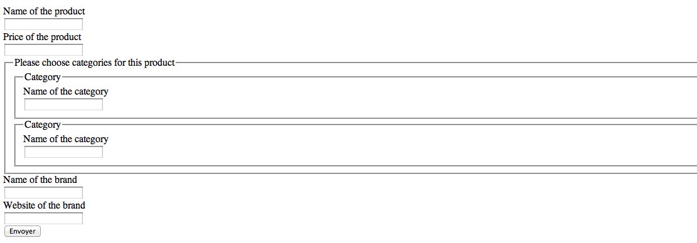
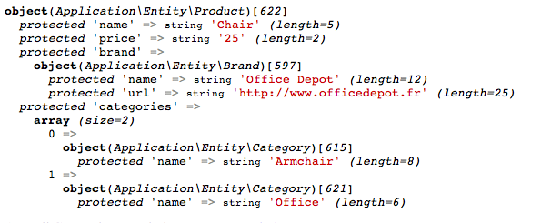
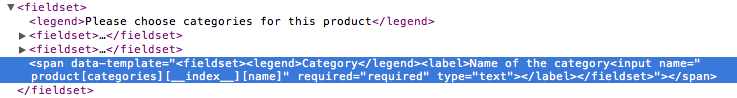
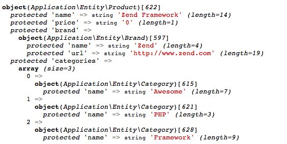
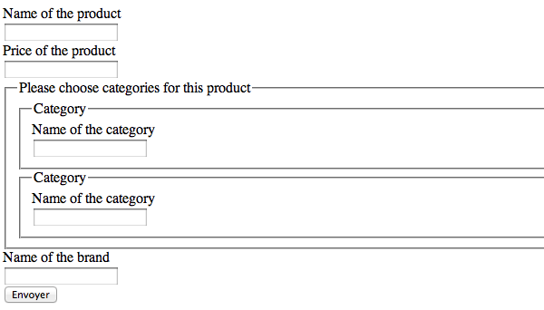

.. _zend.form.collections:

Form Collections
================

Often, fieldsets or elements in your forms will correspond to other domain
objects. In some cases, they may correspond to collections of domain objects. In
this latter case, in terms of user interfaces, you may want to add items
dynamically in the user interface -- a great example is adding tasks to a task
list.

This document is intended to demonstrate these features. To do so, we first need
to define some domain objects that we'll be using.

.. code-block:: php
   :linenos:

    namespace Application\Entity;

    class Product
    {
        /**
         * @var string
         */
        protected $name;

        /**
         * @var int
         */
        protected $price;

        /**
         * @var Brand
         */
        protected $brand;

        /**
         * @var array
         */
        protected $categories;

        /**
         * @param string $name
         * @return Product
         */
        public function setName($name)
        {
            $this->name = $name;
            return $this;
        }

        /**
         * @return string
         */
        public function getName()
        {
            return $this->name;
        }

        /**
         * @param int $price
         * @return Product
         */
        public function setPrice($price)
        {
            $this->price = $price;
            return $this;
        }

        /**
         * @return int
         */
        public function getPrice()
        {
            return $this->price;
        }

        /**
         * @param Brand $brand
         * @return Product
         */
        public function setBrand(Brand $brand)
        {
            $this->brand = $brand;
            return $this;
        }

        /**
         * @return Brand
         */
        public function getBrand()
        {
            return $this->brand;
        }

        /**
         * @param array $categories
         * @return Product
         */
        public function setCategories(array $categories)
        {
            $this->categories = $categories;
            return $this;
        }

        /**
         * @return array
         */
        public function getCategories()
        {
            return $this->categories;
        }
    }

    class Brand
    {
        /**
         * @var string
         */
        protected $name;

        /**
         * @var string
         */
        protected $url;

        /**
         * @param string $name
         * @return Brand
         */
        public function setName($name)
        {
            $this->name = $name;
            return $this;
        }

        /**
         * @return string
         */
        public function getName()
        {
            return $this->name;
        }

        /**
         * @param string $url
         * @return Brand
         */
        public function setUrl($url)
        {
            $this->url = $url;
            return $this;
        }

        /**
         * @return string
         */
        public function getUrl()
        {
            return $this->url;
        }
    }

    class Category
    {
        /**
         * @var string
         */
        protected $name;

        /**
         * @param string $name
         * @return Category
         */
        public function setName($name)
        {
            $this->name = $name;
            return $this;
        }

        /**
         * @return string
         */
        public function getName()
        {
            return $this->name;
        }
    }

As you can see, this is really simple code. A Product has two scalar properties
(name and price), a OneToOne relationship (one product has one brand), and a
OneToMany relationship (one product has many categories).

.. _zend.form.collections.fieldsets:

Creating Fieldsets
------------------

The first step is to create three fieldsets. Each fieldset will contain all the
fields and relationships for a specific entity.

Here is the ``Brand`` fieldset:

.. code-block:: php
   :linenos:

    namespace Application\Form;

    use Application\Entity\Brand;
    use Zend\Form\Fieldset;
    use Zend\InputFilter\InputFilterProviderInterface;
    use Zend\Stdlib\Hydrator\ClassMethods as ClassMethodsHydrator;

    class BrandFieldset extends Fieldset implements InputFilterProviderInterface
    {
        public function __construct()
        {
            parent::__construct('brand');

            $this
                ->setHydrator(new ClassMethodsHydrator(false))
                ->setObject(new Brand())
            ;

            $this->add(array(
                'name' => 'name',
                'options' => array(
                    'label' => 'Name of the brand',
                ),
                'attributes' => array(
                    'required' => 'required',
                ),
            ));

            $this->add(array(
                'name' => 'url',
                'type' => 'Zend\Form\Element\Url',
                'options' => array(
                    'label' => 'Website of the brand',
                ),
                'attributes' => array(
                    'required' => 'required',
                ),
            ));
        }

        /**
         * @return array
         */
        public function getInputFilterSpecification()
        {
            return array(
                'name' => array(
                    'required' => true,
                ),
            );
        }
    }

We can discover some new things here. As you can see, the fieldset calls the
method ``setHydrator()``, giving it a ``ClassMethods`` hydrator, and the
``setObject()`` method, giving it an empty instance of a concrete ``Brand``
object.

When the data will be validated, the ``Form`` will automatically iterate through
all the field sets it contains, and automatically populate the sub-objects, in
order to return a complete entity.

Also notice that the ``Url`` element has a type of ``Zend\Form\Element\Url``.
This information will be used to validate the input field. You don't need to
manually add filters or validators for this input as that element provides a
reasonable input specification.

Finally, ``getInputFilterSpecification()`` gives the specification for the remaining
input ("name"), indicating that this input is required. Note that *required* in
the array "attributes" (when elements are added) is only meant to add the
"required" attribute to the form markup (and therefore has semantic meaning
only).

Here is the ``Category`` fieldset:

.. code-block:: php
   :linenos:

    namespace Application\Form;

    use Application\Entity\Category;
    use Zend\Form\Fieldset;
    use Zend\InputFilter\InputFilterProviderInterface;
    use Zend\Stdlib\Hydrator\ClassMethods as ClassMethodsHydrator;

    class CategoryFieldset extends Fieldset implements InputFilterProviderInterface
    {
        public function __construct()
        {
            parent::__construct('category');

            $this
                ->setHydrator(new ClassMethodsHydrator(false))
                ->setObject(new Category())
            ;

            $this->setLabel('Category');

            $this->add(array(
                'name' => 'name',
                'options' => array(
                    'label' => 'Name of the category',
                ),
                'attributes' => array(
                    'required' => 'required',
                ),
            ));
        }

        /**
         * @return array
         */
        public function getInputFilterSpecification()
        {
            return array(
                'name' => array(
                    'required' => true,
                ),
            );
        }
    }

Nothing new here.

And finally the ``Product`` fieldset:

.. code-block:: php
   :linenos:

    namespace Application\Form;

    use Application\Entity\Product;
    use Zend\Form\Fieldset;
    use Zend\InputFilter\InputFilterProviderInterface;
    use Zend\Stdlib\Hydrator\ClassMethods as ClassMethodsHydrator;

    class ProductFieldset extends Fieldset implements InputFilterProviderInterface
    {
        public function __construct()
        {
            parent::__construct('product');

            $this
                ->setHydrator(new ClassMethodsHydrator(false))
                ->setObject(new Product())
            ;

            $this->add(array(
                'name' => 'name',
                'options' => array(
                    'label' => 'Name of the product',
                ),
                'attributes' => array(
                    'required' => 'required',
                ),
            ));

            $this->add(array(
                'name' => 'price',
                'options' => array(
                    'label' => 'Price of the product',
                ),
                'attributes' => array(
                    'required' => 'required',
                ),
            ));

            $this->add(array(
                'type' => 'Application\Form\BrandFieldset',
                'name' => 'brand',
                'options' => array(
                    'label' => 'Brand of the product',
                ),
            ));

            $this->add(array(
                'type' => 'Zend\Form\Element\Collection',
                'name' => 'categories',
                'options' => array(
                    'label' => 'Please choose categories for this product',
                    'count' => 2,
                    'should_create_template' => true,
                    'allow_add' => true,
                    'target_element' => array(
                        'type' => 'Application\Form\CategoryFieldset',
                    ),
                ),
            ));
        }

        /**
         * Should return an array specification compatible with
         * {@link Zend\InputFilter\Factory::createInputFilter()}.
         *
         * @return array
         */
        public function getInputFilterSpecification()
        {
            return array(
                'name' => array(
                    'required' => true,
                ),
                'price' => array(
                    'required' => true,
                    'validators' => array(
                        array(
                            'name' => 'Float',
                        ),
                    ),
                ),
            );
        }
    }

We have a lot of new things here!

First, notice how the brand element is added: we specify it to be of type
``Application\Form\BrandFieldset``. This is how you handle a OneToOne
relationship.  When the form is validated, the ``BrandFieldset`` will first be
populated, and will return a ``Brand`` entity (as we have specified a
``ClassMethods`` hydrator, and bound the fieldset to a ``Brand`` entity using
the ``setObject()`` method). This ``Brand`` entity will then be used to populate
the ``Product`` entity by calling the ``setBrand()`` method.

The next element shows you how to handle OneToMany relationship. The type is
``Zend\Form\Element\Collection``, which is a specialized element to handle such
cases. As you can see, the name of the element ("categories") perfectly matches
the name of the property in the ``Product`` entity.

This element has a few interesting options:

- ``count``: this is how many times the element (in this case a category) has
  to be rendered. We've set it to two in this examples.
- ``should_create_template``: if set to ``true``, it will generate a template
  markup in a ```` element, in order to simplify adding new element on the
  fly (we will speak about this one later).
- ``allow_add``: if set to ``true`` (which is the default), dynamically added
  elements will be retrieved and validated; otherwise, they will be completely
  ignored. This, of course, depends on what you want to do.
- ``target_element``: this is either an element or, as this is the case in this
  example, an array that describes the element or fieldset that will be used in
  the collection. In this case, the ``target_element`` is a ``Category``
  fieldset.

.. _zend.form.collections.form:

The Form Element
----------------

So far, so good. We now have our field sets in place. But those are field sets,
not forms. And only ``Form`` instances can be validated. So here is the form :

.. code-block:: php
   :linenos:

    namespace Application\Form;

    use Zend\Form\Form;
    use Zend\InputFilter\InputFilter;
    use Zend\Stdlib\Hydrator\ClassMethods as ClassMethodsHydrator;

    class CreateProduct extends Form
    {
        public function __construct()
        {
            parent::__construct('create_product');

            $this
                ->setAttribute('method', 'post')
                ->setHydrator(new ClassMethodsHydrator(false))
                ->setInputFilter(new InputFilter())
            ;

            $this->add(array(
                'type' => 'Application\Form\ProductFieldset',
                'options' => array(
                    'use_as_base_fieldset' => true,
                ),
            ));

            $this->add(array(
                'type' => 'Zend\Form\Element\Csrf',
                'name' => 'csrf',
            ));

            $this->add(array(
                'name' => 'submit',
                'attributes' => array(
                    'type' => 'submit',
                    'value' => 'Send',
                ),
            ));
        }
    }

``CreateProduct`` is quite simple, as it only defines a ``Product`` fieldset, as
well as some other useful fields (``CSRF`` for security, and a ``Submit`` button).

Notice the ``use_as_base_fieldset`` option. This option is here to say to the form:
"hey, the object I bind to you is, in fact, bound to the fieldset that is the
base fieldset." This will be to true most of the times.

What's cool with this approach is that each entity can have its own ``Fieldset`` and
can be reused. You describe the elements, the filters, and validators for each
entity only once, and the concrete ``Form`` instance will only compose those
fieldsets. You no longer have to add the "username" input to every form that
deals with users!

.. _zend.form.collections.controller:

The Controller
--------------

Now, let's create the action in the controller:

.. code-block:: php
   :linenos:

       /**
         * @return array
         */
        public function indexAction()
        {
            $form = new CreateProduct();
            $product = new Product();
            $form->bind($product);

            $request = $this->getRequest();
            if ($request->isPost()) {
                $form->setData($request->getPost());

                if ($form->isValid()) {
                    var_dump($product);
                }
            }

            return array(
                'form' => $form,
            );
        }

This is super easy. Nothing to do in the controllers. All the magic is done
behind the scene.

.. _zend.form.collections.view:

The View
--------

And finally, the view:

.. code-block:: php
   :linenos:

    <?php
    $form->setAttribute('action', $this->url('home'))
         ->prepare();

    echo $this->form()->openTag($form);

    $product = $form->get('product');

    echo $this->formRow($product->get('name'));
    echo $this->formRow($product->get('price'));
    echo $this->formCollection($product->get('categories'));

    $brand = $product->get('brand');

    echo $this->formRow($brand->get('name'));
    echo $this->formRow($brand->get('url'));

    echo $this->formHidden($form->get('csrf'));
    echo $this->formElement($form->get('submit'));

    echo $this->form()->closeTag();

A few new things here :

- the ``prepare()`` method. You *must* call it prior to rendering anything in
  the view (this function is only meant to be called in views, not in
  controllers).
- the ``FormRow`` helper renders a label (if present), the input itself, and
  errors.
- the ``FormCollection`` helper will iterate through every element in the
  collection, and render every element with the FormRow helper (you may specify
  an alternate helper if desired, using the ``setElementHelper()`` method on
  that ``FormCollection`` helper instance). If you need more control about the
  way you render your forms, you can iterate through the elements in the
  collection, and render them manually one by one.

Here is the result:

As you can see, collections are wrapped inside a fieldset, and every item in the
collection is itself wrapped in the fieldset. In fact, the ``Collection``
element uses label for each item in the collection, while the label of the
``Collection`` element itself is used as the legend of the fieldset. You must have
a label on every element in order to use this feature. If you don't want the fieldset
created, but just the elements within it, simply add a boolean ``false`` as the second
parameter of the ``FormCollection`` view helper.

If you validate, all elements will show errors (this is normal, as we've marked
them as required). As soon as the form is valid, this is what we get :

As you can see, the bound object is completely filled, not with arrays, but with
objects!

But that's not all.

.. _zend.form.collections.dynamic-elements:

Adding New Elements Dynamically
-------------------------------

Remember the ``should_create_template``? We are going to use it now.

Often, forms are not completely static. In our case, let's say that we don't
want only two categories, but we want the user to be able to add other ones at
runtime. ``Zend\Form`` has this capability. First, let's see what it generates
when we ask it to create a template:

As you can see, the collection generates two fieldsets (the two categories)
*plus* a span with a ``data-template`` attribute that contains the full HTML
code to copy to create a new element in the collection. Of course ``__index__``
(this is the placeholder generated) has to be changed to a valid value.
Currently, we have
2 elements (``categories[0]`` and ``categories[1]``, so ``__index__`` has to be
changed to 2.

If you want, this placeholder (``__index__`` is the default) can be changed using
the ``template_placeholder`` option key:

.. code-block:: php
   :linenos:

    $this->add(array(
        'type' => 'Zend\Form\Element\Collection',
        'name' => 'categories',
        'options' => array(
            'label' => 'Please choose categories for this product',
            'count' => 2,
            'should_create_template' => true,
            'template_placeholder' => '__placeholder__',
            'target_element' => array(
                'type' => 'Application\Form\CategoryFieldset',
            ),
        ),
    ));

First, let's add a small button "Add new category" anywhere in the form:

.. code-block:: html
   :linenos:

    <button onclick="return add_category()">Add a new category</button>

The ``add_category`` function is fairly simple:

1. First, count the number of elements we already have.
2. Get the template from the ``span``'s ``data-template`` attribute.
3. Change the placeholder to a valid index.
4. Add the element to the DOM.

Here is the code:

.. code-block:: html
   :linenos:

    

(Note: the above example assumes ``$()`` is defined, and equivalent to jQuery's
``$()`` function, Dojo's ``dojo.query``, etc.)

One small remark about the ``template.replace``: the example uses
``currentCount`` and not ``currentCount + 1``, as the indices are zero-based
(so, if we have two elements in the collection, the third one will have the
index ``2``).

Now, if we validate the form, it will automatically take into account this new
element by validating it, filtering it and retrieving it:

Of course, if you don't want to allow adding elements in a collection, you must
set the option ``allow_add`` to ``false``. This way, even if new elements are
added, they won't be validated and hence, not added to the entity. Also, if we don't
want elements to be added, we don't need the data template, either. Here's how
you do it:

.. code-block:: php
   :linenos:

    $this->add(array(
        'type' => 'Zend\Form\Element\Collection',
        'name' => 'categories',
        'options' => array(
            'label' => 'Please choose categories for this product',
            'count' => 2,
            'should_create_template' => false,
            'allow_add' => false,
            'target_element' => array(
                'type' => 'Application\Form\CategoryFieldset',
            ),
        ),
    ));

There are some limitations to this capability:

- Although you can add new elements and remove them, you *CANNOT* remove more
  elements in a collection than the initial count (for instance, if your code
  specifies ``count == 2``, you will be able to add a third one and remove it, but
  you won't be able to remove any others. If the initial count is 2, you *must*
  have at least two elements.
- Dynamically added elements have to be added at the end of the collection. They
  can be added anywhere (these elements will still be validated and inserted
  into the entity), but if the validation fails, this newly added element will
  be automatically be replaced at the end of the collection.

.. _zend.form.collections.validation-groups:

Validation groups for fieldsets and collection
----------------------------------------------

Validation groups allow you to validate a subset of fields.

As an example, although the ``Brand`` entity has a ``URL`` property, we don't
want the user to specify it in the creation form (but may wish to later in the
"Edit Product" form, for instance). Let's update the view to remove the ``URL``
input:

.. code-block:: php
   :linenos:

    <?php

    $form
        ->setAttribute('action', $this->url('home'))
        ->prepare()
    ;

    echo $this->form()->openTag($form);

    $product = $form->get('product');

    echo $this->formRow($product->get('name'));
    echo $this->formRow($product->get('price'));
    echo $this->formCollection($product->get('categories'));

    $brand = $product->get('brand');

    echo $this->formRow($brand->get('name'));

    echo $this->formHidden($form->get('csrf'));
    echo $this->formElement($form->get('submit'));

    echo $this->form()->closeTag();

This is what we get:

The ``URL`` input has disappeared, but even if we fill every input, the form won't
validate. In fact, this is normal. We specified in the input filter that the ``URL``
is a *required* field, so if the form does not have it, it won't validate, even
though we didn't add it to the view!

Of course, you could create a ``BrandFieldsetWithoutURL`` fieldset, but of
course this is not recommended, as a lot of code will be duplicated.

The solution: validation groups. A validation group is specified in a ``Form``
object (hence, in our case, in the ``CreateProduct`` form) by giving an array of
all the elements we want to validate.  Our ``CreateProduct`` now looks like this:

.. code-block:: php
   :linenos:

    namespace Application\Form;

    use Zend\Form\Form;
    use Zend\InputFilter\InputFilter;
    use Zend\Stdlib\Hydrator\ClassMethods as ClassMethodsHydrator;

    class CreateProduct extends Form
    {
        public function __construct()
        {
            parent::__construct('create_product');

            $this
                ->setAttribute('method', 'post')
                ->setHydrator(new ClassMethodsHydrator())
                ->setInputFilter(new InputFilter())
            ;

            $this->add(array(
                'type' => 'Application\Form\ProductFieldset',
                'options' => array(
                    'use_as_base_fieldset' => true,
                ),
            ));

            $this->add(array(
                'type' => 'Zend\Form\Element\Csrf',
                'name' => 'csrf',
            ));

            $this->add(array(
                'name' => 'submit',
                'attributes' => array(
                    'type' => 'submit',
                    'value' => 'Send',
                ),
            ));

            $this->setValidationGroup(array(
                'csrf',
                'product' => array(
                    'name',
                    'price',
                    'brand' => array(
                        'name',
                    ),
                    'categories' => array(
                        'name',
                    ),
                ),
            ));
        }
    }

Of course, don't forget to add the ``CSRF`` element, as we want it to be
validated too (but notice that I didn't write the submit element, as we don't
care about it). You can recursively select the elements you want.

There is one simple limitation currently: validation groups for collections are
set on a per-collection basis, not per-element in a collection basis. This means you
cannot say, "validate the name input for the first element of the categories
collection, but don't validate it for the second one." But, honestly, this is
really an edge-case.

Now, the form validates (and the ``URL`` is set to null as we didn't specify it).
